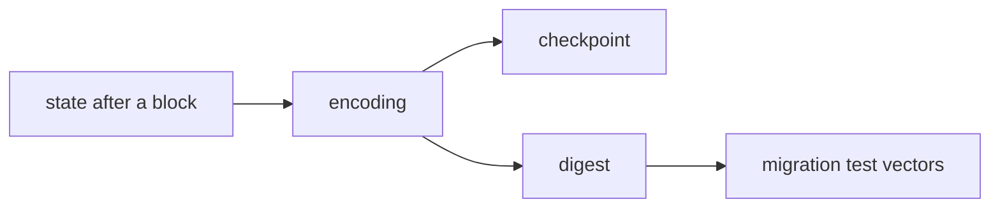

# BEDROCK-CHAIN-STATE

| Field | Value |
| --- | --- |
| Name | Bedrock Chain State |
| Slug | 248 |
| Status | raw |
| Category | Standards Track |
| Editor | Marcin Pawlowski <marcin@logos.co> |
| Contributors |  |

<!-- timeline:start -->

## Timeline

<!-- timeline:end -->

# Revision History

| **Version** | **Changes** | **Date** |
| --- | --- | --- |
| 1.0.0 | Initial revision. | 2026-10-06 |

# Introduction

A node that bootstraps from a checkpoint imports the chain state as bytes, and an era's migration is checked against the states before and after it. Both require every implementation to hold the same state and to produce the same bytes for it.

This document lists the components of the recorded chain state, gives each an exact type, and specifies their canonical encoding and the digest that names a state. The rules that read and write each component stay in [Mantle](bedrock-v1.1-mantle-specification.md), [Proof of Work](proof-of-work.md), [Service Declaration Protocol](bedrock-service-declaration-protocol.md) and the documents they link to.

# Overview

The recorded chain state is what a node holds, besides the blocks themselves, to validate and execute the next block: the notes and their places in the note tree, the channels, the service declarations and their snapshots, the reward records of leaders, Blend and proof of work, and the fee accounting. The epoch state that Cryptarchia derives for each epoch, such as the epoch nonce, is not part of it.

The state is encoded as a layout version followed by its components, always in the same order. Each component is encoded with the rules of [Mantle Transaction Encoding](mantle-transaction-encoding.md). A map or a set lists its entries in ascending order, so two nodes that hold the same state produce the same bytes.



A checkpoint carries the encoding itself. The digest is the hash of the encoding, and names a state where the bytes are not needed.

# Protocol

The **recorded chain state** after a block is the value of each **component** listed in [Chain State](#chain-state) after that block. [Era Migration](bedrock-eras.md#era-migration) migrates it from one era to the next.

The encoding of a state starts with its **layout version**, which names the list of components and their types. This document defines layout version 1, which era 0 uses. An era whose migration adds or removes a component, or changes the type of one, defines a new layout version.

The **state digest** is the hash of the encoding ([State Digest](#state-digest)).

# Details

## Parameters

```python
CHAIN_STATE_LAYOUT_VERSION: uint16 = 1   # the layout this document defines
```

## Encoding Rules

The state is encoded under rules 1, 2 and 4 of [Canonical Encoding](bedrock-v1.1-block-construction.md#canonical-encoding), with the terminals of [Mantle Transaction Encoding](mantle-transaction-encoding.md#common-structures). A structure that Mantle Transaction Encoding defines, such as `Note` or `Locator`, is encoded as it defines. In addition:

1. A list, a set or a map is encoded as a `UINT64` count of its entries, followed by the entries.
2. A list keeps its own order. A set lists its elements, and a map its keys, in ascending order.
3. An integer or a field element compares by its value. Any other element or key compares byte by byte.
4. A map entry is its key followed by its value.
5. An optional value is the byte `0x00` when absent, or `0x01` followed by the value.
6. A decoder rejects a set or a map whose elements or keys are not strictly ascending. Otherwise two byte strings would decode to the same state.

## Chain State

The recorded chain state of layout version 1 is `CHAIN_STATE_LAYOUT_VERSION` followed by the components below, in this order. Each row gives the value after block B. Where no other document names that value, the row derives it from the chain up to B.

| Component | Type | Value after block B |
| --- | --- | --- |
| `notes` | map `NoteId` → `LedgerNote` | The notes of the [ledger](bedrock-v1.1-mantle-specification.md#ledger), each with its leaf position in the note tree ([Ledger Root](cryptarchia-proof-of-leadership.md#ledger-root)). |
| `channel_notes` | map `NoteId` → `ChannelId` | [Channel Notes](bedrock-v1.1-mantle-specification.md#channel-notes) |
| `channels` | map `ChannelId` → `ChannelState` | [Channel Operations](bedrock-v1.1-mantle-specification.md#channel-operations) |
| `declarations` | map `DeclarationId` → `DeclarationInfo` | [Declaration Storage](bedrock-service-declaration-protocol.md#declaration-storage) |
| `sdp_snapshot` | map `DeclarationId` → `DeclarationInfo` | The [snapshot](bedrock-service-declaration-protocol.md#snapshots) for the epoch of B. |
| `next_sdp_snapshot` | map `DeclarationId` → `DeclarationInfo` | The snapshot for the epoch after the epoch of B. |
| `voucher_tree` | list of `VoucherPeak` | The [voucher tree](bedrock-anonymous-leaders-reward.md#voucher-creation-and-inclusion), holding the `leader_voucher` of every block after the Genesis block up to B. |
| `last_voucher_root` | `FieldElement` | The root of `voucher_tree` when the epoch of B started, or 0 in epoch 0 ([Leaders Reward](bedrock-anonymous-leaders-reward.md#leaders-reward)). |
| `last_voucher_count` | `UINT64` | The number of vouchers in `voucher_tree` when the epoch of B started, or 0 in epoch 0. |
| `voucher_nullifier_set` | set of `FieldElement` | [LEADER_CLAIM](bedrock-v1.1-mantle-specification.md#leader_claim) |
| `leaders_rewards` | `UINT64` | [Leaders Reward](bedrock-anonymous-leaders-reward.md#leaders-reward) |
| `pending_leaders_rewards` | `UINT64` | The leader rewards and tips of the blocks of the epoch of B, up to B ([Leaders Reward](bedrock-anonymous-leaders-reward.md#leaders-reward)). |
| `blend_target` | optional `BlendTarget` | The record of the epoch before the epoch of B from which Blend rewards are paid ([Reward Calculation](blend-protocol.md#reward-calculation)). Absent when no rewards are calculated for that epoch. |
| `blend_income` | `UINT64` | The Blend income of the blocks of the epoch of B, up to B ([Reward Calculation](blend-protocol.md#reward-calculation)). |
| `pow_reward_pool` | `UINT64` | [Reward Pool](proof-of-work.md#reward-pool) |
| `epoch_pow_reward` | `UINT64` | [Reward Pool](proof-of-work.md#reward-pool) |
| `difficulty_reward` | `FieldElement` | [Reward Difficulty](proof-of-work.md#reward-difficulty) |
| `pow_pool_refill` | `UINT64` | The fees of the blocks of the epoch of B, up to B, diverted to the proof of work reward pool ([Reward Pool](proof-of-work.md#reward-pool)). |
| `pow_nullifiers` | map `FieldElement` → `UINT64` | [Acceptance Window](proof-of-work.md#acceptance-window). The value is the slot of the block the claim referenced. |
| `block_slots` | map `Hash32` → `UINT64` | [Acceptance Window](proof-of-work.md#acceptance-window) |
| `epoch_tx_counts` | `TxCounts` | The blocks and Mantle Transactions of the epoch of B, up to B, without the Genesis block ([Blend Difficulty](proof-of-work.md#blend-difficulty)). |
| `closed_epoch_tx_counts` | optional `TxCounts` | The `epoch_tx_counts` of the epoch before the epoch of B. Absent in epoch 0. |
| `execution_base_fee` | `UINT64` | The base fee of the next block, $`b_{exec}`$ ([Base Fee Update Rule](execution-market.md#base-fee-update-rule)). |
| `average_execution_gas` | `UINT64` | $`G_{avg}`$ after B ([Base Fee Update Rule](execution-market.md#base-fee-update-rule)). |
| `permanent_storage_gas_price` | `UINT64` | $`P_{storage}`$ of the epoch of B ([State Variables](storage-markets.md#state-variables)). |
| `storage_gas_average` | `UINT64` | $`T_{RA}`$ of the epoch before the epoch of B ([State Variables](storage-markets.md#state-variables)). |
| `storage_gas_used` | `UINT64` | $`C_{usage}`$ of the epoch of B, up to B ([State Variables](storage-markets.md#state-variables)). |
| `pooled_fees_window` | list of `UINT64` | $`D_{1,\tau}`$ of the last $`T`$ blocks, oldest first and ending with B ([Block Rewards](block-rewards.md#block-rewards)). |

`service_notes` ([Service notes](bedrock-v1.1-mantle-specification.md#service-notes)) is not a component. Its keys are the `service_note_id` values of `declarations`, and each key maps to the declarations that name it.

The key of each `notes` entry is the `NoteId` that [Note Id](bedrock-v1.1-mantle-specification.md#note-id) derives from the entry's `op_id`, `output_number` and `note`.

```schema
LedgerNote       = OpId OutputNumber Note Position
OpId             = Hash32
OutputNumber     = UINT64
Position         = UINT32                ; the note's leaf in the note tree

ChannelState     = AccreditedKeys ConfigThreshold TipHash ConfigTipHash TipSlot
                   TipSequencer TipSequencerStartingSlot PostingTimeframe PostingTimeout
                   TransferThreshold
AccreditedKeys   = UINT64 *Ed25519PublicKey   ; in configured order
TipHash          = Hash32
ConfigTipHash    = Hash32
TipSlot          = UINT64
TipSequencer     = UINT16
TipSequencerStartingSlot = UINT64

DeclarationInfo  = SDPDeclare Created Active WithdrawAt Nonce
Created          = UINT32
Active           = UINT32
WithdrawAt       = %x00 / %x01 UINT32    ; absent, or the epoch of the withdrawal

VoucherPeak      = FieldElement Height   ; the root of one perfect subtree of the appended vouchers
Height           = Byte                  ; strictly decreasing along the list

BlendTarget      = Participants LedgerAged EpochNonce Lottery0 Lottery1 BlendDifficulty Income
Participants     = UINT64 *(ProviderId BlendParticipant)  ; ascending ProviderId
ProviderId       = Ed25519PublicKey
BlendParticipant = ZkPublicKey Distance
Distance         = %x00 / %x01 UINT64    ; absent, or the Hamming distance of the accepted activity proof
LedgerAged       = FieldElement          ; the aged note-tree root of the target epoch
EpochNonce       = FieldElement          ; the epoch nonce of the target epoch
Lottery0         = FieldElement
Lottery1         = FieldElement
BlendDifficulty  = FieldElement          ; difficulty_blend of the target epoch
Income           = UINT64                ; blend_income of the target epoch

TxCounts         = Blocks Transactions
Blocks           = UINT64
Transactions     = UINT64
```

`ConfigThreshold`, `PostingTimeframe`, `PostingTimeout`, `TransferThreshold`, `SDPDeclare` and `Nonce` are those of [Mantle Transaction Encoding](mantle-transaction-encoding.md).

## State Digest

```python
def state_digest(encoded_state: bytes) -> Hash32:
    return hash(b"CHAIN_STATE_V1" + encoded_state)
```

where `hash` is Blake2b as specified in [Common Cryptographic Components](common-cryptographic-components.md).
