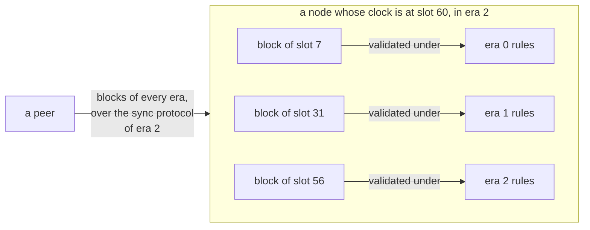
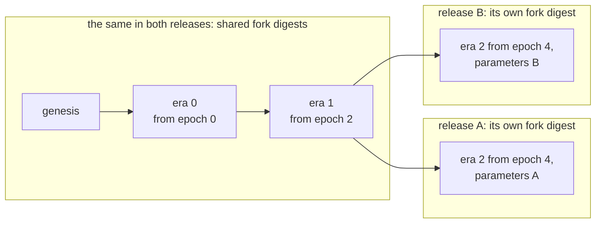
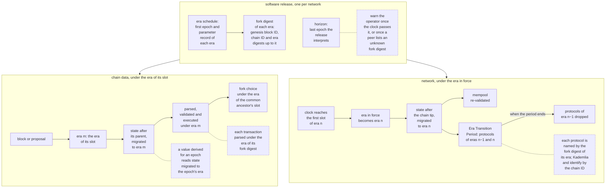

# BEDROCK-ERAS

| Field | Value |
| --- | --- |
| Name | Bedrock Eras |
| Slug | 247 |
| Status | raw |
| Category | Standards Track |
| Editor | Marcin Pawlowski <marcin@logos.co> |
| Contributors |  |

<!-- timeline:start -->

## Timeline

<!-- timeline:end -->

# Revision History

| **Version** | **Changes** | **Date** |
| --- | --- | --- |
| 1.0.0 | Initial revision. | 2026-09-04 |

# Introduction

The rules and parameters of the protocol change over the life of the chain. Every node must still apply the same rules to the same block, including a node that syncs blocks made before a change.

Eras make this possible. An era is a range of consecutive epochs ([Cryptarchia Protocol](cryptarchia-v1-protocol.md#epoch)) governed by one set of protocol rules. Each software release carries a schedule of eras, so every node changes rules at the same epoch and reads each block under the rules of its era.

This document specifies the era schedule and the parameter record of an era, the era that governs chain data and the network layer, the migration of the chain state between eras, the transition period at an era boundary, the protocol identifiers, and the horizon of a release. The rules an era applies are specified where they are defined, in [Cryptarchia Protocol](cryptarchia-v1-protocol.md), [Mantle](bedrock-v1.1-mantle-specification.md), [Blend Protocol](blend-protocol.md), [Proof of Work](proof-of-work.md) and the other Bedrock specifications.

# Overview

The history of the chain is divided into eras. Each era is a run of consecutive epochs under one set of rules and one set of parameters. Every release of the node software carries a schedule that says at which epoch each era begins. The schedule is not read from the chain, so a node learns of a new era by installing a release that names it.

```mermaid
---
displayMode: compact
---
gantt
    title Slots, epochs and eras, for an example schedule
    dateFormat X
    axisFormat slot %s
    tickInterval 10second
    todayMarker off
    section Epochs
        epoch 0 : p0, 0, 10s
        epoch 1 : p1, after p0, 10s
        epoch 2 : p2, after p1, 15s
        epoch 3 : p3, after p2, 15s
        epoch 4 : p4, after p3, 15s
    section Blocks
        era 0 rules : r0, 0, 20s
        era 1 rules : r1, after r0, 30s
        era 2 rules : r2, after r1, 15s
    section Chain state
        migration at slot 20 : milestone, m1, after r0, 0s
        migration at slot 50 : milestone, m2, after r1, 0s
    section Network
        era 0 protocols : n0, 0, 23s
        era 1 protocols : n1, after r0, 33s
        era 2 protocols : n2, after r1, 15s
    section Transition
        both eras : crit, t1, after r0, 3s
        both eras : crit, t2, after r1, 3s
```



In this example, the epochs of era 0 are 10 slots long. The schedule starts era 1 at epoch 2, with epochs of 15 slots, and era 2 at epoch 4. An era begins at the first slot of its first epoch: slot 20 for era 1 and slot 50 for era 2. The rules for blocks change exactly at that slot. There, a migration carries the chain state into the new era and leaves unchanged whatever the new era does not redefine. The first block at or after that slot reads the migrated state. The network follows the local clock: when the clock reaches that slot, a node runs the protocols of both eras for a short transition period, then drops the old ones. The lengths are not to scale. An epoch lasts days, and a transition period lasts seconds.

A node judges a block by the era the block was made in, which the block's slot tells it. It talks to its peers in the era its own clock says has begun. A node that syncs from genesis therefore validates old blocks under old rules while it talks to the network under the current ones.



The node fetches every block over the sync protocol of era 2, the era of its clock. It validates each block under the rules of the era of the block's slot.

Each era has a fork digest, a fingerprint of the genesis block and of the schedule up to that era. Network protocol names and transactions carry it. Two releases whose schedules agree share their protocol names up to the first era where the schedules differ, and never again after it.



Both releases share the fork digests of eras 0 and 1, and with them the protocol names of those eras. Their era 2 parameters differ, so their era 2 fork digests and protocol names differ too.

The two protocols that find peers and describe them carry the identifier of the chain in their names instead of a fork digest. No era changes it.

A release knows the rules only up to its horizon, the last epoch it interprets. A node warns its operator once its clock passes the horizon, and when a peer advertises a fork digest the node does not know.

```mermaid
---
displayMode: compact
---
gantt
    title Two releases and a horizon, for an example schedule
    dateFormat X
    axisFormat slot %s
    tickInterval 10second
    todayMarker off
    section Epochs
        epoch 0 : p0, 0, 10s
        epoch 1 : p1, after p0, 10s
        epoch 2 : p2, after p1, 15s
        epoch 3 : p3, after p2, 15s
        epoch 4 : p4, after p3, 15s
        epoch 5 : p5, after p4, 15s
        epoch 6 : p6, after p5, 15s
    section Release B
        era 0 : b0, 0, 20s
        era 1 : b1, after b0, 30s
        era 2 : b2, after b1, 45s
    section Release A
        era 0 : a0, 0, 20s
        era 1 : a1, after a0, 60s
        past the horizon : crit, a2, after a1, 15s
    section A warns
        unknown fork digest : milestone, w1, after b1, 0s
        horizon passed : milestone, w2, after a1, 0s
```



In this example, release A knows eras 0 and 1 and sets its horizon at epoch 5. Release B adds era 2 from epoch 4. At slot 50, the nodes of release B enter era 2 and advertise its fork digest. A node of release A does not know that digest and warns its operator. It keeps applying the rules of era 1. At slot 80, the first slot after its horizon, it warns its operator again.

A node whose release lacks the rules of an era it must apply halts when it starts or imports a checkpoint.

# Protocol



A software release carries one **era schedule** per network. Each entry gives the first epoch of an era and its **parameter record**, the values of the constants the era's rules read ([Era Parameters](#era-parameters)). Every slot and every epoch belongs to the last era that begins at or before it. Epoch and slot lengths may differ between eras, so slots and times are counted era by era ([Notation](#notation)). [Era Schedule](#era-schedule) constrains what an era may change and what a release may change in a schedule.

Each era has a **fork digest**, a hash of the genesis block ID, the chain ID and the era digest of every era up to it. An era digest is a hash of the era's first epoch and parameter record ([Notation](#notation)).

A release interprets the chain up to its **horizon**, an epoch it fixes for each network. A node warns its operator once its clock passes the horizon, and when a peer advertises a fork digest the node does not know ([Horizon](#horizon)).

A node interprets each piece of chain data under one era:

- a block or proposal, and everything it carries: the era of its slot;
- a transaction, when parsing it: the era whose fork digest it carries;
- a comparison of two chains: the era of the slot of their common ancestor.

[Era of Chain Data](#era-of-chain-data) specifies these rules, the fork digests a block accepts, and when a node must halt.

Between eras, the recorded chain state passes through a **migration** that the new era defines. A block, and a value derived for an epoch, read the state migrated to their own era ([Era Migration](#era-migration)).

A node runs its network protocols under the **era in force**, the era of the slot its clock gives. Their identifiers and gossipsub topics carry the fork digest of their era, except those of Kademlia and identify, which carry the chain ID ([Network Protocol Identity](#network-protocol-identity)). When the era in force changes, the node runs the network protocols of both eras for the **Era Transition Period**, then drops those of the predecessor era ([Era Transition Period](#era-transition-period)).

A node keeps four values that depend on the era in force:

- the era in force itself, which changes when the clock reaches the first slot of the next era ([Notation](#notation));
- the state after its local chain tip, migrated when the era in force changes ([Era Migration](#era-migration));
- its mempool, re-validated against that state ([Era Migration](#era-migration));
- the identifiers it accepts connections on, those of both eras during the Era Transition Period and those of the era in force otherwise ([Era Transition Period](#era-transition-period)).

# Details

## Notation

| Symbol | Name | Description |
| --- | --- | --- |
| $`E_n`$ | first epoch number of era $`n`$ | The epoch number of entry $`n`$ of the era schedule, counting from 0. |
| $`P_n`$ | parameter record of era $`n`$ | The [parameter record](#era-parameters) of entry $`n`$ of the era schedule. |
| $`L_n`$ | epoch length of era $`n`$ | The epoch length of [Epoch Schedule](cryptarchia-v1-protocol.md#epoch-schedule) under the rules of era $`n`$. |
| $`\Delta_n`$ | slot length of era $`n`$ | The slot length of [Constants](cryptarchia-v1-protocol.md#constants) under the rules of era $`n`$, in nanoseconds. |
| $`S_n`$ | first slot of era $`n`$ | $`S_0 = 0`$, $`S_n = S_{n-1} + (E_n - E_{n-1}) \cdot L_{n-1}`$. |
| $`\tau_n`$ | start time of era $`n`$ | $`\tau_0 = 10^9 \cdot \text{genesis\_time}`$, $`\tau_n = \tau_{n-1} + (S_n - S_{n-1}) \cdot \Delta_{n-1}`$. In nanoseconds since the Unix epoch, as every time $`t`$ here. `genesis_time` is from [Cryptarchia Parameters](bedrock-genesis-block.md#cryptarchia-parameters). |
| $`\textbf{era}(ep)`$ | era of an epoch | $`\max\{n : E_n \le ep\}`$. |
| $`\textbf{era}(sl)`$ | era of a slot | $`\max\{n : S_n \le sl\}`$. |
| $`\textbf{epoch}(sl)`$ | epoch of a slot | $`E_m + \lfloor (sl - S_m) / L_m \rfloor`$ with $`m = \textbf{era}(sl)`$. |
| $`\textbf{first\_slot}(ep)`$ | first slot of an epoch | $`S_m + (ep - E_m) \cdot L_m`$ with $`m = \textbf{era}(ep)`$. |
| $`\textbf{slot}(t)`$ | slot of a time | $`S_m + \lfloor (t - \tau_m) / \Delta_m \rfloor`$ with $`m = \max\{n : \tau_n \le t\}`$, defined for $`t \ge \tau_0`$. $`\textbf{wallclock\_time}().\textbf{to\_slot}()`$ of [Block Header Validation](cryptarchia-v1-protocol.md#block-header-validation) is $`\textbf{slot}(\textbf{wallclock\_time}())`$. |
| *none* | era in force | $`\textbf{era}(\textbf{wallclock\_time}().\textbf{to\_slot}())`$. |
| $`G`$ | genesis block ID | The [Block ID](cryptarchia-v1-protocol.md#block-id) of the [Genesis Block](bedrock-genesis-block.md). |
| $`D_n`$ | era digest of era $`n`$ | $`\textbf{hash}(\texttt{ERA\_DIGEST\_V1} \,\|\, E_n \,\|\, P_n)`$, with the `hash` of [Block ID](cryptarchia-v1-protocol.md#block-id), $`E_n`$ as an [`EpochNumber`](cryptarchia-v1-protocol.md#epoch) and $`P_n`$ in its [encoding](#era-parameters). |
| $`F_n`$ | fork digest of era $`n`$ | $`\textbf{hash}(\texttt{FORK\_DIGEST\_V1} \,\|\, G \,\|\, \text{chain\_id} \,\|\, D_0 \,\|\, \dots \,\|\, D_n)`$, with the same `hash` and `chain_id` encoded as in [Cryptarchia Parameters](bedrock-genesis-block.md#cryptarchia-parameters). |
| $`H`$ | horizon | The last epoch a software release interprets, per network. |

## Parameters

```python
MAINNET_ERA_SCHEDULE: list[tuple[EpochNumber, EraParameters]] = [(0, P_0)]  # (E_n, P_n) of each era of mainnet
TESTNET_ERA_SCHEDULE: list[tuple[EpochNumber, EraParameters]] = [(0, P_0)]  # (E_n, P_n) of each era of testnet
```

## Era Schedule

The era schedule is embedded in the node software and is not read from the chain. Each network has its own schedule. The schedule is a list of entries, each an epoch number and a [parameter record](#era-parameters). The epoch numbers strictly increase, and the first of them is 0.

An era must not change the comparison of chains that diverge by at most $`k`$ blocks ([Online Fork Choice Rule](fork-choice.md#online-fork-choice-rule)). Otherwise fork choice depends on the order in which forks were seen for the first $`k`$ blocks of the era.

The nodes of two software releases apply different rules from the first epoch whose era has a different digest in the two schedules. From that epoch they use different fork digests. A software release must not change the rules of a published era, or the migration into it, while keeping the era's first epoch and parameter record. Otherwise the nodes of the two releases apply different rules under one fork digest. A software release must not publish an entry, or change the record of an entry, whose epoch has begun. Otherwise a node that installs the release holds state executed under the wrong era.

## Era Parameters

The parameter record of an era is a layout version followed by the fields below, in this order. A field holds the value of its source constant under the rules of the era. The layout version is a `UINT16` equal to 1. Integers are unsigned and little-endian. A ratio is its numerator, then its denominator, each a `UINT32`. The denominator is not zero. A duration is its whole seconds as a `UINT64`, then the nanoseconds past them as a `UINT32`.

| Field | Encoding | Source constant |
| --- | --- | --- |
| `num_blend_layers` | `UINT64` | $`\beta_{max}`$ of [Global Parameters](blend-protocol.md#global-parameters) |
| `minimum_network_size` | `UINT64` | The minimal network size of [Minimal Network Size](blend-protocol.md#minimal-network-size) |
| `network_absorption_in_rounds` | `UINT64` | $`\eta`$ of [Global Parameters](blend-protocol.md#global-parameters) |
| `data_replication_factor` | `UINT64` | $`R_D`$ of [Global Parameters](blend-protocol.md#global-parameters) |
| `message_frequency_per_round` | ratio | $`F_C`$ of [Global Parameters](blend-protocol.md#global-parameters) |
| `maximum_release_delay_in_rounds` | `UINT64` | $`\Delta_{max}`$ of [Global Parameters](blend-protocol.md#global-parameters) |
| `target_peering_degree` | `UINT32` | $`\Phi_{CC}`$ of [Global Parameters](blend-protocol.md#global-parameters) |
| `verification_rate_per_second` | `UINT32` | $`V`$ of [Global Parameters](blend-protocol.md#global-parameters) |
| `edge_node_send_deadline_in_rounds` | `UINT64` | $`T_E`$ of [Global Parameters](blend-protocol.md#global-parameters) |
| `core_handshake_deadline_in_rounds` | `UINT128` | $`T_H`$ of [Global Parameters](blend-protocol.md#global-parameters) |
| `activity_threshold_sensitivity` | `UINT64` | $`\theta`$ of [Activity Threshold](blend-protocol.md#activity-threshold) |
| `epoch_config` | three `UINT8` | The lengths of the three phases of [Epoch Schedule](cryptarchia-v1-protocol.md#epoch-schedule), in multiples of $`\lfloor k/f \rfloor`$ |
| `security_param` | `UINT32` | $`k`$ of [Constants](cryptarchia-v1-protocol.md#constants) |
| `slot_activation_coeff` | ratio | $`f`$ of [Constants](cryptarchia-v1-protocol.md#constants) |
| `learning_rate` | ratio | `beta` of [Parameters and variables](cryptarchia-total-stake-inference.md#parameters-and-variables) |
| `uncle_reference_window_in_block` | `UINT32` | $`W`$ of [Constants](cryptarchia-v1-protocol.md#constants) |
| `service_params` | A `UINT32` count, then for each service in ascending order of its `ServiceType` byte: that byte, `inactivity_period` as a `UINT32` and `epoch` as a `UINT32` | [Service Parameters](bedrock-service-declaration-protocol.md#service-parameters) |
| `min_stake` | `stake_threshold` as a `UINT64`, then `epoch` as a `UINT32` | [Minimum Stake](bedrock-service-declaration-protocol.md#minimum-stake) |
| `base_difficulty` | `UINT32` | $`n`$ in `BLEND_DIFFICULTY_BASE` $`= \lfloor p / 2^n \rfloor`$ of [Parameters](proof-of-work.md#parameters) |
| `target_transactions_per_block` | `UINT64` | `TARGET_TXS_PER_BLOCK` of [Parameters](proof-of-work.md#parameters) |
| `max_step` | `UINT64` | `BLEND_MAX_STEP` of [Parameters](proof-of-work.md#parameters) |
| `damping_num` | `UINT32` | `BLEND_DAMPING_NUM` of [Parameters](proof-of-work.md#parameters) |
| `damping_den_offset` | `UINT32` | `BLEND_DAMPING_DEN` minus `BLEND_DAMPING_NUM` of [Parameters](proof-of-work.md#parameters) |
| `minimum_difficulty` | `UINT32` | $`n`$ in `REWARD_TARGET_CAP` $`= \lfloor p / 2^n \rfloor`$ of [Parameters](proof-of-work.md#parameters) |
| `ema_smoothing_factor` | `UINT64` | `EMA_SMOOTHING_FACTOR` of [Parameters](proof-of-work.md#parameters) |
| `ema_smoothing_precision` | `UINT64` | `EMA_SMOOTHING_PRECISION` of [Parameters](proof-of-work.md#parameters) |
| `target_claims_per_block` | `UINT64` | `TARGET_CLAIMS_PER_BLOCK` of [Parameters](proof-of-work.md#parameters) |
| `rate_num` | `UINT64` | `EPOCH_POW_DISTRIBUTION_RATE_NUM` of [Parameters](proof-of-work.md#parameters) |
| `rate_den` | `UINT64` | `EPOCH_POW_DISTRIBUTION_RATE_DEN` of [Parameters](proof-of-work.md#parameters) |
| `pow_share` | `UINT64` | `POW_SHARE` of [Parameters](proof-of-work.md#parameters) |
| `share_den` | `UINT64` | `SHARE_DEN` of [Parameters](proof-of-work.md#parameters) |
| `expected_blocks_per_window` | `UINT64` | `EXPECTED_BLOCKS_PER_WINDOW` of [Parameters](proof-of-work.md#parameters) |
| `slot_duration` | duration | The slot length of [Constants](cryptarchia-v1-protocol.md#constants) |

In every record, the epoch length $`L_n`$ and the slot length $`\Delta_n`$ are at least 1. Otherwise $`\textbf{epoch}(sl)`$ or $`\textbf{slot}(t)`$ divides by zero.

The `stake_thresholds` ([Minimum Stake](bedrock-service-declaration-protocol.md#minimum-stake)) and `parameters` ([Service Parameters](bedrock-service-declaration-protocol.md#service-parameters)) stores hold the `min_stake` and `service_params` entries of the records of the schedule.

A software release that adds, removes or re-encodes a field defines a new layout version, used by the eras that adopt it.

## Era of Chain Data

A block or proposal, and everything it carries, is parsed, validated and executed under the rules of $`\textbf{era}(sl)`$ of its slot, except that a transaction is parsed under the era whose fork digest it carries. `slot` is the first field of the header ([Block Header](cryptarchia-v1-protocol.md#block-header)) and has the same encoding in every era, and every message that carries a block or proposal begins with the header in its [canonical encoding](bedrock-v1.1-block-construction.md#canonical-encoding). Otherwise a node cannot parse a block before it knows the block's era.

Every transaction begins with its fork digest ([Mantle Transaction](bedrock-v1.1-mantle-specification.md#mantle-transaction)), in the same encoding in every era. Otherwise a node cannot parse a transaction before it knows the transaction's era. A block of era $`m`$ accepts a transaction that carries $`F_m`$, or $`F_{m-1}`$ while the block's slot lies in epoch $`E_m`$.

[Fork choice](fork-choice.md) compares two chains under the era of the slot of their $`\textbf{common\_ancestor}`$ ([Fork Pruning](cryptarchia-v1-protocol.md#fork-pruning)). The fork choice rule of an era reads only the block tree and the slot of each block. Otherwise it is undefined on the blocks of a later era that re-encodes a field it reads. [Commit](cryptarchia-v1-protocol.md#commit) uses the $`k`$ of the era of the slot of the local chain tip.

At startup and on checkpoint import, a node whose software does not implement the rules of every era from $`\textbf{era}(sl_{B_\text{imm}})`$ ([latest immutable block](cryptarchia-v1-protocol.md#latest-immutable-block)) to the era in force must halt. A halted node stops every protocol and exits with an error to the operator.

A node keeps in its mempool only transactions valid under the era in force.

## Era Migration

Every era after the first defines a migration from its predecessor. A migration is a function of the recorded chain state alone. The recorded chain state is the state a Mantle Operation is validated against ([Validation](bedrock-v1.1-mantle-specification.md#validation), [Proof of Work Operations](bedrock-v1.1-mantle-specification.md#proof-of-work-operations)) and the [snapshots](bedrock-service-declaration-protocol.md#snapshots) of the current and later epochs.

The migration must be:

- **Total**: defined for every state reachable under the predecessor era. A migration undefined for a reachable state halts the network at the boundary.
- **Identity by default**: every state component the new era does not redefine is unchanged.

A block reads the state after any block of an earlier era with the intervening migrations applied, in order. When the era in force changes, a node applies the same migrations to the state after its local chain tip; it re-validates its mempool and runs the network protocols of the new era against that state.

A value derived for an epoch is derived under the rules of the epoch's era: its [Epoch State](cryptarchia-v1-protocol.md#epoch-state), its `difficulty_blend` ([Blend Difficulty](proof-of-work.md#blend-difficulty)) and its `epoch_pow_reward` ([Reward Pool](proof-of-work.md#reward-pool)). A quantity measured over an epoch, such as a phase boundary, an observation window or an expected block count, uses the parameters of that epoch's era. Where a derivation reads the chain state as of a slot, it reads the state after the last block at or before that slot, migrated to the epoch's era. A value derived for an earlier epoch is used as it was derived.

The rules of an era verify the Activity Proofs and reward claims of the last epoch of the predecessor era, [CLAIM_POW_REWARD](bedrock-v1.1-mantle-specification.md#claim_pow_reward) included, as the predecessor's rules do. Otherwise the rewards of that epoch are lost.

## Era Transition Period

The Era Transition Period is the first $`T`$ [rounds](blend-protocol.md#time) after the era in force changes, with $`T`$ the [Transition Period](blend-protocol.md#transition-period) of the new era. It applies to the network layer only.

During the Era Transition Period a node must:

1. Accept and open connections on the identifiers of both eras.
2. Validate a Blend message under the era of the connection it arrived on.
3. Keep every input the predecessor era's message checks read until the period ends.

After the Era Transition Period the node must drop the identifiers of the predecessor era and must not process its Blend messages. A synchronization stream open at the end of the period is served to its end.

## Network Protocol Identity

Every protocol identifier and gossipsub topic a Logos Blockchain specification defines is `/logos-blockchain/<chain_id>/<protocol>` for Kademlia and identify ([P2P Network](../draft/p2p-network.md)), and `/logos-blockchain/<fork_digest>/<protocol>` for every other protocol. `<chain_id>` is `chain_id` ([Cryptarchia Parameters](bedrock-genesis-block.md#cryptarchia-parameters)), percent-encoded as in [RFC 3986](https://www.rfc-editor.org/rfc/rfc3986#section-2.1) except for its unreserved characters. `<fork_digest>` is the fork digest $`F_n`$ of an era $`n`$ in lowercase hexadecimal, and the identifier is an identifier of era $`n`$. `<protocol>` is the identifier the protocol's own specification defines.

A node sends a message it generates over the identifiers of the era in force at generation. A node relays or releases a received or processed Blend message, and broadcasts its payload, over the identifiers of the era of the connection it arrived on. A node publishes a proposal it accepts, and a transaction it admits to its mempool, on the topic of the era in force. A [synchronization](cryptarchia-v1-bootstr-sync.md#downloading-blocks) response carries blocks of any era.

## Horizon

$`H`$ must not be smaller than $`E_n`$ of the last entry of the schedule. Otherwise the node warns its operator before its last era begins.

When $`\textbf{wallclock\_time}().\textbf{to\_slot}()`$ reaches the first slot of epoch $`H+1`$, a node warns its operator that its software no longer interprets the chain. A node also warns its operator when a peer lists, in the `protocols` field of its [identify](https://github.com/libp2p/specs/blob/master/identify/README.md) message, an identifier whose fork digest the node does not know.
