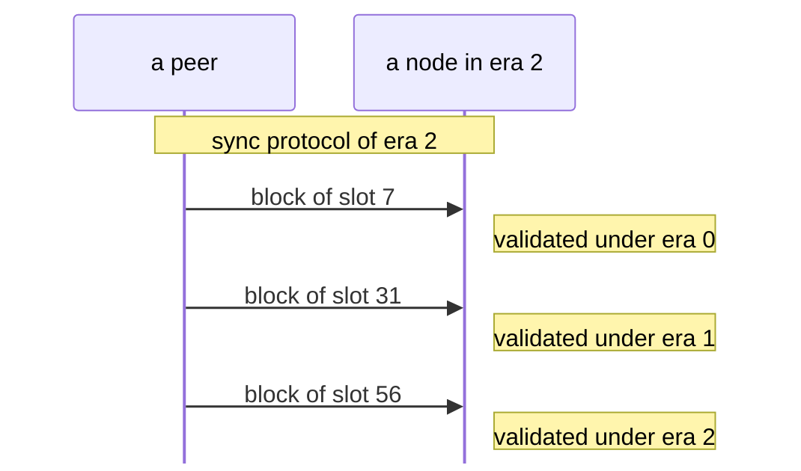
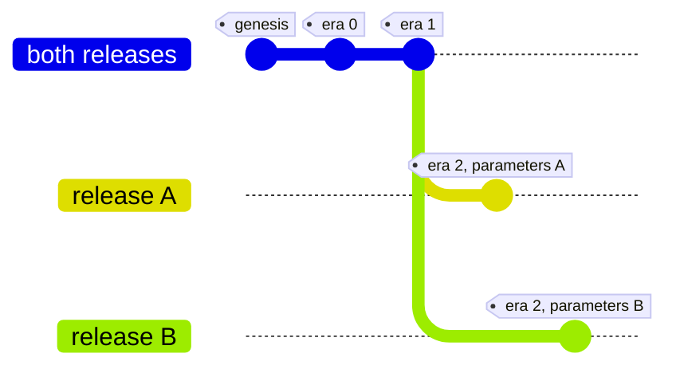
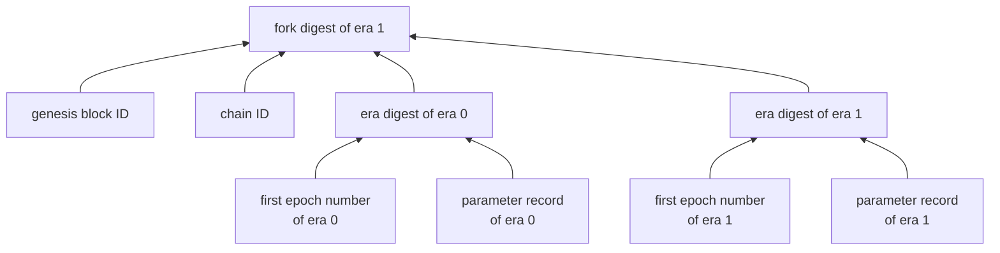
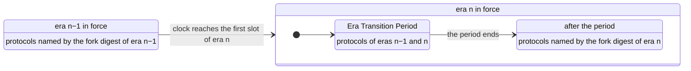
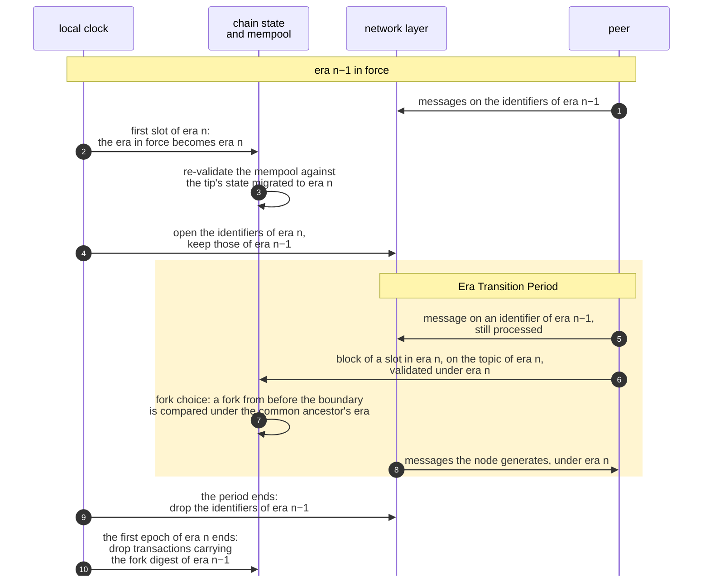

# BEDROCK-ERAS

| Field | Value |
| --- | --- |
| Name | Bedrock Eras |
| Slug | 247 |
| Status | raw |
| Category | Standards Track |
| Editor | Marcin Pawlowski <marcin@logos.co> |
| Contributors |  |

<!-- timeline:start -->

## Timeline

<!-- timeline:end -->

# Revision History

| **Version** | **Changes** | **Date** |
| --- | --- | --- |
| 1.0.0 | Initial revision. | 2026-09-04 |

# Introduction

The rules and parameters of the protocol change over the life of the chain. Every node must still apply the same rules to the same block, including a node that syncs blocks made before a change.

Eras make this possible. An era is a range of consecutive epochs ([Cryptarchia Protocol](cryptarchia-v1-protocol.md#epoch)) governed by one set of protocol rules. Each release of the node software carries a schedule of eras, so every node changes rules at the same epoch and validates each block under the rules of the block's era.

This document specifies the era schedule and the parameter record of an era, which era governs chain data and the network layer, the migration of the chain state between eras, the transition period at an era boundary, and the protocol identifiers. The rules an era applies are specified where they are defined, in [Cryptarchia Protocol](cryptarchia-v1-protocol.md), [Mantle](bedrock-v1.1-mantle-specification.md), [Blend Protocol](blend-protocol.md), [Proof of Work](proof-of-work.md) and the other Bedrock specifications.

# Overview

The history of the chain is divided into eras. Each era is a range of consecutive epochs under one set of rules and one set of parameters. Every release carries a schedule that says at which epoch each era begins. The schedule is not read from the chain, so a node learns of a new era by installing a release that names it.

```mermaid
---
displayMode: compact
config:
  gantt:
    useWidth: 800
---
gantt
    title Slots, epochs and eras, for an example schedule
    dateFormat X
    axisFormat slot %s
    tickInterval 10second
    todayMarker off
    section Epochs
        epoch 0 : p0, 0, 10s
        epoch 1 : p1, after p0, 10s
        epoch 2 : p2, after p1, 15s
        epoch 3 : p3, after p2, 15s
        epoch 4 : p4, after p3, 15s
    section Blocks
        era 0 rules : r0, 0, 20s
        era 1 rules : r1, after r0, 30s
        era 2 rules : r2, after r1, 15s
    section Chain state
        migration at slot 20 : milestone, m1, after r0, 0s
        migration at slot 50 : milestone, m2, after r1, 0s
    section Network
        era 0 protocols : n0, 0, 23s
        era 1 protocols : n1, after r0, 33s
        era 2 protocols : n2, after r1, 15s
    section Transition
        both eras : crit, t1, after r0, 3s
        both eras : crit, t2, after r1, 3s
```



In this example, the epochs of era 0 are 10 slots long. The schedule starts era 1 at epoch 2, with epochs of 15 slots, and era 2 at epoch 4. An era begins at the first slot of its first epoch: slot 20 for era 1 and slot 50 for era 2. The rules for blocks change exactly at that slot. There, a migration carries the chain state into the new era and leaves unchanged everything the new era does not redefine. Nodes validate the first block at or after that slot against the migrated state. The network follows the local clock: when the clock reaches that slot, a node runs the protocols of both eras for a short transition period, then drops the old ones. The lengths are not to scale. An epoch lasts days, and a transition period lasts seconds.

A node validates a block under the era of the block's slot. It talks to its peers under the era its own clock has reached. A node that syncs from genesis therefore validates old blocks under old rules while it talks to the network under the current ones.



The node fetches every block over the sync protocol of era 2, the era of its clock. It validates each block under the rules of the era of the block's slot.

Each era has a fork digest, a fingerprint of the chain and of the schedule up to that era. Protocol identifiers and transactions carry it. Two releases share their protocol identifiers for every era before the first era where their schedules differ, and for no era from it on.



Both releases share the fork digests of eras 0 and 1, and with them the protocol identifiers of those eras. Their era 2 parameters differ, so their era 2 fork digests and protocol identifiers differ too.

The two protocols that find peers and describe them carry the chain ID in their identifiers instead of a fork digest. Their identifiers are the same in every era.

A node whose release misses an upgrade keeps applying the rules it knows. It warns its operator when a peer advertises a fork digest the node does not know, which shows that the peer runs a schedule the node's release lacks.

```mermaid
---
displayMode: compact
config:
  gantt:
    useWidth: 800
---
gantt
    title Two releases, for an example schedule
    dateFormat X
    axisFormat slot %s
    tickInterval 10second
    todayMarker off
    section Epochs
        epoch 0 : p0, 0, 10s
        epoch 1 : p1, after p0, 10s
        epoch 2 : p2, after p1, 15s
        epoch 3 : p3, after p2, 15s
        epoch 4 : p4, after p3, 15s
        epoch 5 : p5, after p4, 15s
        epoch 6 : p6, after p5, 15s
    section Release B
        era 0 : b0, 0, 20s
        era 1 : b1, after b0, 30s
        era 2 : b2, after b1, 45s
    section Release A
        era 0 : a0, 0, 20s
        era 1 : a1, after a0, 75s
    section A warns
        unknown fork digest : milestone, w1, after b1, 0s
```



In this example, release A knows eras 0 and 1. Release B adds era 2 from epoch 4. At slot 50, the nodes of release B enter era 2 and advertise its fork digest. A node of release A does not know that digest and warns its operator. It keeps applying the rules of era 1.

A node whose release lacks the rules of an era it must apply halts when it starts or imports a checkpoint.

# Protocol

## Schedule and Parameter Records

Every node must know, for any slot or epoch, which era's rules apply.

A release carries one **era schedule** per network. Each entry gives the first epoch number of an era and its **parameter record**. The record holds the values the era gives to the constants that may change between eras, from [Blend Protocol](blend-protocol.md), [Cryptarchia Protocol](cryptarchia-v1-protocol.md), the [Service Declaration Protocol](bedrock-service-declaration-protocol.md) (SDP) and [Proof of Work](proof-of-work.md). Its encoding starts with a block version, which names the layout of the era's blocks, and a layout version. The fields follow in Blend, Cryptarchia and Time sections, each starting with its own version. A release changes a version when it changes what the version names ([Era Parameters](#era-parameters)).

Every slot and every epoch belongs to the last era that begins at or before it. An era may change the epoch length and the slot length, so a node computes the start of each era from the era before it ([Era Boundaries](#era-boundaries)):

- the first slot of an era is the previous era's first slot plus the previous era's length in slots: its number of epochs times its epoch length;
- the start time of an era is the previous era's start time plus the previous era's duration: its number of slots times its slot length.

A schedule changes only under these rules ([Era Schedule](#era-schedule)):

- a release may add or change an era only for an epoch that has not begun;
- a release must not change the rules of a published era, or the migration into it, without changing the era's first epoch number or parameter record;
- an era must not change how the [Cryptarchia Fork Choice Rule](fork-choice.md) compares chains that diverge by at most $`k`$ blocks, where $`k`$ is the security parameter of [Constants](cryptarchia-v1-protocol.md#constants).

## Fork and Era Digests

Nodes whose releases apply different rules must not exchange data that they would read differently.

Each era has an **era digest**, a hash of its first epoch number and parameter record. It also has a **[fork digest](#fork-digest)**, a hash of the genesis block ID, the chain ID ([Bedrock Genesis Block](bedrock-genesis-block.md)) and the era digest of every era up to it.



Every transaction and most protocol identifiers carry the fork digest of their era. Two releases have the same fork digests up to the first era where their schedules differ, and different ones from that era on ([Era Schedule](#era-schedule)).

## Chain Data

A node handles data from more than one era. A syncing node downloads old blocks, and a transaction signed just before a boundary may arrive after it.

A node interprets each piece of chain data under one era:

- a block or proposal, and everything it carries: the era of its slot;
- a transaction, when parsing it: the era whose fork digest it carries;
- a comparison of two chains: the era of the slot of their common ancestor.

[Era of Chain Data](#era-of-chain-data) specifies the rules behind this list:

- A node learns the era before it parses the rest. The slot comes first in every message that carries a block or proposal, and the fork digest comes first in every transaction, each in an encoding no era changes.
- A block may include a transaction that carries the fork digest of the block's era. In the first epoch of an era, it may also include one that carries the previous era's.
- The fork choice rule of every era reads only the block tree and the slots of its blocks. [Commit](cryptarchia-v1-protocol.md#commit) uses the $`k`$ of the era of the local chain tip.
- At startup and on checkpoint import ([Bootstrapping from Checkpoint](cryptarchia-v1-bootstr-sync.md#bootstrapping-from-checkpoint)), a node halts if its release lacks the rules of an era it must still apply, from the era of the latest immutable block to the era in force.

## Chain State

A new era may change what the chain state holds and how it is laid out, while the state built under the previous era must carry over.

Between eras, the **recorded chain state** passes through a **[migration](#era-migration)** that the new era defines. The recorded chain state is the state [Mantle](bedrock-v1.1-mantle-specification.md) Operations are validated against, together with the SDP snapshots. A migration turns the state of the previous era into the state of the new era. It:

- depends on the recorded chain state alone;
- is defined for every state the previous era can reach;
- leaves unchanged every part of the state that the new era does not redefine.

The rules of the new era apply to every state the migration produces.

A node migrates state recorded in an earlier era before it uses it:

- it validates a block against its parent's state, with every migration from the parent's era to the block's era applied in order;
- it derives a value for an epoch from the chain state as of a slot, migrated to the epoch's era;
- it re-validates its mempool against the state after its local chain tip, migrated to the era in force.

The values derived for an epoch, such as its epoch state, its Blend difficulty and its proof-of-work reward, follow the rules of the epoch's own era. A node verifies active messages and reward claims under the era of the epoch they are for, even when a block of the next era carries them ([Era Migration](#era-migration)).

## Network Layer

Peers must exchange messages only under rules they share. Their clocks reach a boundary at slightly different times, and messages already on their way at the boundary must still arrive.

A node runs its network protocols under the **era in force**, the era of the current slot by its local clock. Their identifiers and gossipsub topics ([P2P Network](../draft/p2p-network.md)) carry the fork digest of their era. Those of Kademlia and identify carry the chain ID instead ([Network Protocol Identity](#network-protocol-identity)).

Each message a node sends goes out on the identifiers of one era: the era in force for what it generates, accepts or admits, and the era of the arriving connection for a Blend message it relays or releases ([Network Protocol Identity](#network-protocol-identity)).

When the era in force changes, the node runs the network protocols of both eras for the **[Era Transition Period](#era-transition-period)**, whose length is the new era's Blend Transition Period:

- during the period, it validates each Blend message under the era of the connection it arrived on;
- when the period ends, it drops the identifiers of the previous era;
- it serves any synchronization stream still open at that point to its end.



## Outdated Releases

A node learns of an era only from the schedule of its release. A node that misses an upgrade therefore keeps applying the rules it knows, while its fork digest separates it from the upgraded nodes.

The node still meets upgraded peers, because peer discovery does not depend on the fork digest. It warns its operator when one of them advertises a fork digest the node does not know ([Network Protocol Identity](#network-protocol-identity)).

## An Era Boundary Step by Step

At the boundary into an era $`n`$, these mechanisms act in a fixed order. The numbers in the diagram match the steps below.



1. Before the boundary, the node exchanges messages with its peers on the identifiers of era $`n-1`$.
2. When its clock reaches the first slot of era $`n`$, the era in force becomes era $`n`$ ([Era Boundaries](#era-boundaries)).
3. The node re-validates its mempool against the state after its local chain tip, migrated to era $`n`$ ([Era Change](#era-change)). A transaction that carries the fork digest of era $`n-1`$ stays valid until step 10 ([Era of Chain Data](#era-of-chain-data)).
4. It opens the identifiers of era $`n`$ and keeps those of era $`n-1`$, which starts the [Era Transition Period](#era-transition-period).
5. A message that arrives on an identifier of era $`n-1`$ is still processed ([Era Transition Period](#era-transition-period)).
6. A block whose slot lies in era $`n`$ arrives on the topic of era $`n`$. Once the node's clock has reached the block's slot, the node validates the block under era $`n`$, against its parent's state migrated to era $`n`$ ([Era of Chain Data](#era-of-chain-data), [Era Migration](#era-migration), [Block Header Validation](cryptarchia-v1-protocol.md#block-header-validation)).
7. If the block extends a fork that left the local chain before the boundary, fork choice compares the two chains under the era of their common ancestor's slot, which precedes era $`n`$ ([Era of Chain Data](#era-of-chain-data)). If the node switches to that fork, it re-validates its mempool against the new tip ([Era Change](#era-change)).
8. The node sends the messages it generates under era $`n`$. It releases a Blend message it generates no earlier than one round after the era in force changes ([Transition Period](blend-protocol.md#transition-period)).
9. When the period ends, the node drops the identifiers of era $`n-1`$ ([Era Transition Period](#era-transition-period)).
10. When the first epoch of era $`n`$ ends, blocks may no longer include transactions that carry the fork digest of era $`n-1`$, and the node drops them from its mempool ([Era of Chain Data](#era-of-chain-data), [Era Change](#era-change)).

## Node State

A node keeps three values that depend on the era in force:

- the era in force itself, which changes when the clock reaches the first slot of the next era ([Era Boundaries](#era-boundaries));
- its mempool, re-validated against the state after its local chain tip, migrated to the era in force, whenever the tip or the era in force changes ([Era Change](#era-change));
- the identifiers it accepts connections on, those of both eras during the Era Transition Period and those of the era in force otherwise ([Era Transition Period](#era-transition-period)).

# Details

## Notation

| Symbol | Name | Description |
| --- | --- | --- |
| $`E_n`$ | first epoch number of era $`n`$ | `first_epoch(n)` of [Era Boundaries](#era-boundaries), the epoch number of entry $`n`$ of the era schedule, counting from 0. |
| $`P_n`$ | parameter record of era $`n`$ | The [parameter record](#era-parameters) of entry $`n`$ of the era schedule. |
| $`L_n`$ | epoch length of era $`n`$ | `epoch_length(n)` of [Era Boundaries](#era-boundaries), in slots. |
| $`\Delta_n`$ | slot length of era $`n`$ | `slot_length(n)` of [Era Boundaries](#era-boundaries), in seconds. |
| $`\textbf{era}(sl)`$ | era of a slot | `era_of_slot(sl)` of [Era Boundaries](#era-boundaries). |
| $`\textbf{epoch}(sl)`$ | epoch of a slot | `epoch_of_slot(sl)` of [Era Boundaries](#era-boundaries). |
| $`\textbf{first\_slot}(ep)`$ | first slot of an epoch | `first_slot_of_epoch(ep)` of [Era Boundaries](#era-boundaries). |
| $`\textbf{slot}(t)`$ | slot of a time | `slot_of_time(t)` of [Era Boundaries](#era-boundaries). |
| *none* | era in force | `era_in_force()` of [Era Boundaries](#era-boundaries). |
| $`F_n`$ | fork digest of era $`n`$ | `fork_digest(n)` of [Fork Digest](#fork-digest). |

## Parameters

```python
SCHEDULE: list[tuple[EpochNumber, EraParameters]] = [(0, P_0)]  # (E_n, P_n) of each era
```

## Era Schedule

The era schedule is embedded in each release and is not read from the chain. Each network has its own schedule. The schedule is a list of entries, each an epoch number and a [parameter record](#era-parameters). The epoch numbers strictly increase, and the first of them is 0.

An era must not change the comparison of chains that diverge by at most $`k`$ blocks ([Online Fork Choice Rule](fork-choice.md#online-fork-choice-rule)). Otherwise fork choice depends on the order in which forks were seen for the first $`k`$ blocks of the era.

The rules of an era decide which blocks, transactions and messages are valid under it, how they execute, how chains compare, and how the state migrates into it. An era is published once a release that schedules it is distributed.

The nodes of two releases apply different rules from the first epoch whose era has a different digest in the two schedules. From that epoch they use different fork digests. A release must not change the rules of a published era while keeping the era's first epoch number and parameter record. Otherwise the nodes of the two releases apply different rules under one fork digest. A release must not publish an entry, or change the record of an entry, whose epoch has begun. Otherwise a node that installs the release holds state executed under the wrong era.

## Era Parameters

The parameter record of an era is, in this order:

- `block_version`, which names the layout of the era's blocks, headers and proposals. Version 1 is the layout that [Block Construction, Validation and Execution](bedrock-v1.1-block-construction.md) specifies.
- `layout_version`, which names the sections that follow and their order. Version 1 lists the sections of the table below, in table order.
- The sections. Each section is its `version` followed by its fields. The table gives the fields of version 1 of each section, in order.

A field holds the value of its source constant under the rules of the era. The Encoding column names the encoder that `encode` applies to the field.

| Section | Field | Encoding | Source constant |
| --- | --- | --- | --- |
| `blend` | `num_blend_layers` | `UINT64` | $`\beta_{max}`$ of [Global Parameters](blend-protocol.md#global-parameters) |
| `blend` | `minimum_network_size` | `UINT64` | The minimal network size of [Minimal Network Size](blend-protocol.md#minimal-network-size) |
| `blend` | `network_absorption_in_rounds` | `UINT64` | $`\eta`$ of [Global Parameters](blend-protocol.md#global-parameters) |
| `blend` | `data_replication_factor` | `UINT64` | $`R_D`$ of [Global Parameters](blend-protocol.md#global-parameters) |
| `blend` | `message_frequency_per_round` | `ratio` | $`F_C`$ of [Global Parameters](blend-protocol.md#global-parameters) |
| `blend` | `maximum_release_delay_in_rounds` | `UINT64` | $`\Delta_{max}`$ of [Global Parameters](blend-protocol.md#global-parameters) |
| `blend` | `target_peering_degree` | `UINT32` | $`\Phi_{CC}`$ of [Global Parameters](blend-protocol.md#global-parameters) |
| `blend` | `verification_rate_per_second` | `UINT32` | $`V`$ of [Global Parameters](blend-protocol.md#global-parameters) |
| `blend` | `edge_node_send_deadline_in_rounds` | `UINT64` | $`T_E`$ of [Global Parameters](blend-protocol.md#global-parameters) |
| `blend` | `core_handshake_deadline_in_rounds` | `UINT128` | $`T_H`$ of [Global Parameters](blend-protocol.md#global-parameters) |
| `blend` | `activity_threshold_sensitivity` | `UINT64` | $`\theta`$ of [Activity Threshold](blend-protocol.md#activity-threshold) |
| `cryptarchia` | `epoch_config` | `phases` | The lengths of the three phases of [Epoch Schedule](cryptarchia-v1-protocol.md#epoch-schedule), in multiples of $`\lfloor k/f \rfloor`$ |
| `cryptarchia` | `security_param` | `UINT32` | $`k`$ of [Constants](cryptarchia-v1-protocol.md#constants) |
| `cryptarchia` | `slot_activation_coeff` | `ratio` | $`f`$ of [Constants](cryptarchia-v1-protocol.md#constants) |
| `cryptarchia` | `learning_rate` | `ratio` | `beta` of [Parameters and variables](cryptarchia-total-stake-inference.md#parameters-and-variables) |
| `cryptarchia` | `uncle_reference_window_in_block` | `UINT32` | $`W`$ of [Constants](cryptarchia-v1-protocol.md#constants) |
| `cryptarchia` | `service_params` | `service_params` | [Service Parameters](bedrock-service-declaration-protocol.md#service-parameters) |
| `cryptarchia` | `min_stake` | `min_stake` | [Minimum Stake](bedrock-service-declaration-protocol.md#minimum-stake) |
| `cryptarchia` | `base_difficulty` | `UINT32` | $`n`$ in `BLEND_DIFFICULTY_BASE` $`= \lfloor p / 2^n \rfloor`$ of [Parameters](proof-of-work.md#parameters) |
| `cryptarchia` | `target_transactions_per_block` | `UINT64` | `TARGET_TXS_PER_BLOCK` of [Parameters](proof-of-work.md#parameters) |
| `cryptarchia` | `max_step` | `UINT64` | `BLEND_MAX_STEP` of [Parameters](proof-of-work.md#parameters) |
| `cryptarchia` | `damping_num` | `UINT32` | `BLEND_DAMPING_NUM` of [Parameters](proof-of-work.md#parameters) |
| `cryptarchia` | `damping_den_offset` | `UINT32` | `BLEND_DAMPING_DEN` minus `BLEND_DAMPING_NUM` of [Parameters](proof-of-work.md#parameters) |
| `cryptarchia` | `minimum_difficulty` | `UINT32` | $`n`$ in `REWARD_TARGET_CAP` $`= \lfloor p / 2^n \rfloor`$ of [Parameters](proof-of-work.md#parameters) |
| `cryptarchia` | `ema_smoothing_factor` | `UINT64` | `EMA_SMOOTHING_FACTOR` of [Parameters](proof-of-work.md#parameters) |
| `cryptarchia` | `ema_smoothing_precision` | `UINT64` | `EMA_SMOOTHING_PRECISION` of [Parameters](proof-of-work.md#parameters) |
| `cryptarchia` | `target_claims_per_block` | `UINT64` | `TARGET_CLAIMS_PER_BLOCK` of [Parameters](proof-of-work.md#parameters) |
| `cryptarchia` | `rate_num` | `UINT64` | `EPOCH_POW_DISTRIBUTION_RATE_NUM` of [Parameters](proof-of-work.md#parameters) |
| `cryptarchia` | `rate_den` | `UINT64` | `EPOCH_POW_DISTRIBUTION_RATE_DEN` of [Parameters](proof-of-work.md#parameters) |
| `cryptarchia` | `pow_share` | `UINT64` | `POW_SHARE` of [Parameters](proof-of-work.md#parameters) |
| `cryptarchia` | `share_den` | `UINT64` | `SHARE_DEN` of [Parameters](proof-of-work.md#parameters) |
| `cryptarchia` | `expected_blocks_per_window` | `UINT64` | `EXPECTED_BLOCKS_PER_WINDOW` of [Parameters](proof-of-work.md#parameters) |
| `time` | `slot_duration` | `UINT64` | The slot length of [Constants](cryptarchia-v1-protocol.md#constants), in seconds |

```python
def uint(width: int) -> Callable[[int], bytes]:
    return lambda x: x.to_bytes(width, byteorder='little')

def ratio(r: Ratio) -> bytes:
    # A value has one encoding only in lowest terms.
    assert r.den != 0 and gcd(r.num, r.den) == 1
    return uint(4)(r.num) + uint(4)(r.den)

def phases(lengths: tuple[int, int, int]) -> bytes:
    return b"".join(uint(1)(x) for x in lengths)

def service_params(entries: dict[int, ServiceParameters]) -> bytes:
    # Ascending service types fix the order of the entries.
    out = uint(4)(len(entries))
    for service_type in sorted(entries):
        e = entries[service_type]
        out += uint(1)(service_type) + uint(4)(e.inactivity_period) + uint(4)(e.epoch)
    return out

def min_stake(m: MinStake) -> bytes:
    return uint(8)(m.stake_threshold) + uint(4)(m.epoch)

ENCODERS = {"UINT32": uint(4), "UINT64": uint(8), "UINT128": uint(16),
            "ratio": ratio, "phases": phases, "service_params": service_params,
            "min_stake": min_stake}

def encode(p: EraParameters) -> bytes:
    # This document defines version 1 of the layout and of each section only.
    assert p.layout_version == 1
    out = uint(2)(p.block_version) + uint(2)(p.layout_version)
    for section, fields in FIELDS.items():
        s = getattr(p, section)
        assert s.version == 1
        out += uint(2)(s.version)
        for name, encoding in fields:
            out += ENCODERS[encoding](getattr(s, name))
    return out
```

`FIELDS` maps each section of the table above, in table order, to its rows, as pairs of a field and its encoding. A ratio's parts are `num` and `den`. An entry of `service_params` is keyed by its `ServiceType` byte and has `inactivity_period` and `epoch`. `min_stake` has `stake_threshold` and `epoch`. A record that `encode` rejects is invalid.

In every record, the numerator of `slot_activation_coeff`, the epoch length $`L_n`$ and the slot length $`\Delta_n`$ are at least 1. Otherwise `epoch_length(n)`, $`\textbf{epoch}(sl)`$ or $`\textbf{slot}(t)`$ divides by zero.

The `stake_thresholds` store ([Minimum Stake](bedrock-service-declaration-protocol.md#minimum-stake)) holds the `min_stake` of each record of the schedule. The `parameters` store ([Service Parameters](bedrock-service-declaration-protocol.md#service-parameters)) holds the `service_params` entries of each record.

A release defines a new version, used by the eras that adopt it:

- a new section version when it adds, removes or re-encodes a field of the section;
- a new layout version when it adds, removes or reorders a section;
- a new block version when it changes the layout of blocks, headers or proposals.

## Era Boundaries

```python
def first_epoch(n: int) -> EpochNumber:
    return SCHEDULE[n][0]

def epoch_length(n: int) -> uint64:
    p = SCHEDULE[n][1].cryptarchia
    f = p.slot_activation_coeff
    return sum(p.epoch_config) * (p.security_param * f.den // f.num)

def slot_length(n: int) -> uint64:
    return SCHEDULE[n][1].time.slot_duration

def first_slot_of_era(n: int) -> uint64:
    if n == 0:
        return 0
    return (first_slot_of_era(n - 1)
            + (first_epoch(n) - first_epoch(n - 1)) * epoch_length(n - 1))

def start_time_of_era(n: int) -> uint64:
    if n == 0:
        return genesis_time
    return (start_time_of_era(n - 1)
            + (first_slot_of_era(n) - first_slot_of_era(n - 1)) * slot_length(n - 1))

def last_era_from(start, x) -> int:
    # Eras start in increasing order, so the last one that starts at or before x holds x.
    return max(n for n in range(len(SCHEDULE)) if start(n) <= x)

def era_of_slot(sl: uint64) -> int:
    return last_era_from(first_slot_of_era, sl)

def epoch_of_slot(sl: uint64) -> EpochNumber:
    era = era_of_slot(sl)
    return first_epoch(era) + (sl - first_slot_of_era(era)) // epoch_length(era)

def first_slot_of_epoch(ep: EpochNumber) -> uint64:
    era = last_era_from(first_epoch, ep)
    return first_slot_of_era(era) + (ep - first_epoch(era)) * epoch_length(era)

def slot_of_time(t: uint64) -> uint64:
    era = last_era_from(start_time_of_era, t)
    return first_slot_of_era(era) + (t - start_time_of_era(era)) // slot_length(era)

def era_in_force() -> int:
    return era_of_slot(slot_of_time(wallclock_time()))
```

`SCHEDULE` is the era schedule of the node's network ([Parameters](#parameters)). `cryptarchia` and `time` are sections of the [parameter record](#era-parameters). A slot is an unsigned 64-bit integer, as the `slot` of a [Block Header](cryptarchia-v1-protocol.md#block-header) is. A time is the number of whole seconds elapsed since the Unix epoch, an unsigned 64-bit integer. `genesis_time` is from [Cryptarchia Parameters](bedrock-genesis-block.md#cryptarchia-parameters). `slot_of_time(t)` is defined for `t` from `start_time_of_era(0)` on. `wallclock_time().to_slot()` of [Block Header Validation](cryptarchia-v1-protocol.md#block-header-validation) is `slot_of_time(wallclock_time())`.

## Fork Digest

```python
def era_digest(n: int) -> hash:
    return hash(b"ERA_DIGEST_V1",
                first_epoch(n).to_bytes(4, byteorder='little'),
                encode(SCHEDULE[n][1]))

def fork_digest(n: int) -> hash:
    return hash(b"FORK_DIGEST_V1",
                GENESIS_BLOCK_ID,
                ENCODED_CHAIN_ID,
                *(era_digest(i) for i in range(n + 1)))
```

`hash` is the hash function of [Block ID](cryptarchia-v1-protocol.md#block-id), applied to the concatenation of its arguments. `encode` is the encoding of the [parameter record](#era-parameters). `GENESIS_BLOCK_ID` is the Block ID of the [Genesis Block](bedrock-genesis-block.md). `ENCODED_CHAIN_ID` is `chain_id` with its length prefix, encoded as in [Cryptarchia Parameters](bedrock-genesis-block.md#cryptarchia-parameters).

## Era of Chain Data

A block or proposal, and everything it carries, is parsed, validated and executed under the rules of the era of its slot, $`\textbf{era}(sl)`$, except that a transaction is parsed under the era whose fork digest it carries. `slot` is the first field of the header ([Block Header](cryptarchia-v1-protocol.md#block-header)) and has the same encoding in every era. Every message that carries a block or proposal begins with the header in its [canonical encoding](bedrock-v1.1-block-construction.md#canonical-encoding). Otherwise a node cannot parse a block before it knows the block's era.

Every transaction begins with its fork digest ([Mantle Transaction](bedrock-v1.1-mantle-specification.md#mantle-transaction)), in the same encoding in every era. Otherwise a node cannot parse a transaction before it knows the transaction's era. A block may include a transaction only if `accepts_fork_digest` holds for the block's `slot` and the transaction's `fork_digest`:

```python
def accepts_fork_digest(slot: uint64, digest: hash) -> bool:
    era = era_of_slot(slot)
    if digest == fork_digest(era):
        return True
    # A transaction signed just before the boundary carries the previous era's digest.
    return (era > 0 and digest == fork_digest(era - 1)
            and epoch_of_slot(slot) == first_epoch(era))
```

[Fork choice](fork-choice.md) compares two chains under the era of the slot of their $`\textbf{common\_ancestor}`$ ([Fork Pruning](cryptarchia-v1-protocol.md#fork-pruning)). The fork choice rule of an era reads only the block tree and the slot of each block. Otherwise it is undefined on the blocks of a later era that re-encodes a field it reads. [Commit](cryptarchia-v1-protocol.md#commit) uses the $`k`$ of the era of the slot of the local chain tip.

At startup and on checkpoint import ([Bootstrapping from Checkpoint](cryptarchia-v1-bootstr-sync.md#bootstrapping-from-checkpoint)), a node whose release does not implement the rules of every era from $`\textbf{era}(sl_{B_\text{imm}})`$ ([latest immutable block](cryptarchia-v1-protocol.md#latest-immutable-block)) to the era in force must halt. A halted node stops every protocol and exits with an error to the operator.

## Era Migration

Every era after the first defines a migration from the previous era. A migration is a function of the recorded chain state alone. The recorded chain state is the state a Mantle Operation is validated against ([Validation](bedrock-v1.1-mantle-specification.md#validation), [Proof of Work Operations](bedrock-v1.1-mantle-specification.md#proof-of-work-operations)) and the [snapshots](bedrock-service-declaration-protocol.md#snapshots) of the current and later epochs.

A migration must be:

- **Total**: defined for every state reachable under the previous era. A migration undefined for a reachable state halts the network at the boundary.
- **Identity by default**: every state component the new era does not redefine is unchanged.

The rules of the new era must apply to every state the migration produces. Otherwise, from the era's first slot, a rule can read a state component that is missing or still in the previous era's form.

A node validates and executes a block against the state after its parent, migrated from the era of the parent's slot to the era of the block's slot:

```python
def migrate(state: State, from_era: int, to_era: int) -> State:
    # Each migration takes the state of the era before its own.
    for era in range(from_era + 1, to_era + 1):
        state = migrations[era](state)
    return state
```

`State` is the recorded chain state. `migrations` maps each era after the first to the migration it defines. A node applies `migrate` to every block it validates, on any fork and during synchronization, whatever the era in force. For example, with era 1 from slot 20 and era 2 from slot 50, take a parent at slot 18. A child at slot 19 is validated against the parent's state as it is. A child at slot 25 is validated against it after `migrations[1]`, and a child at slot 52 after `migrations[1]` and then `migrations[2]`.

A node derives some values once per epoch: the [Epoch State](cryptarchia-v1-protocol.md#epoch-state), `difficulty_blend` ([Blend Difficulty](proof-of-work.md#blend-difficulty)) and `epoch_pow_reward` ([Reward Pool](proof-of-work.md#reward-pool)). To derive such a value for an epoch `ep`, it:

- applies the rules of the era of `ep`;
- measures a quantity over an epoch, such as a phase boundary, an observation window or an expected block count, with the parameters of the era of the epoch it is measured over;
- reads the chain state as of a slot from the state after the last block at or before that slot, migrated to the era of `ep` with `migrate`;
- uses a value derived for an earlier epoch as it was derived.

For example, the Epoch State of epoch $`E_n`$ uses the learning rate of era $`n`$. Its observation window is the first $`\lfloor 6k/f \rfloor`$ slots of epoch $`E_n - 1`$, with the $`k`$ and $`f`$ of era $`n-1`$. Its eligible notes come from the state as of the first slot of epoch $`E_n - 1`$, migrated to era $`n`$. Its stake inference starts from the $`D`$ that era $`n-1`$ derived for epoch $`E_n - 1`$.

A node verifies an active message ([Active Message](blend-protocol.md#active-message)) or a [CLAIM_POW_REWARD](bedrock-v1.1-mantle-specification.md#claim_pow_reward) under the rules of the era of the epoch it is for, whatever the era of the block that carries it. Otherwise the rewards of the last epoch of an era, which are claimed in the next era, are lost. An active message is for the epoch in its `epoch_number`. A claim is for the epoch whose nonce it carries.

## Era Change

A node keeps in its mempool only transactions valid under the era in force, against the state after its local chain tip migrated to the era in force:

```python
def revalidate_mempool(tip: Block, mempool: list[Transaction]) -> list[Transaction]:
    # The tip's state is in the era of the tip's slot, which can precede the era in force.
    era = era_in_force()
    state = migrate(state_after(tip), era_of_slot(tip.slot), era)
    return [tx for tx in mempool if valid_under(era, tx, state)]
```

`state_after(b)` is the [recorded chain state](#era-migration) after block `b`. `valid_under(n, tx, state)` holds when `tx` is valid under the rules of era `n` against `state`. A node applies `revalidate_mempool` whenever its local chain tip changes. When the era in force changes to era `new`, it applies `revalidate_mempool` and starts the [Era Transition Period](#era-transition-period) into era `new`, before it processes anything under era `new`.

## Era Transition Period

The Era Transition Period is the first $`T`$ [rounds](blend-protocol.md#time) after the era in force changes, with $`T`$ the [Transition Period](blend-protocol.md#transition-period) of the new era. It applies to the network layer only.

During the Era Transition Period a node must:

1. Accept and open connections on the identifiers of both eras.
2. Validate a Blend message under the era of the connection it arrived on.
3. Keep, until the period ends, every input that the previous era's Blend message checks read.
4. Process any other message that arrives on an identifier of either era as it would on an identifier of the era in force ([Era of Chain Data](#era-of-chain-data), [Network Protocol Identity](#network-protocol-identity)).

After the Era Transition Period the node must drop the identifiers of the previous era and must not process its Blend messages. A synchronization stream open at the end of the period is served to its end.

## Network Protocol Identity

Every protocol identifier and gossipsub topic a Logos Blockchain specification defines is `/logos-blockchain/<chain_id>/<protocol>` for Kademlia and identify ([P2P Network](../draft/p2p-network.md)), and `/logos-blockchain/<fork_digest>/<protocol>` for every other protocol. `<chain_id>` is `chain_id` ([Cryptarchia Parameters](bedrock-genesis-block.md#cryptarchia-parameters)), percent-encoded as in [RFC 3986](https://www.rfc-editor.org/rfc/rfc3986#section-2.1), with uppercase hexadecimal digits, except for its unreserved characters. `<fork_digest>` is the fork digest $`F_n`$ of an era $`n`$, in lowercase hexadecimal. Such an identifier is an identifier of era $`n`$. `<protocol>` is the identifier the protocol's own specification defines.

A node sends a message it generates over the identifiers of the era in force at generation. A node relays or releases a received or processed Blend message, and broadcasts its payload, over the identifiers of the era of the connection it arrived on. A node publishes a proposal it accepts, and a transaction it admits to its mempool, on the topic of the era in force. A [synchronization](cryptarchia-v1-bootstr-sync.md#downloading-blocks) response carries blocks of any era.

A node warns its operator when a peer lists, in the `protocols` field of its [identify](https://github.com/libp2p/specs/blob/master/identify/README.md) message, an identifier whose fork digest is none of the fork digests of the node's schedule. The warning does not stop the node.
