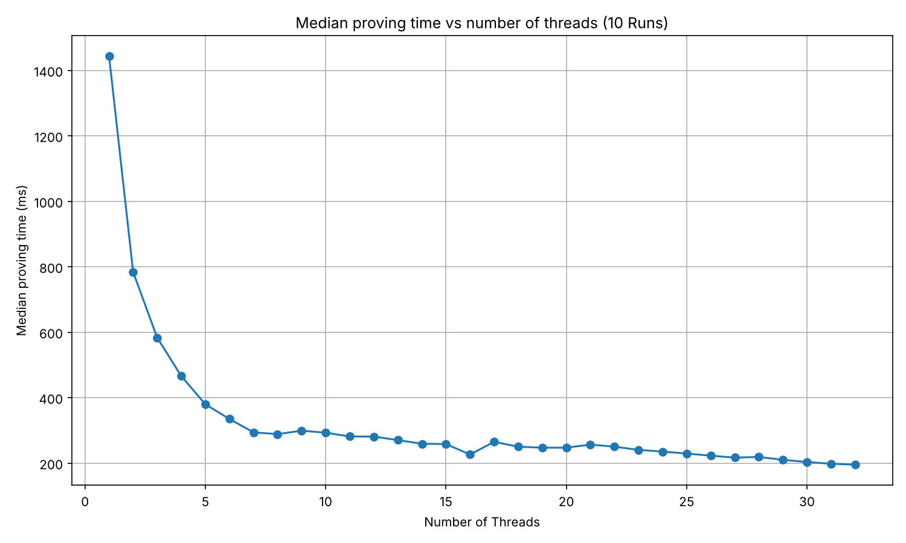

# MANTLE

| Field | Value |
| --- | --- |
| Name | Mantle |
| Slug | 98 |
| Status | raw |
| Category | Informational |
| Editor | Thomas Lavaur <thomas@logos.co> |
| Contributors | David Rusu <davidrusu@logos.co>, Filip Dimitrijevic <filip@logos.co>, Marcin Pawlowski <marcin@logos.co> |

<!-- timeline:start -->

## Timeline

- **2026-05-27** — [`b7602ed`](https://github.com/logos-co/logos-lips/blob/b7602ed8a225d41ca0bfaaa432524dc84d2ded7e/docs/blockchain/raw/bedrock-v1.1-mantle-specification.md) — chore: move blockchain specs from notion to github
- **2026-05-18** — [`58b5698`](https://github.com/logos-co/logos-lips/blob/58b56988429f4d69a9e10a9fc118725e229e37c5/docs/blockchain/raw/bedrock-v1.1-mantle-specification.md) — chore(blockchain): migrate contributor emails to @logos.co (#338)
- **2026-01-19** — [`f24e567`](https://github.com/logos-co/logos-lips/blob/f24e567d0b1e10c178bfa0c133495fe83b969b76/docs/blockchain/raw/bedrock-v1.1-mantle-specification.md) — Chore/updates mdbook (#262)
- **2026-01-16** — [`89f2ea8`](https://github.com/logos-co/logos-lips/blob/89f2ea89fc1d69ab238b63c7e6fb9e4203fd8529/docs/blockchain/raw/bedrock-v1.1-mantle-specification.md) — Chore/mdbook updates (#258)

<!-- timeline:end -->

# Revisions History

| **Version** | **Changes** | Date |
| --- | --- | --- |
| 1.1.0 | Initial revision. | 2026-12-01 |
| 1.2.0 | Removed DA references. Removed notions of Sovereignty and Rollups and used Zones for simplicity. Removed Nomos from specifications and DSTs. Added bridging and decentralized sequencing for channels. | 2026-01-01 |
| 1.2.1 | [RFC] Improve Mantle Transaction hash. | 2026-03-25 |
| 1.3.0 | [[RFC] Make Ledger Transaction an Operation](mantle-transaction-encoding/appendices/rfc-make-ledger-transaction-an-operation.md). | 2026-04-02 |
| 1.4.0 | [[RFC] Enforce NoteId uniqueness](mantle-transaction-encoding/appendices/rfc-enforce-noteid-uniqueness.md). | 2026-04-24 |
| 1.5.0 | [[RFC] Simplify Mantle Transaction and Refactor Ledger Operations](mantle-transaction-encoding/appendices/rfc-simplify-mantle-transaction-and-refactor-ledger-operations.md). | 2026-05-06 |
| 1.6.0 | [RFC] Remove Concept of a Session | 2026-06-22 |
| 1.7.0 | Factor out the multi eddsa threshold verification and added a validation step in channel config to check the new config threshold is lower or equal than the number of accredited keys | 2026-06-25 |
| 1.8.0 | [RFC] Update channels to support proof of stake participation and test vectors for OpId and Mantle Transaction Hash | 2026-07-06 |
| 1.9.0 | Update the execution of `CHANNEL_DEPOSIT` to consume the inputs and recreate them in the channel, updating their NoteId avoid replay attacks in case of withdraw after a deposit | 2026-07-27 |
| 1.9.1 | Rename the excess balance left after the mandatory fees into `tx_priority_tip` and convert it back into a `TokenValue` explicitly | 2026-08-05 |
| 1.9.2 | Required checked arithmetic for all token value, balance, gas, and fee computations. | 2026-08-06 |
| 1.10.0| Enforce non empty inputs for every operation not only transfer moving the assertion in the validation of input spendability | 2026-08-11 |
| 1.10.1| [RFC] One canonical encoding for `ServiceType` and `Locator`: `ServiceType` is its one-byte discriminant and `Locator` is the multiaddr binary form. Added a `declaration_id` test vector | 2026-08-14 |
| 1.10.2| Precise the state validation reads: the Operations of a Mantle Transaction are validated and executed one after the other in the order they appear, each against the state the preceding ones left, and a Mantle Transaction against the state the transactions preceding it in the block left. Accumulated the transaction balance along that pass, replacing `get_transaction_balance` | 2026-08-24 |
| 1.11.0 | Track the configuration lineage of a channel: `ChannelState` gains `config_tip_hash` and the `CHANNEL_CONFIG` payload carries the `parent` configuration it extends, ordering configurations and preventing their replay | 2026-08-27 |
| 1.11.1 | Renamed locked notes into service notes: `service_notes`, `ServiceNote` and `service_note_id` replace their locked counterparts, and the note kind is named after the role it plays rather than after the state it is left in | 2026-08-27 |
| 1.12.0 | Specified the `SDP_ACTIVE` execution effects, matching the implementation: `active` is set to the epoch of the including block, and a message the activity logic rejects makes the Operation invalid. Set `withdraw_at` to `current_epoch + 2`, the epoch at which the node stops providing the service, and removed declarations at `withdraw_at` | 2026-09-02 |
| 1.13.0 | Removed the `None` case of `op_proofs`, every Operation carrying exactly one proof. A `CHANNEL_CONFIG` creating a channel is verified against a threshold of `0` and its proof carries no signature and no index. Execution Gas is derived from the Operation and the state it is validated against, the thresholds pricing the channel Operations being the ones held in the channel state | 2026-08-31 |
| 1.14.0 | Moved SDP declaration removal to `withdraw_at + 1`; the last served epoch's reward is paid in the same first block, before removal | 2026-09-11 |
| 1.15.0 | Add the `CLAIM_POW_REWARD` Operation and the proof of work state it is validated against; the reward pool and the difficulty controllers are specified in [Proof of Work](proof-of-work.md) | 2026-09-08 |
| 1.16.0 | Gas Determination table updated for strict Ed25519 verification: channel Operations 56 → 59 Execution Gas per signature, `EXECUTION_SDP_DECLARE_GAS` 646 → 649, from [Gas Cost Determination](analysis-gas-cost-determination.md) 1.7.0 | 2026-09-24 |
| 2.0.0 | Change the utxo ledger to support private notes with transaction unlinkability, kept in a ledger, an SDP and one note set per channel. Channel notes are moved by the steps their holders sign and are withdrawn by their holders. Removed `LEADER_CLAIM` and `CHANNEL_TRANSFER`, signed `SDP_ACTIVE` with the `provider_id` and made the `CLAIM_POW_REWARD` ticket publicly verifiable | 2026-10-01 |

# Introduction

Mantle is a foundational element of Bedrock, designed to provide a minimal and efficient execution layer that connects together Bedrock Services in order to provide the necessary functionality for Zones. It can be viewed as the system call interface of Bedrock, exposing a safe and constrained set of Operations to interact with lower-level Bedrock services, similar to syscalls in an operating system.

Mantle Transactions provide Operations for Zones and blockchain Services to interact with Bedrock. For example, a Zone sequencer posting an update to Bedrock, or a node operator declaring its participation in the Blend Network, would be done through the corresponding Operations within a Mantle Transaction.

Mantle manages assets using a private note-based ledger that follows an UTXO model. Each Mantle Transaction can include Transfer Operation, and any excess balance serves as the fee payment.

# Overview

## Mantle Transaction

The features of the Logos Blockchain are exposed through Mantle Transactions. Each transaction can contain one or more **Operations**. Mantle Transactions enable users to execute multiple Operations atomically: the Operations are applied one after the other in the order they appear, and either all of them take effect or none does.

## Mantle Operations

Logos Blockchain features are exposed through Mantle Operations, which can be combined in a single Mantle Transaction and valided atomically. These Operations enable transfers and functions such as on-chain data posting, Cross-Zone interactions and SDP interaction.

## Mantle Ledger

The Mantle Ledger enables asset transfers using an obfuscated UTXO model. The ledger tracks three kinds of notes, each in note sets of its own: regular notes, service notes (collateral for service declarations) and channel notes (channel bridge funds). All of them are shielded and participate in Proof of Stake.

## Transaction Fees

Mantle Transaction fees are derived from a gas model. The Logos Blockchain has two different gas markets, accounting for permanent data storage, and execution costs. Each Operation has an associated Execution Gas cost. Users can build unbalanced Mantle Transactions to tip the leaders and incentivize the network to include their transaction.

| Gas Market | Charged On | Pricing Basis |
| --- | --- | --- |
| Execution Gas | Operations | Operation dependent |
| Permanent Storage Gas | Signed Mantle Transaction | Proportional to encoded size |

# Mantle Transaction

Mantle Transactions form the core of Mantle, enabling users to combine multiple Operations to access different functions. Each transaction contains one or more Operations. The system validates the Operations atomically and execute them in their order of apparition.

```python
class MantleTx:
    ops: list[Op]

class Op:
    opcode: byte
    payload: bytes

def mantle_txhash(tx: MantleTx) -> Hash:
    tx_bytes = encode(tx)

    h = Hasher()
    h.update(b"MANTLE_TXHASH_V1")
    h.update(tx_bytes)

    return h.digest()
```

The [hash function used](common-cryptographic-components.md), as well as other cryptographic primitives like ZK proof generation protocol and signature schemes, are described in [Common Cryptographic Components](common-cryptographic-components.md).

## Mantle Transaction Hash

A Mantle Transaction must include all relevant proofs for each Operation.

```python
class SignedMantleTx:
    tx: MantleTx
    op_proofs: list[OpProof] # each Op has exactly 1 associated proof
```

Every proof (zk proofs or signatures) must be cryptographically bound to the `MantleTx` through the `mantle_txhash` to prevent replay attacks. This binding is achieved by including the `MantleTx` hash reduced modulo $`p`$ as a public input in every ZK proof.

```python
mantle_txhash_fr = FiniteField(mantle_txhash, byte_order="little", modulus = p)
```

  `mantle_txhash` is a classical 256-bit hash digest and must be reduced to a field element before being passed to any ZkHasher or used as a ZK public input. We apply a direct modular reduction mod $`p`$ (via `FiniteField(..., modulus=p)`). Since $`p \approx 2^{254}`$, the reduction is slightly non-uniform. This is inconsequential in practice as the collision probability remains around $`2^{-254}`$, and proof binding is derived from the collision-resistance of the classic hash, not from uniformity over $`F_p`$.

## Arithmetic

All arithmetic in this specification is checked. Every addition, subtraction, and multiplication over transaction balance, gas amounts, and fees is performed on the stated integer type, and a Mantle Transaction is invalid if any intermediate or final result cannot be represented in that type; results must never silently wrap around or saturate. Token value is supposed to never exceed the precision of `TokenValue` (see the [Notes](#notes) section).

The pseudocode expresses these checks with the following helpers; a failed check makes the Mantle Transaction invalid:

```python
UINT64_MAX = 2**64 - 1

def checked_uint64(value: int) -> TokenValue:
        assert 0 <= value <= UINT64_MAX
        return value
```

The proof of work difficulty updates are the exception to these bounds; they are specified in [Puzzle Target](proof-of-work.md#puzzle-target).

## Mantle Transaction Fee

The transaction mandatory fee is a sum of two components: the multiplication of the total Execution Gas by the `execution_base_fee`, and the total size of the encoded signed Mantle Transaction multiplied by the `permanent_storage_gas_price`. The execution base fee and the permanent storage gas price are protocol-determined values that are the same for every Mantle Transaction in a block. They are derived following [[Execution Market](execution-market.md) and [Storage Markets](storage-markets.md).

```python
def mandatory_fees(signed_tx: SignedMantleTx,
                   ledger: Ledger,
                   channels: dict[ChannelId, ChannelState],
                   permanent_storage_gas_price: TokenValue, # Given by Storage Market
                   execution_gas_base_price: TokenValue) -> uint64:  # Given by Execution Market
    mantle_tx = signed_tx.tx
    permanent_storage_fees = checked_uint64(len(encode(signed_tx)) * permanent_storage_gas_price)
    tx_execution_gas = 0

    for op in mantle_tx.ops:
        # Compute how much execution gas of this operation as defined
        # in the gas determination Appendix, against the state this
        # Operation is validated against
        tx_execution_gas += execution_gas(op, ledger, channels)
    execution_base_fees = checked_uint64(tx_execution_gas * execution_gas_base_price)

    return checked_uint64(execution_base_fees + permanent_storage_fees)
```

The Execution Gas of an Operation is deterministically derived from that Operation and the state it is validated against.

If the Mantle Transaction is unbalanced (meaning that the Transaction consume more value than it creates) and that the leftover balance cover more than the mandatory fees, the remaining is treated as execution tip fees.

## **Validation**

*Given*

```python
signed_tx = SignedMantleTx(
    tx=MantleTx(ops),
    op_proofs
)

permanent_storage_gas_price: TokenValue # Given by Storage Market
execution_gas_base_price: TokenValue    # Given by Execution Market

ledger: Ledger
channels: dict[ChannelId, ChannelState]
```

The state validation reads is not a fixed snapshot: it advances as the block is processed. A Mantle Transaction is validated against the state left by the Mantle Transactions preceding it in the block, as defined in [Block Proposal Validation](bedrock-v1.1-block-construction.md#block-proposal-validation), and validation and execution then follow one another Operation by Operation, in the order the Operations appear: the Operation at index `i` is validated against the state the Operations at indices `0` to `i-1` left, then executed to produce the state the Operation at index `i+1` is validated against. This is what the `ledger`, `channels` and `declarations` given to each Operation below denote.

The commitment MMRs of the [note sets](#ledger) that some Operations are proven against follow the same Operation by Operation progression, but locally to the Mantle Transaction. Every Operation adding notes to a note set appends their commitments to the buffer of that set for the Mantle Transaction when executed, and every Operation referencing a commitment MMR root of a set references the root of that set at one of the last 1024 blocks, against which it is verified once the buffer of the set is appended to it. An Operation can therefore consume the outputs of a previous Operation of the same Mantle Transaction without waiting for a block to include them.

Atomicity is what a failed check means, not simultaneity. If any of the checks below fails, the whole Mantle Transaction is invalid: none of its Operations takes effect, whether or not it was reached. An invalid Mantle Transaction is never skipped over either, the block including it being invalid and nothing of that block being executed.

Mantle validators will ensure the following:

1. We have exactly one proof for each Operation, of the variant that Operation requires.
    ```python
    assert len(op_proofs) == len(ops)
    ```

2. Each Operation is valid, and takes effect before the next one is validated.
    ```python
    tx_balance = 0
    for op, op_proof in zip(ops, op_proofs):
        assert op.opcode in MANTLE_OPCODES
        validate_mantle_op(mantle_txhash(tx), op.opcode, op.payload, op_proof)
        tx_balance = checked_uint64(tx_balance + excess_value(op))
        execute_mantle_op(op.opcode, op.payload)

    def excess_value(op) -> TokenValue:
        # the excess of every ZkTransfer of the Operation, which pays the fees
        if op.opcode in (TRANSFER, CHANNEL_DEPOSIT, CHANNEL_WITHDRAW, SDP_WITHDRAW):
            return op.payload.excess_value
        return 0

    def validate_mantle_op(txhash, opcode, payload, op_proof):
        if opcode == CHANNEL_INSCRIBE:
            validate_channel_inscribe(txhash, payload, op_proof)
        # elif opcode == ...
        #    ...

    def execute_mantle_op(opcode, payload):
        if opcode == CHANNEL_INSCRIBE:
            execute_channel_inscribe(payload)
        # elif opcode == ...
        #    ...
    ```

3. The Mantle Transaction excess balance pays at least the mandatory fees.
    ```python
    tx_mandatory_fee = mandatory_fees(signed_tx,                        # uint64
                                      ledger,
                                      channels,
                                      permanent_storage_gas_price,
                                      execution_gas_base_price)
    assert tx_mandatory_fee <= tx_balance
    tx_priority_tip = checked_uint64(tx_balance - tx_mandatory_fee)
    ```

## Execution

*Given*

```python
SignedMantleTx(
    tx=MantleTx(ops),
    op_proofs
)
```

Mantle Validators execute each Operation in `ops` according to its opcode, in the order the Operations appear and along the state progression [Validation](#validation) defines. The subsections below define, for each opcode, what validating and executing an Operation amount to.

# Operations

## Opcodes

| **Operation** | **Opcode** | **Description** |
| --- | --- | --- |
| TRANSFER | 0x00 | Consume and create notes. |
| *RESERVED* | *0x01 - 0x0F* |  |
| CHANNEL_CONFIG | 0x10 | Configure a channel |
| CHANNEL_INSCRIBE | 0x11 | Write a message permanently onto Mantle. |
| CHANNEL_DEPOSIT | 0x12 | Deposit notes into a channel |
| CHANNEL_WITHDRAW | 0x13 | Withdraw notes from a channel |
| *RESERVED* | *0x14 - 0x1F* |  |
| SDP_DECLARE | 0x20 | Declare intention to participate as a node in a Bedrock Service, locking notes as collateral. |
| SDP_WITHDRAW | 0x21 | Withdraw participation from a Bedrock Service, unlocking your notes in the process. |
| SDP_ACTIVE | 0x22 | Signal that you are still an active participant of a Bedrock Service. |
| *RESERVED* | *0x23 - 0x2F* |  |
| CLAIM_POW_REWARD | 0x30 | Claim a reward from the pow reward pool. |
| *RESERVED* | *0x31 - 0xFF* |  |

## Channel Operations

Channels allow Zones to post their updates on chain. Channels form virtual chains that overlay on top of the Cryptarchia blockchain. Clients and Followers of a Zone can watch its channel to learn the state of that Zone. Each channel has its own [note set](#ledger), enabling bridging between Zones and Bedrock.

### Message Ordering

Channels form virtual chains by having each message reference its parent message. The order of messages in these channels is enforced by the sequencer by building a hash chain of messages, i.e. new messages reference the previous messages through a parent hash. Given that Cryptarchia has long finality times, these message parent references allow Zone sequencers to continue to post new updates to channels without having to wait for finality. No matter how Cryptarchia forks and reorgs, the channel messages from honest sequencers will eventually be re-included in a way that satisfies the virtual chain order.

Configurations form a second hash chain within the channel: each configuration names the configuration it supersedes, so a pending reconfiguration stays valid while the sequencer keeps posting inscriptions.

The first time a message is sent to an unclaimed channel, the key that signs the initial message becomes the only accredited key in the list (Note that this key may correspond to a threshold signature key). Accredited keys of a channel forms a committee that can configure the channel and take turns to write messages to that channel following a round-robin algorithm. Configuring a channel includes modifying the list of accredited keys, the round-robin parameters and the required number of signatures to establish a new configuration.

Validators must maintain the following state to process channel Operations:

```python
channels: dict[ChannelId, ChannelState] # ChannelId is 32 bytes

class ChannelState:
    # Channel Configuration
    accredited_keys: list[Ed25519PublicKey]  # limited to 65 535 keys
    configuration_threshold: u16  # indicating how many keys are
                                  # required to update the configuration

    # Message Ordering
    tip_hash: hash         # Last message of the channel
    config_tip_hash: hash  # Last configuration of the channel

    # Decentralized Sequencing
    tip_slot: Slot
    tip_sequencer: u16      # indicating the actual
                            # sequencer position in the list of accredited keys
    tip_sequencer_starting_slot: Slot
    posting_timeframe: u32  # number of slots (0 = infinity)
    posting_timeout: u32    # number of slots (0 = no timeout)

    # Bridging
    note_set: int           # index of the note set of the channel in ledger.sets

def default_channel(block_slot: Slot, keys: list[Ed25519PublicKey], note_set: int) -> ChannelState:
    return ChannelState(
        tip_hash = ZERO,
        config_tip_hash = ZERO,
        tip_slot = block_slot,
        accredited_keys = keys,
        tip_sequencer = 0,
        tip_sequencer_starting_slot = block_slot,
        posting_timeframe = 0,
        posting_timeout = 0,
        configuration_threshold = 1,
        note_set = note_set)

def create_channel(channel_id: ChannelId, block_slot: Slot, keys: list[Ed25519PublicKey]):
    # a new channel gets the next note set, so channels are ordered by creation
    ledger.sets.append(empty_note_set())
    channels[channel_id] = default_channel(block_slot, keys, len(ledger.sets) - 1)
```

Note that the user chooses the ChannelId mapping to the ChannelState (but it’s restricted to 32 bytes). We don't currently impose restrictions on it, but we may do so in the future to prevent undesirable behaviors.

### Decentralized Sequencing

To determine which sequencer is currently authorized to send messages, we use a round-robin algorithm. When a message is posted to a channel, the following algorithm is used to determine who the sequencer is:

```python
# Round Robin algorithm determining the new sequencer index and the
# new sequencer starting slot
def round_robin(block_slot: Slot, channel: ChannelState) -> (u16, u64):
    elapsed_slots = block_slot - channel.tip_slot
    if elapsed_slots >= channel.posting_timeout and channel.posting_timeout != 0:
        # Get the number of sequencers that get timed out
        sequencers_timed_out = elapsed_slots // channel.posting_timeout
        index = (
            (channel.tip_sequencer + sequencers_timed_out)
            % len(channel.accredited_keys)
        )
        starting_slot = (
            channel.tip_slot
            + sequencers_timed_out * channel.posting_timeout
        )
    else:
        # Get the number of timeframes elapsed to get who is the sequencer
        tip_sequencer_duration = block_slot - channel.tip_sequencer_starting_slot
        index = (
            (channel.tip_sequencer + (tip_sequencer_duration // channel.posting_timeframe))
            % len(channel.accredited_keys)
        )
        starting_slot = (
            channel.tip_sequencer_starting_slot
            + (tip_sequencer_duration // channel.posting_timeframe) * channel.posting_timeframe
        )
    return (index, starting_slot)
```

### Bridging

Channels let their bridged notes keep participating in Proof of Stake. When a user deposits notes into a channel, they stay on the ledger and are not turned into inert collateral. They are consumed and re-created as shielded notes of the channel's note set, which continue to count toward Proof of Stake and can still be used to create PoLs (see [Channel Notes](#channel-notes)). Two goals motivate this design:

- **More PoS participation, stronger security.** Funds deposited into a channel would otherwise leave the staking set. Keeping them as channel notes means the capital backing the application layer also backs consensus security, so bridging does not shrink the stake that secures the chain.
- **No split between security and application.** A user no longer has to choose between staking funds or using them in a channel. The same funds do both at once. They stay usable inside the channel while still earning Proof of Leadership rewards, so capital is never fragmented between the two.

**Holders keep their notes.** A channel note is a shielded note of the channel's note set, owned by the holder of its `ZkPublicKey`. Only that holder can spend it, in one of two ways:

- *Inside the channel*, the holder signs a step off chain: a ZkTransfer that consumes its channel notes and creates channel notes of the same total value. The sequencers of the channel collect the steps of their users and publish them, in the order they choose, in a [`CHANNEL_INSCRIBE`](#channel_inscribe). The ledger verifies every step, so a sequencer orders the moves of a channel but never makes one.
- *Out of the channel*, the holder posts a [`CHANNEL_WITHDRAW`](#channel_withdraw) alone. Its notes leave the channel at once, and the notes it creates enter the ledger note set `WITHDRAW_DELAY` slots later, so the Zone sees every exit before its value is spendable on the ledger.

**Ageing.** Because a deposit and a step consume notes and create new ones, a channel note restarts the ageing process and must age again before it can create a PoL. Bridged funds still count toward Proof of Stake, so the goals above hold, but the participation is not continuous across these moves.

**What each party can do.**

| Party | Can | Cannot |
|---|---|---|
| Holder of the note's `ZkPublicKey` | Create a PoL with the note and earn its rewards. Sign a step moving the note inside the channel. Withdraw the note alone | Spend the note in any other Operation |
| Channel sequencers | Collect the steps of their users and publish them, in the order they choose, in the inscriptions of the channel | Move a note without its holder's step |

### CHANNEL_INSCRIBE

Write a message to a channel with the message data being permanently stored on the Logos Blockchain, and apply the steps the sequencer collected from the users of the channel.

#### Payload

```python
class ChannelStep:
    inputs: list[NoteNf]        # nullifiers of the consumed channel notes
    outputs: list[NoteCm]       # commitments of the created channel notes
    cm_merkle_root: MerkleRoot  # a recent (less than 1024 blocks) MMR root of the channel note set

class Inscribe:
    channel: ChannelId       # 32 bytes Channel being written to
    inscription : bytes      # Message to be written on the blockchain
    parent: hash             # Previous message in the channel
    signer: Ed25519PublicKey # Identity of message sender
    steps: list[ChannelStep] # Moves of channel notes, in the order they apply
```

A step is signed by the holder of the notes it consumes, off chain and before the Mantle Transaction carrying it exists. Its ZkTransfer is therefore bound to the step itself rather than to the `mantle_txhash`, and it balances exactly, with an `excess_value` of `0`:

```python
def step_msg(step: ChannelStep) -> zkhash:
    return zkhash(
        FiniteField(b"CHANNEL_STEP_V1", byte_order="little", modulus=p),
        FiniteField(len(step.inputs), byte_order="little", modulus=p),
        *step.inputs,
        FiniteField(len(step.outputs), byte_order="little", modulus=p),
        *step.outputs)
```

A step applies once, since its nullifiers can be inserted only once.

#### Proof

```python
class InscribeProof:
    signature: Ed25519Signature    # by the signer, over the mantle_txhash
    step_proofs: list[ZkTransfer]  # one per step, in the order of the steps
```

#### Execution Gas

  Channel Inscribe Operations have an Execution Gas cost of `EXECUTION_CHANNEL_INSCRIBE_GAS + EXECUTION_TRANSFER_GAS * len(steps)`. See [Gas Determination](#gas-determination) for the Execution Gas values.

#### Validation

  *Given*

```python
txhash: hash
msg: Inscribe
proof: InscribeProof

channels: dict[ChannelId, ChannelState]
ledger: Ledger
block_slot: Slot
```
 
  *Validate*

```python
if msg.channel in channels:
    chan = channels[msg.channel]
    current_sequencer_index = round_robin(block_slot, chan)[0]

    # Ensure the signer is the one authorized to write to the channel
    assert msg.signer == chan.accredited_keys[current_sequencer_index]

    # Ensure message is continuing the channel sequence
    assert msg.parent == chan.tip_hash
else:
    # Channel will be created automatically upon execution
    # Ensure that this message is the genesis message (parent == ZERO)
    assert msg.parent == ZERO
    # A channel being created holds no note yet
    assert len(msg.steps) == 0

# Ensure the msg signer signature
assert Ed25519_verify(txhash, msg.signer, proof.signature)

# Ensure every step is spendable in the channel note set and signed by its holder
assert len(proof.step_proofs) == len(msg.steps)
for step, step_proof in zip(msg.steps, proof.step_proofs):
    ledger.assert_spendable(chan.note_set, step.inputs, step.cm_merkle_root)
    assert ZkTransfer_verify(chan.note_set,
                             step.inputs,
                             step.outputs,
                             0,  # a step balances exactly
                             step.cm_merkle_root,
                             step_msg(step),
                             step_proof)
```

The steps are validated against the state the Inscribe Operation is validated against, so a step cannot consume a note created by an earlier step of the same inscription, and two steps cannot consume the same note.

#### Execution

  *Given*

```python
msg: Inscribe

channels: dict[ChannelId, ChannelState]
ledger: Ledger
block_slot: Slot
```

  *Execute*

  1. If the channel does not exist, create it just-in-time.
      ```python
      if msg.channel not in channels:
          create_channel(msg.channel, block_slot, [msg.signer])
      ```

  2. Apply the steps, in their order.
      ```python
      chan = channels[msg.channel]
      for step in msg.steps:
          ledger.execute_spending(chan.note_set, step.inputs)
          ledger.execute_adding(chan.note_set, step.outputs)
      ```

  3. Update the channel sequencer.
      ```python
      chan = channels[msg.channel]
      (new_sequencer_index, new_sequencer_starting_slot) = round_robin(block_slot, chan)

      chan.tip_sequencer_starting_slot = new_sequencer_starting_slot
      chan.tip_sequencer = new_sequencer_index
      ```

  4. Update the channel tip.
      ```python
      chan = channels[msg.channel]
      chan.tip_hash = hash(encode(msg))
      chan.tip_slot = block_slot
      ```

### CHANNEL_CONFIG

Overwrite the configuration of a channel.

#### Payload

```python
class ChannelConfig:
    channel: ChannelId
    parent: hash             # Previous configuration of the channel
    keys: list[Ed25519PublicKey]
    posting_timeframe: u32
    posting_timeout: u32
    configuration_threshold: u16
```

#### Proof

A Channel Config is authorized by a threshold of the channel's accredited keys using [Multiple Ed25519 Signatures Verification](#multiple-ed25519-signatures-verification).

```python
class ChannelConfigOpProof:
    signatures: list[Ed25519Signature] # signatures from configuration_threshold
    indexes: list[u16]  # signatures of accredited keys with their index.
                        # indexes must be ordered from smallest to
                        # biggest without duplication
```

#### Execution Gas

  Channel Config Operations have a linear Execution Gas cost equal to `EXECUTION_CHANNEL_CONFIG_GAS * configuration_threshold`, where `configuration_threshold` is the one held in the channel state, and `0` for a channel that does not exist yet. See [Gas Determination](#gas-determination) for the Execution Gas values.

#### Validation

  *Given*

```python
txhash: zkhash
config: ChannelConfig
proof: ChannelConfigOpProof
channels: dict[ChannelId, ChannelState]
```

  *Validate*

```python
assert config.configuration_threshold > 0
assert len(config.keys) > 0
assert len(config.keys) < 2^16
# The configuration threshold must be reachable with the accredited keys,
# otherwise the channel would be locked out of any future reconfiguration
assert config.configuration_threshold <= len(config.keys)

if config.channel in channels:
    chan = channels[config.channel]

    # Ensure the configuration is extending the last configuration
    # of the channel
    assert config.parent == chan.config_tip_hash

    # Verify the configuration_threshold signatures (see Appendix)
    MultiEd25519_verify(txhash,
                        proof.signatures,
                        proof.indexes,
                        chan.accredited_keys,
                        chan.configuration_threshold)
else:
    # Channel will be created automatically upon execution
    # Ensure that this configuration is the genesis configuration
    assert config.parent == ZERO

    # No key is accredited yet, so the threshold to verify against is 0
    # and the proof must carry no signature and no index (see Appendix)
    MultiEd25519_verify(txhash,
                        proof.signatures,
                        proof.indexes,
                        [],
                        0)
```

#### Execution

  *Given*

```python
config: ChannelConfig

channels: dict[ChannelId, ChannelState]
ledger: Ledger
block_slot: Slot
```

  *Execute*

  1. If the channel does not exist, create it just-in-time.

      ```python
      if config.channel not in channels:
          create_channel(config.channel, block_slot, config.keys)
      ```

  2. Update the configuration.

      ```python
      chan = channels[config.channel]

      # Update Channel Configuration Parameters
      chan.accredited_keys = config.keys
      chan.configuration_threshold = config.configuration_threshold

      # Update Decentralized Sequencing Parameters
      chan.tip_slot = block_slot
      chan.tip_sequencer = 0
      chan.tip_sequencer_starting_slot = block_slot
      chan.posting_timeframe = config.posting_timeframe
      chan.posting_timeout = config.posting_timeout
      ```

  3. Update the configuration tip.

      ```python
      chan = channels[config.channel]
      chan.config_tip_hash = hash(encode(config))
      ```

### CHANNEL_DEPOSIT

Deposit notes to a channel. The deposit consumes notes of the ledger note set and creates notes of the channel note set, which resets their ageing.

A Zone that credits a deposit in its own state must be sure the deposit really lands on-chain. If the Zone reflects the deposit through a `CHANNEL_INSCRIBE` posted in a separate Mantle Transaction, a reorganization can reorder the two so that the inscription is included while the deposit is not, leaving the Zone crediting funds it never received. Two options avoid this:

- Wait for the deposit to be finalized before interpreting it, at the cost of the finalization delay.
- Include the deposit in the same Mantle Transaction as the inscription. Mantle Transactions validate atomically, so the inscription is included only if the deposit is. This removes the waiting period entirely.

#### Payload

```python
class ChannelDeposit:
    channel: ChannelId
    inputs: list[NoteNf]        # nullifiers of the consumed notes of the ledger note set
    cm_merkle_root: MerkleRoot  # a recent (less than 1024 blocks) MMR root of the ledger note set
    outputs: list[NoteCm]       # commitments of the created notes of the channel note set
    excess_value: TokenValue    # the excess to pay the fees
    metadata: bytes
```

#### Proof

  A Channel Deposit proves the ownership of the notes being consumed, the created notes and the excess value using a [Zero Knowledge Transfer Proof (ZkTransfer)](#zero-knowledge-transfer-proof-zktransfer).

```python
ZkTransfer
```

#### Execution Gas

  Channel Deposit Operations have a fixed Execution Gas cost of `EXECUTION_CHANNEL_DEPOSIT_GAS`. See [Gas Determination](#gas-determination) for the Execution Gas values.

#### Validation

  *Given*

```python
mantle_txhash: zkhash # zkhash of mantle tx containing this ledger tx
deposit: ChannelDeposit
deposit_proof: ZkTransfer

channels: dict[ChannelId, ChannelState]

ledger: Ledger
```

  *Validate*

  1. Verify that the channel exist
      ```python
      assert deposit.channel in channels
      ```

  2. Ensure all inputs are spendable in the ledger note set.
      ```python
      ledger.assert_spendable(LEDGER_SET, deposit.inputs, deposit.cm_merkle_root)
      ```

  3. Validate ownership over deposited notes and balance.
      ```python
      assert ZkTransfer_verify(LEDGER_SET,
                               deposit.inputs,
                               deposit.outputs,
                               deposit.excess_value,
                               deposit.cm_merkle_root,
                               mantle_txhash,
                               deposit_proof)
      ```

#### Execution

  *Given*

```python
deposit: ChannelDeposit

channels: dict[ChannelId, ChannelState]

ledger: Ledger
```

  *Execute*

Consume the inputs in the ledger note set and create the outputs in the channel note set.

```python
ledger.execute_spending(LEDGER_SET, deposit.inputs)
ledger.execute_adding(channels[deposit.channel].note_set, deposit.outputs)
```

### CHANNEL_WITHDRAW

Withdraw notes from a channel. The holder of the notes posts the withdrawal alone: it consumes notes of the channel note set at once, and its outputs enter the ledger note set `WITHDRAW_DELAY` slots later, so the Zone sees every exit before its value is spendable on the ledger.

```python
WITHDRAW_DELAY: Slot = 86_400  # 1 day
```

#### Payload

```python
class ChannelWithdraw:
    channel: ChannelId
    inputs: list[NoteNf]        # nullifiers of the consumed notes of the channel note set
    cm_merkle_root: MerkleRoot  # a recent (less than 1024 blocks) MMR root of the channel note set
    outputs: list[NoteCm]       # commitments of the notes created in the ledger note set
    excess_value: TokenValue    # the excess to pay the fees
```

#### Proof

  A Channel Withdraw proves the ownership of the notes being consumed, the created notes and the excess value using a [Zero Knowledge Transfer Proof (ZkTransfer)](#zero-knowledge-transfer-proof-zktransfer).

```python
ZkTransfer
```

#### Execution Gas

  Channel Withdraw Operations have a fixed Execution Gas cost of `EXECUTION_CHANNEL_WITHDRAW_GAS`. See [Gas Determination](#gas-determination) for the Execution Gas values.

#### Validation

  *Given*

```python
mantle_txhash: zkhash
withdrawal: ChannelWithdraw
proof: ZkTransfer

channels: dict[ChannelId, ChannelState]
ledger: Ledger
```

  *Validate*

  1. Check that the channel exists
      ```python
      assert withdrawal.channel in channels
      chan = channels[withdrawal.channel]
      ```

  2. Ensure all inputs are spendable in the channel note set.
      ```python
      ledger.assert_spendable(chan.note_set, withdrawal.inputs, withdrawal.cm_merkle_root)
      ```

  3. Validate ownership over the withdrawn notes and balance.
      ```python
      assert ZkTransfer_verify(chan.note_set,
                               withdrawal.inputs,
                               withdrawal.outputs,
                               withdrawal.excess_value,
                               withdrawal.cm_merkle_root,
                               mantle_txhash,
                               proof)
      ```

#### Execution

  *Given*

```python
withdrawal: ChannelWithdraw

channels: dict[ChannelId, ChannelState]
ledger: Ledger
block_slot: Slot
```

  *Execute*

Consume the inputs in the channel note set, and keep the outputs until their due slot.

```python
ledger.execute_spending(channels[withdrawal.channel].note_set, withdrawal.inputs)
ledger.pending_withdrawals.append((block_slot + WITHDRAW_DELAY, withdrawal.outputs))
```

At the start of every block, before its transactions, the outputs of every pending withdrawal whose due slot is reached are appended to the ledger note set (see [Block Execution](bedrock-v1.1-block-construction.md#block-execution)):

```python
def release_withdrawals(block_slot: Slot):
    pending = []
    for (due, outputs) in ledger.pending_withdrawals:
        if due <= block_slot:
            ledger.execute_adding(LEDGER_SET, outputs)
        else:
            pending.append((due, outputs))
    ledger.pending_withdrawals = pending
```

## Service Declaration Protocol (SDP) Operations

These Operations implement the [Service Declaration Protocol](bedrock-service-declaration-protocol.md).

Validators must keep the following state when implementing SDP Operations:

```python
declarations: dict[DeclarationID, DeclarationInfo]
```

### Common SDP Structures

```python
class ServiceType(Enum):
    BN=0 # Blend Network; the one-byte discriminant is the canonical encoding

class Locator(bytes):
    # multiaddr binary form; the canonical encoding
    # (see SDP: Locators)
    def validate(self):
        assert len(self) <= 329
        assert validate_multiaddr(self)

class MinStake:
    stake_threshold: int # stake value
    epoch: EpochNumber # epoch number

class ServiceParameters:
    inactivity_period: NumberOfEpochs # number of epochs
    epoch: EpochNumber                # epoch number at which the Service Parameters were set

class DeclarationInfo:
    service: ServiceType
    locators: list[Locator]
    provider_id: Ed25519PublicKey
    zk_id: ZkPublicKey
    service_note: NoteCm             # the note of the SDP note set staked by the declaration
    withdraw_outputs: list[NoteCm]   # the notes the withdrawal creates, released at removal
    created: EpochNumber
    active: EpochNumber
    withdraw_at: EpochNumber | None
    # SDP ops updating a declaration must use monotonically increasing nonces
    nonce: int
```

### SDP_DECLARE

The service registration follows the definition given in [**Declaration Message**](bedrock-service-declaration-protocol.md#declaration-message):

#### Payload

```python
class DeclarationMessage:
    service_type: ServiceType
    locators: list[Locator]
    provider_id: Ed25519PublicKey
    zk_id: ZkPublicKey
    inputs: list[NoteNf]
    cm_merkle_root: MerkleRoot
    amount: TokenValue
```

Service notes are introduced in [Service notes](#service-notes) and serve as Service collaterals. They cannot be spent before the owner withdraws its participation from the declared service.

#### Proof

```python
class DeclarationProof:
    zk_proof: ZkTransfer             # proving spendability over inputs
    provider_sig: Ed25519Signature  # signature proving ownership of provider key
```

  see: [Zero Knowledge Transfer Proof (ZkTransfer)](#zero-knowledge-transfer-proof-zktransfer).

#### Execution Gas

  SDP Declare Operations have a fixed Execution Gas cost of `EXECUTION_SDP_DECLARE_GAS`. See [Gas Determination](#gas-determination) for the Execution Gas values.

#### Validation

  *Given*

```python
txhash: zkhash                  # the txhash of the transaction we are validating
declaration: DeclarationMessage # the declaration we are validating
proof: DeclarationProof

min_stake: MinStake      # the (global) minimum stake setting
ledger: Ledger           # the set of unspent notes
declarations: dict[DeclarationID, DeclarationInfo]
```

  *Validate*

  The declaration is verified according to [Declare](bedrock-service-declaration-protocol.md#declare).

  1. Ensure ownership over the inputs and `provider_id`.
      ```python
      assert ZkTransfer_verify(LEDGER_SET,
                               declaration.inputs,
                               [], # no outputs
                               declaration.amount,
                               declaration.cm_merkle_root,
                               txhash,
                               proof.zk_proof)
      assert Ed25519_verify(txhash, declaration.provider_id, proof.provider_sig)
      ```

  2. Ensure declaration does not already exist.
      ```python
      assert declaration_id(declaration) not in declarations
      ```

  3. Ensure the locators list is non-empty and has no more than 8 entries.
      ```python
      assert len(declaration.locators) >= 1
      assert len(declaration.locators) <= 8
      ```

  4. Ensure the inputs are spendable and the value is sufficient for joining the service.
      ```python
      ledger.assert_spendable(LEDGER_SET, declaration.inputs, declaration.cm_merkle_root)
      assert declaration.amount >= min_stake.stake_threshold
      ```

#### Execution

  *Given*

```python
declaration: DeclarationMessage # the declaration we are executing
current_epoch: EpochNumber
ledger: Ledger
declarations: dict[DeclarationID, DeclarationInfo]
```

  *Execute*

  1. Consume the inputs in the ledger note set.
      ```python
      ledger.execute_spending(LEDGER_SET, declaration.inputs)
      ```

  2. Create the service note under the `zk_id` in the SDP note set.
      ```python
      declaration_op_id = derive_op_id(declaration)
      service_note = Note(
          value=declaration.amount,
          nonce=derive_note_nonce(declaration_op_id, 0, declaration.amount, declaration.zk_id),
          public_key=declaration.zk_id
      )
      ledger.execute_adding(SDP_SET, [derive_note_cm(service_note)])
      ```

  3. Store the declaration as explained in [**Declaration Storage**](bedrock-service-declaration-protocol.md#declaration-storage).
      ```python
      declare_id = declaration_id(declaration)
      declarations[declare_id] = DeclarationInfo(
          service: declaration.service
          locators: declaration.locators
          provider_id: declaration.provider_id
          zk_id: declaration.zk_id
          service_note: derive_note_cm(service_note)
          withdraw_outputs: []
          created=current_epoch,
          active=current_epoch + 2,
          withdraw_at=None
          nonce=0
      )
      ```

### SDP_WITHDRAW

The service withdrawal follows the definition given in [Withdraw Message](bedrock-service-declaration-protocol.md#withdraw-message).

#### Payload

```python
class WithdrawMessage:
    declaration: DeclarationID
    nonce: int
    service_note_nf: NoteNf     # nullifier of the service note of the declaration
    outputs: list[NoteCm]       # commitments of the notes created in the ledger note set
    excess_value: TokenValue    # the excess to pay the fees
```

The withdrawal consumes the service note of the declaration and creates the notes that return its value. Its ZkTransfer is proven against the root of a Merkle tree whose only leaf is the service note, every other node being `0`. That root is computed from the commitment held in the declaration, so the nullifier is the one of this service note and of no other note:

```python
def single_note_root(note_cm: NoteCm) -> MerkleRoot:
    root = note_cm
    for height in range(32):
        root = zkhash(root, 0)
    return root
```

#### Proof

  A signature from the `provider_id` attached to the declaration and a [Zero Knowledge Transfer Proof (ZkTransfer)](#zero-knowledge-transfer-proof-zktransfer) by the holder of the service note are required for withdrawing from a service.

```python
class WithdrawProof:
    zk_proof: ZkTransfer             # consuming the service note
    provider_sig: Ed25519Signature   # signature proving ownership of provider key
```

#### Execution Gas

  SDP Withdraw Operations have a fixed Execution Gas cost of `EXECUTION_SDP_WITHDRAW_GAS`. See [Gas Determination](#gas-determination) for the Execution Gas values.

#### Validation

  *Given*

```python
txhash: zkhash # Mantle transaction hash of the tx containing this operation
withdraw: WithdrawMessage
proof: WithdrawProof

ledger: Ledger
declarations: dict[DeclarationID, DeclarationInfo]
```

  *Validate*

  Validate SDP withdrawal according to [**Withdraw**](bedrock-service-declaration-protocol.md#withdraw).

  1. Ensure declaration exists.
      ```python
      assert withdraw.declaration in declarations
      declare_info = declarations[withdraw.declaration]
      ```
  2. Ensure the declaration is not already scheduled for withdrawal.
      ```python
      assert declare_info.withdraw_at is None
      ```
  3. Ensure the `provider_id` attached to this declaration authorized this Operation.
      ```python
      assert Ed25519_verify(txhash, declare_info.provider_id, proof.provider_sig)
      ```
  4. Ensure that the nonce is greater than the previous one.
      ```python
      assert withdraw.nonce > declare_info.nonce
      ```
  5. Ensure the service note of the declaration is consumed by its holder and balances the outputs.
      ```python
      assert withdraw.service_note_nf not in ledger.sets[SDP_SET].nullifiers
      assert ZkTransfer_verify_root([withdraw.service_note_nf],
                                    withdraw.outputs,
                                    withdraw.excess_value,
                                    single_note_root(declare_info.service_note),
                                    txhash,
                                    proof.zk_proof)
      ```

#### Execution

  *Given*

```python
withdraw: WithdrawMessage

current_epoch: EpochNumber # current epoch
ledger: Ledger
declarations: dict[DeclarationID, DeclarationInfo]
```

  *Execute*

  Executes the withdrawal protocol [**Withdraw**](bedrock-service-declaration-protocol.md#withdraw).

  1. Update the declaration info with the nonce, the withdrawal epoch and the notes released at removal.
      ```python
      declare_info = declarations[withdraw.declaration]
      declare_info.nonce = withdraw.nonce
      declare_info.withdraw_at = current_epoch + 2
      declare_info.withdraw_outputs = withdraw.outputs
      ```

  2. Consume the service note in the SDP note set.
      ```python
      ledger.execute_spending(SDP_SET, [withdraw.service_note_nf])
      ```

### SDP Epoch Finalization

Withdrawn declarations are removed by Mantle as part of the epoch transition,
not when the `WithdrawMessage` is processed. The rewards of epoch
`withdraw_at - 1` ([Withdraw](bedrock-service-declaration-protocol.md#withdraw))
are distributed in the first block of epoch `withdraw_at + 1` (see
[Service Reward Distribution Protocol](bedrock-service-reward-distribution.md)).
In that same block, after the rewards have been distributed, every declaration
with `withdraw_at + 1 <= current_epoch` is removed and its stake unlocked.
Declarations that withdrew without earning a final reward are removed by the
same step.

  *Given*

```python
current_epoch: EpochNumber
ledger: Ledger
declarations: dict[DeclarationID, DeclarationInfo]
```

  *Execute*

  For every `declare_id`, `declare_info` in `declarations` where
  `declare_info.withdraw_at is not None and declare_info.withdraw_at + 1 <= current_epoch`:

  1. Release the notes created by the withdrawal in the ledger note set.
      ```python
      ledger.execute_adding(LEDGER_SET, declare_info.withdraw_outputs)
      ```

  2. Remove the declaration.
      ```python
      del declarations[declare_id]
      ```

### SDP_ACTIVE

The service active action follows the definition given in [Active Message](bedrock-service-declaration-protocol.md#active-message).

#### Payload

```python
class Active:
    declaration: DeclarationID
    nonce: int
    metadata: bytes # a service-specific node activeness metadata
```

#### Proof

  A signature from the `provider_id` attached to the declaration.

```python
Ed25519Signature
```

#### Execution Gas

  SDP Active Operations have a fixed Execution Gas cost of `EXECUTION_SDP_ACTIVE_GAS`. See [Gas Determination](#gas-determination) for the Execution Gas values.

#### Validation

  *Given*

```python
txhash: zkhash # Mantle transaction hash of the tx containing this operation
active: Active
signature: Ed25519Signature

declarations: dict[DeclarationID, DeclarationInfo]
```

  *Validate*

```python
assert active.declaration in declarations
declaration_info = declarations[active.declaration]

assert active.nonce > declaration_info.nonce

assert Ed25519_verify(txhash, declaration_info.provider_id, signature)
```

#### Execution

  *Given*

```python
active: Active

current_epoch: EpochNumber # epoch of the block containing this operation
declarations: dict[DeclarationID, DeclarationInfo]
```

  *Execute*

  Executes the active protocol [Active](bedrock-service-declaration-protocol.md#active). If the service-specific activity logic rejects the message, the Operation is invalid.

  1. Update the declaration info with the nonce and the epoch.
      ```python
      declaration_info = declarations[active.declaration]
      declaration_info.nonce = active.nonce
      declaration_info.active = current_epoch
      ```

## Proof of Work Operations

Validators must maintain the following state to process proof of work Operations:

```python
pow_reward_pool: TokenValue      # Reserve the rewards are paid from
epoch_pow_reward: TokenValue     # Reward per claim, fixed for the epoch
difficulty_reward: PowTarget     # the reward threshold, retargeted every block
pow_nullifiers: set[zkhash]      # Spent solutions, retained for the acceptance window
block_slots: dict[hash, SlotNumber]  # Slots of recently seen blocks, for the window check
```

`PowTarget`, the acceptance window, and the maintenance of `pow_reward_pool`, `epoch_pow_reward` and `difficulty_reward` between blocks are specified in [Proof of Work](proof-of-work.md).

### CLAIM_POW_REWARD

This Operation claims a reward from the proof of work [reward pool](proof-of-work.md#reward-pool) by presenting a puzzle solution.

#### Payload

```python
class ClaimPowRewardOp:
    epoch_nonce: zkhash        # Epoch nonce the solution was found against
    block_hash: hash           # Recent canonical block the solution is anchored to
    public_key: ZkPublicKey    # Key the reward note is paid to
    nonce: FrElement           # Value searched for a ticket satisfying the reward threshold
```

#### Proof

  The proof is empty.

#### Execution gas

  Claim Operations have a fixed Execution Gas cost of `EXECUTION_CLAIM_POW_REWARD_GAS`. See [Gas Determination](#gas-determination) for the Execution Gas values.

#### Validation

  *Given*

```python
claim: ClaimPowRewardOp            # the CLAIM_POW_REWARD payload

current_slot: SlotNumber           # slot of the block including this claim
epoch_nonce_current: zkhash        # Cryptarchia epoch nonce of the current epoch
epoch_nonce_previous: zkhash       # and of the epoch before it
WINDOW: SlotNumber                 # the acceptance window, in slots
difficulty_reward: PowTarget       # retargeted every block
pow_nullifiers: set[zkhash]        # spent solutions, retained for WINDOW
pow_reward_pool: TokenValue
epoch_pow_reward: TokenValue
```

  The epoch nonces are the Cryptarchia epoch nonce $`\eta`$ of [Epoch Nonce](cryptarchia-v1-protocol.md#epoch-nonce), and `WINDOW` is derived in [Acceptance Window](proof-of-work.md#acceptance-window).

  *Validate*

```python
# 1. Claiming must be enabled for this block: the pool must be able to cover a reward.
assert epoch_pow_reward > 0
assert pow_reward_pool >= epoch_pow_reward

# 2. The referenced block must be canonical and within the acceptance window.
block = get_block_from_hash(claim.block_hash)   # None if unknown or not canonical
assert block is not None
assert 0 <= current_slot - block.slot <= WINDOW

# 3. The solution must have been found against the current or the previous epoch.
assert claim.epoch_nonce in (epoch_nonce_current, epoch_nonce_previous)

# 4. The ticket must satisfy the reward threshold.
puzzle_ticket = zkhash(claim.nonce,
                       claim.public_key,
                       FiniteField(claim.block_hash, byte_order="little", modulus=p),
                       claim.epoch_nonce)
assert puzzle_ticket < difficulty_reward

# 5. The solution must not have been claimed before. The nullifier is the ticket.
assert puzzle_ticket not in pow_nullifiers
```

#### Execution

  *Given*

```python
claim: ClaimPowRewardOp
puzzle_ticket: zkhash              # computed in validation step 4

ledger: Ledger
pow_reward_pool: TokenValue
epoch_pow_reward: TokenValue       # fixed for the epoch
pow_nullifiers: set[zkhash]
```

  *Execution*

  1. Add `puzzle_ticket` to the `pow_nullifiers` set. The entry is retained until the claim's referenced block leaves the [acceptance window](proof-of-work.md#acceptance-window).
  2. Construct a single output note of value `epoch_pow_reward` under the public key given in the payload, and insert it into the Ledger:
      ```python
      claim_id = derive_op_id(claim)
      output_note = Note(
          value = epoch_pow_reward,
          nonce = derive_note_nonce(claim_id, 0, epoch_pow_reward, claim.public_key),
          public_key = claim.public_key,
      )
      ledger.execute_adding(LEDGER_SET, [derive_note_cm(output_note)])
      ```

  3. Reduce the `pow_reward_pool` by the same amount:
      ```python
      pow_reward_pool = checked_uint64(pow_reward_pool - epoch_pow_reward)
      ```

## TRANSFER

Transfer prove the correct consumption and creation of notes. Because notes aren't transparent, this is done by a ZK proof (see [Zero Knowledge Transfer Proof (ZkTransfer)](#zero-knowledge-transfer-proof-zktransfer)), proving the correctness of the transfer and outputting the excess value of the transfer balance to pay for the fees.

Transactions have complete transaction unlinkability and the public key spending the note is hidden in the commitment.

### Payload

```python
class Transfer:
    inputs: list[NoteNf]  		# the list of consumed note nullifiers
                          		# must be non-empty
    outputs: list[NoteCm]       # the list of created note commitments
    cm_merkle_root: MerkleRoot  # a recent (less than 1024 blocks) MMR root of commitments
    excess_value: TokenValue	# the excess to pay the fees
```

### Proof

  A Transfer proves the inputs, outputs and excess balance with a [Zero Knowledge Transfer Proof (ZkTransfer)](#zero-knowledge-transfer-proof-zktransfer).

```python
ZkTransfer
```

### Execution Gas

  Transfer have a fixed Execution Gas cost of `EXECUTION_TRANSFER_GAS`. See [Gas Determination](#gas-determination) for the Execution Gas values.

### Validation

  *Given*

```python
mantle_txhash: zkhash # zkhash of mantle tx containing this ledger tx
transfer: Transfer
transfer_proof: ZkTransfer

ledger: Ledger
```

  *Validate*

  1. Ensure all inputs are spendable.
      ```python
      ledger.assert_spendable(LEDGER_SET, transfer.inputs, transfer.cm_merkle_root)
      ```

  2. Validate transfer proof.
      ```python
      assert ZkTransfer_verify(LEDGER_SET,
                               transfer.inputs,
                               transfer.outputs,
                               transfer.excess_value,
                               transfer.cm_merkle_root,
                               mantle_txhash,
                               transfer_proof)
      ```

### Execution

  *Given*

```python
transfer: Transfer

ledger: Ledger
```

  *Execution*

  1. Remove inputs from the ledger.
      ```python
      ledger.execute_spending(LEDGER_SET, transfer.inputs)
      ```

  2. Add outputs to the ledger.
      ```python
      ledger.execute_adding(LEDGER_SET, transfer.outputs)
      ```

# Mantle Ledger

## Notes

Notes are composed of three fields representing their value and their owner:

```python
class Note:
    value: TokenValue   # uint64
    nonce: NoteNonce	# FrElement to avoid two notes having the same commitment
    public_key: ZkPublicKey # 32 bytes
```

### Note Commitment and Nullifier

A note can be uniquely identified by its fields. Using the same fields will lead to the same note which is spendable only once. For notes the ledger creates itself, such as rewards and service notes, the nonce can be derived from the Operation that created it and its output number: `(op_id, output_number)` if each Operation are uniquely identifiable. For this reason, every Operation that output notes have a unique payload that is used to derive the Operation identifier.

```python
def derive_op_id(operation: Op) -> Hash:
    op_bytes = encode(op)
    h = Hasher() # /!\ This is a classic hash not a zkhash /!\
    h.update(b"OPERATION_ID_V1")
    h.update(op_bytes)
    return h.digest()

def derive_note_nonce(op_id: Hash, output_number: int, value: TokenValue, public_key: ZkPublicKey) -> NoteNonce:
    return zkhash(
        FiniteField(b"NOTE_NONCE_V1", byte_order="little", modulus= p),
        FiniteField(op_id, byte_order="little", modulus= p),
        FiniteField(output_number, byte_order="little", modulus= p),
        FiniteField(value, byte_order="little", modulus= p),
        public_key
    )
    
def derive_note_cm(note: Note) -> NoteCm:
    return zkhash(
        FiniteField(b"NOTE_CM_V1", byte_order="little", modulus= p),
        FiniteField(note.value, byte_order="little", modulus= p),
        note.nonce,
        note.public_key
    )
	
def derive_note_nf(note_cm: NoteCm, secret_key: ZkSecretKey) -> NoteNf:
    return zkhash(
        FiniteField(b"NOTE_NF_V1", byte_order="little", modulus= p),
        note_cm,
        secret_key
    )
```

`op_id` is a classical 256-bit hash digest and must be reduced to a field element before being passed to the ZkHasher. We apply a direct modular reduction mod `p` (via `FiniteField(..., modulus=p)`). Since $`p \approx2^{-254}`$, the reduction is slightly non-uniform, values in $`[0, 2^{256} \mod p)`$ appear one extra time, but this is inconsequential in practice: the collision probability remains around $`2^{-254}`$, and `NoteNonce` uniqueness is not derived from uniformity of `op_id` over $`𝔽_p`$ but from the collision-resistance of the underlying hash and per-operation payload uniqueness.

These note commitments and nullifiers uniquely define notes in the system. Nodes maintain each [note set](#ledger) through an MMR for note commitments and an indexed merkle tree for note nullifiers.

### Service notes

Service notes are special notes in Mantle that serve as collateral for Service Declarations. Executing a Declare Operation consumes notes of the ledger note set and creates one service note under the declaration's `zk_id` in the SDP note set, its commitment kept with the declaration. A note of the SDP note set is spent only by the Withdraw Operation of its declaration, and the notes that withdrawal creates enter the ledger note set when the declaration is removed. Service notes participate in Proof of Stake.

### Channel Notes

Channel notes are the notes of the note set of a channel, created by deposits and by the steps of the channel's inscriptions. They are spent only by the steps of the channel's inscriptions and by withdrawals, and they participate in Proof of Stake.

## Ledger

The notes live in note sets, each with its own commitment MMR and nullifier IMT. A note belongs to one set from its creation until it is consumed, and is spent only by the Operations of that set:

| Note set | Index | Notes | Spent by |
| --- | --- | --- | --- |
| Ledger | `LEDGER_SET = 0` | the notes of transfers, rewards and withdrawals | Transfers, deposits and declarations |
| SDP | `SDP_SET = 1` | service notes | the Withdraw Operation of their declaration |
| Channel | `2` onward, in the order the channels were created | channel notes | the steps of the channel's inscriptions, and withdrawals |

```python
class NoteSet:
    commitments: list[MerkleRoot]       # the peaks of the commitment MMR
    nullifiers: set[NoteNf]             # the set of nullifiers, maintained in an IMT
    recent_cm_roots: list[MerkleRoot]   # the commitment MMR roots of the last 1024 blocks
    tx_cm_buffer: list[NoteCm]          # the commitments added by the previous Operations
                                        # of the Mantle Transaction, empty at its start

class Ledger:
    sets: list[NoteSet]                              # indexed as in the table above
    pending_withdrawals: list[(Slot, list[NoteCm])]  # channel withdrawals waiting for their due slot

def empty_note_set() -> NoteSet:
    # an empty commitment MMR and a nullifier IMT holding only its sentinel
    ...
```

The note sets are what the [Proof of Leadership](cryptarchia-proof-of-leadership.md#eligible-sets) proves a note against.

### Nullifier Indexed Merkle Tree

The nullifiers of each note set are maintained in an indexed Merkle tree (IMT) of depth $`32`$, whose leaves are appended in insertion order. Each leaf points to the leaf holding the next greater nullifier, so the leaves form a sorted linked list. The first leaf is the sentinel `(0, 0, 0)`, and a `next_nf` of `0` means there is no greater nullifier.

```python
class NullifierLeaf:
    nf: NoteNf
    next_nf: NoteNf  # the next greater nullifier of the set, 0 if none
    next_index: int  # the index of the leaf holding next_nf, 0 if none

def nullifier_leaf_hash(leaf: NullifierLeaf) -> zkhash:
    return zkhash(
        FiniteField(b"NULLIFIER_IMT_LEAF_V1", byte_order="little", modulus= p),
        leaf.nf,
        leaf.next_nf,
        FiniteField(leaf.next_index, byte_order="little", modulus= p)
    )

def insert_nullifier(leaves: list[NullifierLeaf], nf: NoteNf):
    # walk the sorted list to the leaf of the greatest nullifier lower than nf
    low_index = 0
    while leaves[low_index].next_nf != 0 and leaves[low_index].next_nf < nf:
        low_index = leaves[low_index].next_index
    low = leaves[low_index]

    leaves.append(NullifierLeaf(nf=nf, next_nf=low.next_nf, next_index=low.next_index))
    low.next_nf = nf
    low.next_index = len(leaves) - 1
```

A nullifier `nf` is not in the set if and only if there is a leaf `low` with `low.nf < nf` and either `nf < low.next_nf` or `low.next_nf == 0`. The root of the IMT is the Merkle root of depth $`32`$ over the hashes of its leaves, where every position past the last appended leaf holds the value $`0`$. An empty position is therefore distinct from the sentinel, whose position holds `nullifier_leaf_hash(NullifierLeaf(0, 0, 0))`.

### Input Notes Spendability Validation

The following function validates that an input of notes of a note set can be consumed:

```python
class Ledger:
    def assert_spendable(note_set: int, inputs: list[NoteNf], cm_merkle_root: MerkleRoot):
        # Assert inputs are not empty
        assert len(inputs) > 0

        ## Check there is no duplicate
        assert len(inputs) == len(set(inputs))

        # Check the root is the commitment MMR root of the set at one of the last 1024 blocks
        assert cm_merkle_root in ledger.sets[note_set].recent_cm_roots

        # Check that each note is unspent
        for note_nf in inputs:
            assert note_nf not in ledger.sets[note_set].nullifiers
```

### Consuming Input Notes Execution

Consuming notes of a note set inserts their nullifiers in the nullifier IMT of the set:

```python
class Ledger:
    def execute_spending(note_set: int, inputs: list[NoteNf]):
        for note_nf in inputs:
            ledger.sets[note_set].nullifiers.add(note_nf)
```

### Creating Output Notes Execution

Creating notes of a note set appends their commitments to the commitment MMR of the set and to its commitment buffer of the Mantle Transaction:

```python
class Ledger:
    def execute_adding(note_set: int, outputs: list[NoteCm]):
        for note_cm in outputs:
            # appends the commitment to the MMR of the set, updating its peaks
            ledger.sets[note_set].commitments.add(note_cm)
            ledger.sets[note_set].tx_cm_buffer.append(note_cm)
```

# Appendix

## Gas Determination

From the [[Analysis\] Gas Cost Determination](analysis-gas-cost-determination.md), we get the table below:

<!-- TODO: update the values with the Gas Cost Determination -->

| Constants | Value |
| --- | --- |
| EXECUTION_TRANSFER_GAS | 590 |
| EXECUTION_CHANNEL_INSCRIBE_GAS | 59 |
| EXECUTION_CHANNEL_CONFIG_GAS | 59 |
| EXECUTION_CHANNEL_DEPOSIT_GAS | 590 |
| EXECUTION_CHANNEL_WITHDRAW_GAS | 590 |
| EXECUTION_SDP_DECLARE_GAS | 649 |
| EXECUTION_SDP_WITHDRAW_GAS | 649 |
| EXECUTION_SDP_ACTIVE_GAS | 59 |
| EXECUTION_CLAIM_POW_REWARD_GAS | 0 |

## Zero Knowledge Transfer Proof (ZkTransfer)

A proof attesting that for the following public values:

```python
class ZkTransferPublic:
    inputs: list[NoteNf]       # (len = 4)
    outputs: list[NoteCm]      # (len = 8)
    excess_value: TokenValue
    cm_merkle_root: MerkleRoot # the root the inputs are proven against
    msg: zkhash
```

`ZkTransfer_verify_root(inputs, outputs, excess_value, cm_merkle_root, msg, proof)` verifies the proof for these public values. An Operation spending notes of a note set calls `ZkTransfer_verify(note_set, inputs, outputs, excess_value, cm_merkle_root, msg, proof)`, given the root of the set referenced by the Operation, which verifies the proof against the root of that MMR once the commitments of the `tx_cm_buffer` of the set are appended to it. The inputs can therefore be notes created by the previous Operations of the Mantle Transaction.

The prover knows a witness:

```python
class ZkTransferWitness:
    inputs_sk: list[ZkSecretKey]   # (len = 4)
    inputs_nonce: list[FrElement]
    inputs_value: list[TokenValue]
    inputs_selectors: list[boolean]
    inputs_path: list[FrElement]
    outputs_pk: list[ZkPublicKey]  # (len = 8)
    outputs_nonce: list[FrElement]
    outputs_value: list[TokenValue]
```

Such that the following constraints hold:`

- **Each public key is derived from the corresponding secret key.**
  ```python
  assert all(
      inputs_pk[i] == zkhash(FiniteField(b"KDF", byte_order="little", modulus= p), inputs_sk[i])
      for i in range(len(inputs_sk))
  )
  ```
  
- Each input commitment is derived from the public key, the nonce and the value.
  ```python
  assert all(
      inputs_cm[i] = zkhash(FiniteField(b"NOTE_CM_V1", byte_order="little", modulus= p), inputs_value[i], inputs_nonce[i], inputs_pk[i])
      for i in range(len(inputs_sk))
  )
  ```
  
- Each input nullifier is derived from the secret key and the input commitment if its value isn't 0.
  ```python
  assert all(
      if inputs_value[i] != 0:
          inputs[i] == zkhash(FiniteField(b"NOTE_NF_V1", byte_order="little", modulus= p), inputs_cm[i], inputs_sk[i])
      else:
          inputs[i] == 0
      for i in range(len(inputs_sk))
  )
  ```
  
- Each input commitment is in the merkle root announced if its value isn't 0.

- Each output commitment is derived from the public key, the nonce and the value.
  ```python
  assert all(
      outputs_cm[i] = zkhash(FiniteField(b"NOTE_CM_V1", byte_order="little", modulus= p), outputs_value[i], ouputs_nonce[i], outputs_pk[i])
      for i in range(len(outputs_pk))
  )
  ```
  
- Each output is well-formed and the excess value is greater than zero and outputted.
  ```python
  assert all(
      outputs_value[i] < 2^64
      for i in range(len(outputs_value))
  )
  value_inputs = sum(inputs_value)
  value_outputs = sum(outputs_value)
  assert value_inputs > value_outputs
  assert excess_value == value_inputs - value_outputs
  ```

- The proof is bound to `msg` (it’s the `mantle_tx_hash` reduced modulo $`p`$ in case of transactions).

  For implementation, the ZkTransfer circuit will take a maximum of X inputs and Y outputs. To consume fewer inputs or create fewer outputs, the inputs (or outputs) variable will be filled with random values and `inputs_value` (or `outputs_value` respectively) with `0`.

### Benchmark

The material used for the benchmarks is the following:

- CPU       : 13th Gen Intel(R) Core(TM) i9-13980HX (24 cores / 32 threads)
- RAM       : 32GB - Speed: 5600 MT/s
- Motherboard: Micro-Star International Co., Ltd. MS-17S1
- OS        : Ubuntu 22.04.5 LTS
- Kernel    : 6.8.0-59-generic



## Multiple Ed25519 Signatures Verification

The [Channel Configuration](#channel_config) authorizes an action with a threshold of
Ed25519 signatures produced by a list of accredited keys. Each signature comes
with the index, in the accredited keys list, of the key that produced it. The
verification is factored out in the following routine:

*Given*

```python
msg: zkhash                        # the message being signed (the mantle txhash)
signatures: list[Ed25519Signature]
indexes: list[u16]                 # for each signature, the index in `keys` of
                                   # the signing key
keys: list[Ed25519PublicKey]       # the accredited keys
threshold: u16                     # the number of required signatures
```

*Verify*

```python
def MultiEd25519_verify(msg, signatures, indexes, keys, threshold):
    # There must be exactly one index per signature
    assert len(signatures) == len(indexes)

    # There must be exactly `threshold` signatures
    assert len(signatures) == threshold

    # Indexes must be ordered from smallest to biggest without duplication.
    # Being strictly increasing rejects duplicates and, since `idx` is used to
    # index `keys`, guarantees every index stays within bounds.
    for i in range(len(indexes) - 1):
        assert indexes[i] < indexes[i + 1]

    # Each signature must be valid for the accredited key at its index
    for sig, idx in zip(signatures, indexes):
        assert Ed25519_verify(msg, keys[idx], sig)
```

## Test Vectors

TODO: update the test vectors

To see what the payloads represent, refer to [Mantle Transaction Encoding](mantle-transaction-encoding.md).

### Operation Id

| Operation | Payload | `op_id` |
| ------------------------- | - | - |
| `TRANSFER`                | 0x0201000000000000000000000000000000000000000000000000000000000000000200000000000000000000000000000000000000000000000000000000000000020300000000000000040000000000000000000000000000000000000000000000000000000000000005000000000000000600000000000000000000000000000000000000000000000000000000000000 | 0x5e5e1b318aa0c2aec93fbb327e6af5f705e5684269a34e0c1319539d00d06cdb |
| `CHANNEL_CONFIG`          | 0x0707070707070707070707070707070707070707070707070707070707070707000000000000000000000000000000000000000000000000000000000000000002001398f62c6d1a457c51ba6a4b5f3dbd2f69fca93216218dc8997e416bd17d93cafd1724385aa0c75b64fb78cd602fa1d991fdebf76b13c58ed702eac835e9f6180a0000000b0000000c000d00 | 0x8bac7efe4c3ef10745c0d509ac88e2abaf1d3cda94987ed2eeb9ad71dd31d056 |
| `CHANNEL_INSCRIBE`        | 0x0e0e0e0e0e0e0e0e0e0e0e0e0e0e0e0e0e0e0e0e0e0e0e0e0e0e0e0e0e0e0e0e0b00000068656c6c6f206c6f676f730000000000000000000000000000000000000000000000000000000000000000d9bf2148748a85c89da5aad8ee0b0fc2d105fd39d41a4c796536354f0ae2900c | 0xfb9af7fb1384fff51780ec8c5afbcba76449ab7603484f797df3a472e48826c1 |
| `CHANNEL_DEPOSIT`         | 0x1010101010101010101010101010101010101010101010101010101010101010011100000000000000000000000000000000000000000000000000000000000000100000006465706f7369742d6d65746164617461 | 0xf14ff0aad9bc5e8e30c5d1aa3710aaa1c1cc1f47c2c256e7d9e73104cb17ccaf |
| `CHANNEL_WITHDRAW`        | 0x1212121212121212121212121212121212121212121212121212121212121212011300000000000000000000000000000000000000000000000000000000000000 | 0x503d0d08f9faef971864943103965d13be7159fe6e0361c8ea614c6d0431e59c |
| `CHANNEL_TRANSFER`        | 0x14141414141414141414141414141414141414141414141414141414141414140115000000000000000000000000000000000000000000000000000000000000000116000000000000001700000000000000000000000000000000000000000000000000000000000000 | 0xfb24c17731954e8bbe1b0dedd69e4857c8083d1689aff331ba16f3ed5883f0ce |
| `SDP_DECLARE`             | 0x00010b00047f00000191020bb8cd0353470962558a6e0839022ae65c6b2723b32772e5c0c5f4776cb8e6a3e10ba2f319000000000000000000000000000000000000000000000000000000000000001a00000000000000000000000000000000000000000000000000000000000000 | 0x42e93fdce121a5ab4da3201a6fd2da1d42ca8b7d8c1a8c9e2a657a6cdc7aa468 |
| `SDP_WITHDRAW`            | 0x1b1b1b1b1b1b1b1b1b1b1b1b1b1b1b1b1b1b1b1b1b1b1b1b1b1b1b1b1b1b1b1b1d000000000000001c00000000000000000000000000000000000000000000000000000000000000 | 0xc95aea0e46f60c12a8b29b259ca1b39947093c0d88a1ea8400c49e392ca491a0 |
| `SDP_ACTIVE`              | 0x1e1e1e1e1e1e1e1e1e1e1e1e1e1e1e1e1e1e1e1e1e1e1e1e1e1e1e1e1e1e1e1e1f0000000000000001010a0000008a88e3dd7409f195fd52db2d3cba5d72ca6709bf1d94121bf3748801b40f6f5c020202020202020202020202020202020202020202020202020202020202020202020202020202020202020202020202020202020202020202020202020202020202020202020202020202020202020202020202020202020202020202020202020202020202020202020202020202020202020202020202020202020202020202020202020202020202020202020202020202020202020202020202020202020303030303030303030303030303030303030303030303030303030303030303 | 0x76afa55f5733db75a982dc5ccabb5c6a7dab992eda78cdfd5f657f314e388354 |
| `LEADER_CLAIM`            | 0x200000000000000000000000000000000000000000000000000000000000000021000000000000000000000000000000000000000000000000000000000000002200000000000000000000000000000000000000000000000000000000000000 | 0x0dc1a007fdd184b4553a83d166b749a621f5be2de4b3b0429ebf0520d1dd9a51 |

### Mantle Transaction Hash

| Transaction | Payload | Transaction Hash                                                   |
| - | - | - |
| Empty transaction | 0x00 | 0x2eba3f667b80a508f3d44d149a1c27a90ea365a51e4fc8209289088142b364e5 |
| Transaction with one of each operation | 0x0a000201000000000000000000000000000000000000000000000000000000000000000200000000000000000000000000000000000000000000000000000000000000020300000000000000040000000000000000000000000000000000000000000000000000000000000005000000000000000600000000000000000000000000000000000000000000000000000000000000100707070707070707070707070707070707070707070707070707070707070707000000000000000000000000000000000000000000000000000000000000000002001398f62c6d1a457c51ba6a4b5f3dbd2f69fca93216218dc8997e416bd17d93cafd1724385aa0c75b64fb78cd602fa1d991fdebf76b13c58ed702eac835e9f6180a0000000b0000000c000d00110e0e0e0e0e0e0e0e0e0e0e0e0e0e0e0e0e0e0e0e0e0e0e0e0e0e0e0e0e0e0e0e0b00000068656c6c6f206c6f676f730000000000000000000000000000000000000000000000000000000000000000d9bf2148748a85c89da5aad8ee0b0fc2d105fd39d41a4c796536354f0ae2900c121010101010101010101010101010101010101010101010101010101010101010011100000000000000000000000000000000000000000000000000000000000000100000006465706f7369742d6d6574616461746113121212121212121212121212121212121212121212121212121212121212121201130000000000000000000000000000000000000000000000000000000000000014141414141414141414141414141414141414141414141414141414141414141401150000000000000000000000000000000000000000000000000000000000000001160000000000000017000000000000000000000000000000000000000000000000000000000000002000010b00047f00000191020bb8cd0353470962558a6e0839022ae65c6b2723b32772e5c0c5f4776cb8e6a3e10ba2f319000000000000000000000000000000000000000000000000000000000000001a00000000000000000000000000000000000000000000000000000000000000211b1b1b1b1b1b1b1b1b1b1b1b1b1b1b1b1b1b1b1b1b1b1b1b1b1b1b1b1b1b1b1b1d000000000000001c00000000000000000000000000000000000000000000000000000000000000221e1e1e1e1e1e1e1e1e1e1e1e1e1e1e1e1e1e1e1e1e1e1e1e1e1e1e1e1e1e1e1e1f0000000000000001010a0000008a88e3dd7409f195fd52db2d3cba5d72ca6709bf1d94121bf3748801b40f6f5c02020202020202020202020202020202020202020202020202020202020202020202020202020202020202020202020202020202020202020202020202020202020202020202020202020202020202020202020202020202020202020202020202020202020202020202020202020202020202020202020202020202020202020202020202020202020202020202020202020202020202020202020202020202030303030303030303030303030303030303030303030303030303030303030330200000000000000000000000000000000000000000000000000000000000000021000000000000000000000000000000000000000000000000000000000000002200000000000000000000000000000000000000000000000000000000000000 | 0x11e6013847824badf33aa383cfbdb4b5b74a621acefc8296c21f48c4072e0e92 |

### Declaration Id

The `declaration_id` ([Declaration Storage](bedrock-service-declaration-protocol.md#declaration-storage)) is `Hash(service||provider_id||zk_id||locators)` (BLAKE2b, 256-bit output, no DST), where `service` is the one-byte `ServiceType` discriminant and `locators` is the `Locators` production ([Mantle Transaction Encoding](mantle-transaction-encoding.md#sdp-operations)): the element count followed by each `Locator`'s binary form prefixed with its 2-byte little-endian byte length. Note that the preimage field order differs from the `SDP_DECLARE` wire order and excludes the `inputs`, the `cm_merkle_root` and the `amount`. This vector reuses the fields of the `SDP_DECLARE` payload from [Operation Id](#operation-id).

| Field | Value |
| - | - |
| `service` | 0x00 |
| `provider_id` | 0x53470962558a6e0839022ae65c6b2723b32772e5c0c5f4776cb8e6a3e10ba2f3 |
| `zk_id` | 0x1900000000000000000000000000000000000000000000000000000000000000 |
| `locators` | 0x010b00047f00000191020bb8cd03 |
| Preimage | 0x0053470962558a6e0839022ae65c6b2723b32772e5c0c5f4776cb8e6a3e10ba2f31900000000000000000000000000000000000000000000000000000000000000010b00047f00000191020bb8cd03 |
| `declaration_id` | 0x7fb647c069bade94e06685b0825299d220e7cc14752cfc474773b6c4040e37b5 |
