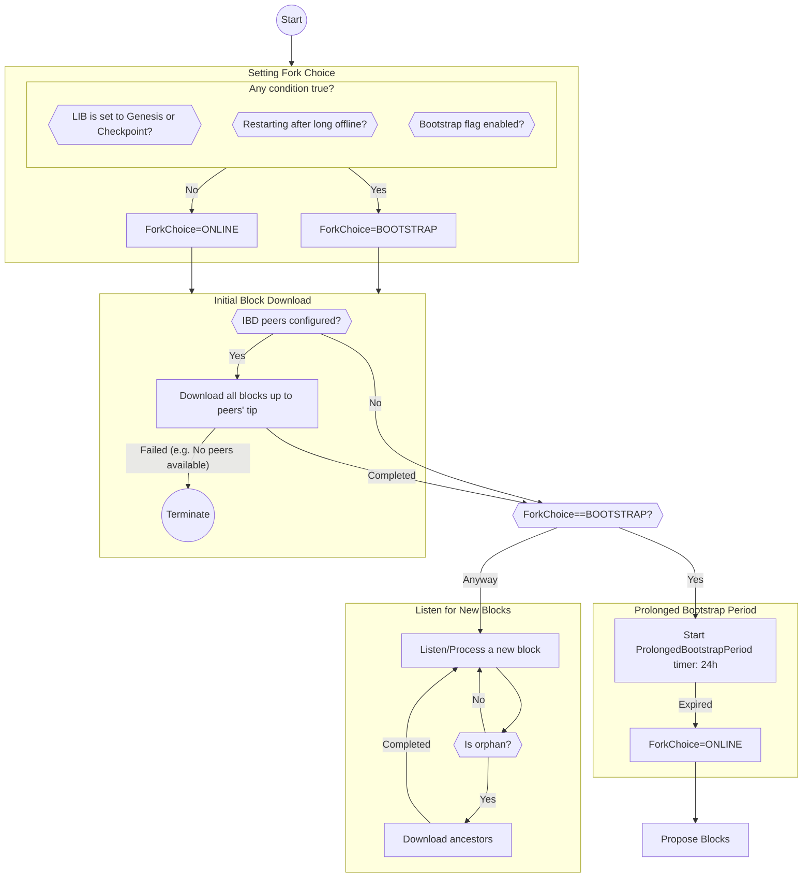

# CRYPTARCHIA-BOOTSTRAPPING-SYNCHRONIZATION

| Field | Value |
| --- | --- |
| Name | Cryptarchia Bootstrapping & Synchronization |
| Slug | 96 |
| Status | raw |
| Category | Standards Track |
| Editor | Youngjoon Lee <youngjoon@logos.co> |
| Contributors | David Rusu <david@logos.co>, Giacomo Pasini <giacomo@logos.co>, Álvaro Castro-Castilla <alvaro@logos.co>, Daniel Sanchez Quiros <daniel@logos.co>, Filip Dimitrijevic <filip@logos.co> |

<!-- timeline:start -->

## Timeline

- **2026-05-27** — [`b7602ed`](https://github.com/logos-co/logos-lips/blob/b7602ed8a225d41ca0bfaaa432524dc84d2ded7e/docs/blockchain/raw/cryptarchia-v1-bootstr-sync.md) — chore: move blockchain specs from notion to github
- **2026-05-18** — [`58b5698`](https://github.com/logos-co/logos-lips/blob/58b56988429f4d69a9e10a9fc118725e229e37c5/docs/blockchain/raw/cryptarchia-v1-bootstr-sync.md) — chore(blockchain): migrate contributor emails to @logos.co (#338)
- **2026-01-19** — [`f24e567`](https://github.com/logos-co/logos-lips/blob/f24e567d0b1e10c178bfa0c133495fe83b969b76/docs/blockchain/raw/cryptarchia-v1-bootstr-sync.md) — Chore/updates mdbook (#262)
- **2026-01-16** — [`89f2ea8`](https://github.com/logos-co/logos-lips/blob/89f2ea89fc1d69ab238b63c7e6fb9e4203fd8529/docs/blockchain/raw/cryptarchia-v1-bootstr-sync.md) — Chore/mdbook updates (#258)

<!-- timeline:end -->

# Revision History

| **Version** | **Changes** | **Date** |
| --- | --- | --- |
| 1.0.0 | Initial revision. | 2026-02-17 |
| 1.0.1 | Noted that a streamed `Block` carries the signed headers of the uncles it references, which is what lets a synchronizing node validate those blocks and reproduce the [Total Stake Inference](cryptarchia-v1-protocol.md#total-stake-inference) without ever seeing their proposals, due to updated [Cryptarchia Protocol](cryptarchia-v1-protocol.md) (uncle references). | 2026-08-06 |
| 1.0.2 | Restricted every chain sync disclosure to the [Sync View](#sync-view), so that a node does not identify itself as a block's proposer by advertising or serving that block before the [Blend Protocol](blend-protocol.md) has released it. Made the tip request explicit as `GetTipRequest`. | 2026-08-21 |

# Introduction

When a new node joins the network or a previously-bootstrapped node has been offline for a while, it cannot follow the most recent honest chain solely by receiving only new blocks because those new blocks cannot be added to the block tree that does not have their parent block. These nodes must first catch up with the most recent honest chain by fetching missing blocks from their peers before they start listening for new blocks.

This document specifies a protocol for nodes to bootstrap with the honest chain efficiently while mitigating long range attacks. It also defines how to handle the case which the node falls behind after the bootstrapping is complete.

This protocol adheres to the key invariant: We never roll back blocks that are deeper than the latest immutable block $`B_\text{imm}`$ in the local chain $`c_{loc}`$, as defined in [Cryptarchia Protocol](cryptarchia-v1-protocol.md) .

# Overview

This protocol defines the bootstrapping mechanism that covers all of the following cases:

- From the **Genesis** block
- From the **checkpoint** block obtained from a trusted checkpoint provider
- From the **local block tree** (with $`B_\text{imm}`$ newer than the Genesis and the checkpoint)

Additionally, the protocol defines the synchronization mechanism that handles orphan blocks while listening for new blocks after the bootstrapping is completed.

The protocol consists of the following key components:

- Determining the fork choice rule ([Bootstrap Fork Choice Rule](fork-choice.md#bootstrap-fork-choice-rule) or [Online Fork Choice Rule](fork-choice.md#online-fork-choice-rule)) at startup
- Switching the fork choice rule from Bootstrap to Online
- Downloading blocks from peers
- Restricting what a node discloses to its sync peers, so that answering them does not reveal which blocks it proposed

The details are described in the [Protocol](#protocol). This section provides only a high-level overview.



Upon startup, a node **determines the fork choice rule**, as defined in [Setting the Fork Choice Rule](#setting-the-fork-choice-rule). If the Bootstrap rule is selected, it is maintained for the [Prolonged Bootstrap Period](#prolonged-bootstrap-period), after which the node switches to the Online rule.

Using the fork choice rule chosen, the node **downloads blocks** to catch up with the tip that each peer advertises.

After downloading is done, the node starts **listening for new blocks.** Upon receiving a new block, the node validates and adds it to its local block tree. If the ancestors of the block are missing from the local block tree, the node downloads missing ancestors using the same mechanism as above.

The node can **propose blocks** after switching to the Online fork choice rule.

Throughout, the node answers its sync peers — and phrases its own requests to them — from its **sync view**, the part of its block tree that is already public, rather than from the whole of it. A block proposer holds the block it built well before the [Blend Protocol](blend-protocol.md) has carried the proposal to anyone else, so a node that disclosed its full block tree over chain sync would identify itself as the proposer to whoever asked. This is defined in [Sync View](#sync-view) and analysed in [Proposer Privacy in Chain Sync](#proposer-privacy-in-chain-sync).

# Protocol

## Constants

| Constant | Name | Description | Value |
| --- | --- | --- | --- |
| $`T_\text{offline}`$ | Offline Grace Period | A period during which a node can be restarted without switching to the Bootstrap rule. | 20 minutes |
| $`T_\text{boot}`$ | Prolonged Bootstrap Period | A period during which Bootstrap fork choice rule must be continuously used after Initial Block Download is completed. This gives nodes additional time to compare their synced chain with a broader set of peers. | 24 hours |
| $`s_\text{gen}`$ | Density Check Slot Window | A number of slots used by density check of Bootstrap rule. This constant is defined in [Definitions](fork-choice.md#definitions). | $`\lfloor\frac{k}{4f}\rfloor`$ (=4h30m) |

## Setting the Fork Choice Rule

Upon startup, a node sets the fork choice rule to the **Bootstrap** rule in one of the following cases. Otherwise, the node uses the **Online** fork choice rule.

- **A node is starting with** $`B_\text{imm}`$ **set to the Genesis block or from a checkpoint block.**
  The node is setting its latest immutable block $`B_\text{imm}`$ to the Genesis or a checkpoint, which clearly indicates that the node intends to catch up with the subsequent blocks. Regardless of how many subsequent blocks remain, the node should use the Bootstrap rule to mitigate long range attacks.

- **A node is restarting after being offline longer than** $`T_\text{offline}`$ **(20 minutes).**
  Unlike starting from Genesis or checkpoint, in the case where a node is restarted while preserving its existing block tree, the node must choose a fork choice rule depending on how long it has been offline.

  If it is certain that a node has been offline longer than the offline grace period $`T_\text{offline}`$ since it last used the Online rule, the node uses the Bootstrap rule upon startup. Otherwise, it starts with the Online rule.

  Details of $`T_\text{offline}`$ are described in [Offline Grace Period](#offline-grace-period). A recommended way how to measure the offline duration is introduced in [**Offline Duration Measurement**](#offline-duration-measurement).

- **A node operator set the Bootstrap rule explicitly (e.g., by** **`--bootstrap`** **flag).**
  In any case where the node operator is clearly aware that the node has fallen behind by more than $`k`$ blocks, they should be able to start the node with the Bootstrap rule. For example, the operator may obtain the latest block height from another trusted operator and realize that their node has fallen significantly behind due to some issue.

## Initial Block Download

If peers for Initial Block Download (IBD) are configured, a node performs IBD by downloading blocks, using the fork choice rule chosen in [Setting the Fork Choice Rule](#setting-the-fork-choice-rule), to catch up with the tip each peer advertises. What a peer advertises is its sync tip, which differs from the tip of its local chain $`c_{loc}`$ only while it is holding back a block it proposed itself, as defined in [Sync View](#sync-view). If no peer is configured, the node skips IBD. For example, genesis nodes will configure no IBD peer because they have to build a chain from scratch.

Blocks are downloaded in parent-to-child order, as defined in the [Downloading Blocks](#downloading-blocks) mechanism. This mechanism applies not only when a node starts from the Genesis block, but also when it already has the local block tree (or a checkpoint block)

```python
def initial_block_download(peers, local_tree):
    # Skip IBD if no peer is set.
    # For example, genesis nodes should be able to skip IBD.
    if len(peers) == 0:
        return

    # In real implementation, these downloadings can be run in parallel.
    # Also, any optimization can be applied to minimize downloadings, such as grouping peers by tip.
    num_success = 0
    for peer in peers:
        is_success = download_blocks(local_tree, peer, target_block=None)
        num_success += 1 if is_success else 0

    # If none of download succeeds (e.g. network errors or invalid blocks),
    # IBD is considered failed.
    if num_success == 0:
        raise IBDFailure
```


The downloaded blocks are validated and added to the local block tree using the fork choice rule determined above. Both block headers and block bodies must be validated. The header validation rules are defined in [Block Header Validation](cryptarchia-v1-protocol.md#block-header-validation).

If the node fails to catch up with at least one IBD peer (e.g., network error or invalid blocks), the node is terminated with an error, allowing the operator to restart the node with other IBD peers.

If downloading is done successfully, the node starts listening for new blocks as described in [Listening for New Blocks](#listening-for-new-blocks).

## Prolonged Bootstrap Period

After [Initial Block Download](#initial-block-download) is completed, a node must maintain the Bootstrap fork choice rule during the Bootstrap Period $`T_\text{boot}`$, if the node chose the Bootstrap rule at [Setting the Fork Choice Rule](#setting-the-fork-choice-rule).

The purpose of the Prolonged Bootstrap Period is giving a syncing node additional time to compare its synced chain with a broader set of peers. In other words, it provides the node with an opportunity to connect to different peers and verify whether they are on the same chain. If the syncing node has downloaded blocks only from peers within an isolated network, the result of [Initial Block Download](#initial-block-download) may not reflect the honest chain followed by the majority of the entire network. To resolve such situations, the node should continue using the Bootstrap rule while discovering additional peers, allowing it to switch to a better chain if one is found.

Theoretically, the Bootstrap rule should be prolonged until the node has seen a sufficient number of blocks beyond the $`s_\text{gen}`$ slot window, which is required for the density check of the Bootstrap rule to be meaningful. However, if the node has seen a fork longer than $`k`$ blocks from its divergence block during [Initial Block Download](#initial-block-download), it means that the node has already seen more slots than $`s_\text{gen}`$ with very high probability, considering the small size of $`s_\text{gen}={k}/{(4f}`$). If the node has never seen any fork longer than $`k`$ blocks, it means that all forks could have been handled by the longest chain rule, which is part of the Bootstrap rule. Therefore, this protocol does not explicitly wait $`s_\text{gen}`$ slots after [Initial Block Download](#initial-block-download). In other words, the protocol does not use $`s_\text{gen}`$ to configure the Prolonged Bootstrap Period.

This protocol configures the Bootstrap Period to 24 hours.

A timer must be started when [Listening for New Blocks](#listening-for-new-blocks) is started after [Initial Block Download](#initial-block-download) is completed. Once the time is completed, the fork choice rule is switched to the Online rule.

## Listening for New Blocks

Once [Initial Block Download](#initial-block-download) is complete and [Prolonged Bootstrap Period](#prolonged-bootstrap-period) is started, a node starts listening for new blocks relayed by its peers.

Upon receiving a new block, the node tries to validate and add it to its local block tree, as defined in [Chain Maintenance](cryptarchia-v1-protocol.md#chain-maintenance).

If the parent of the block is missing from the local block tree, the block cannot be fully validated and added. These blocks are called *orphan blocks*. To handle an orphan block, the node downloads missing blocks from a randomly selected peer, as described in [Downloading Blocks](#downloading-blocks). If the request fails, the node may retry with different peers before abandoning the orphan block. The retry policy can be configured by implementers.

Note that downloading missing blocks does not need to be triggered if it is clear that the orphan block is in a fork diverged before the latest immutable (committed) block, as the node should never revert immutable blocks.

```python
def listen_and_process_new_blocks(fork_choice: ForkChoice, local_tree: Tree, peers: List[Node]):
    for block in listen_for_new_blocks():
        try:
            # Run the chain maintenance defined in the Cryptarchia spec.
            local_tree.on_block(block, fork_choice)
        except InvalidBlock:
            continue
        except ParentNotFound:
            # Ignore the orphan block proactively,
            # if it's clear that the orphan block is in a fork behind the latest immutable block
            # because immutable blocks should never be revereted.
            # This check doesn't cover all cases, but the uncovered cases will be handled by
            # the Cryptarchia block validation during the `download_blocks` below.
            if block.height ≤ local_tree.latest_immutable_block().height:
                continue
            # In real implemention, downloading can be run in background with the retry policy.
            download_blocks(local_tree, random.choice(peers), target_block=block.id)
```

## Sync View

Chain synchronization is a direct, non-anonymous exchange: whoever answers a request reveals its network address to the requester. Block proposals travel the opposite way, through the [Blend Protocol](blend-protocol.md), which exists precisely so that a proposal cannot be traced back to the node that built it. A node that answered sync requests from its full local block tree would undo that separation, because it holds the block it proposed from the moment it builds it, while every other node learns of that block only once the proposal has traversed the Blend network and been released to the broadcast channel. For the whole of that interval, being able to name or serve the block identifies the proposer. The attack and its consequences are analysed in [Proposer Privacy in Chain Sync](#proposer-privacy-in-chain-sync).

To close this, a node answers chain sync — and phrases its own requests — from a restricted view of its block tree rather than from the whole of it.

A block $`B`$ in the local block tree $`T`$ is **publicly disseminated**, from the point of view of the node holding it, if any of the following holds:

- $`B`$ is the Genesis block, or a checkpoint block imported from a trusted provider ([Bootstrapping from Checkpoint](#bootstrapping-from-checkpoint)). Either is public by construction, so the sync view is never empty.
- The node obtained $`B`$ from another node: from the broadcast channel that the Blend network releases proposals to ([Blend Protocol](blend-protocol.md)), or from a sync peer.
- The node itself released $`B`$ to the broadcast channel: as the Blend node completing the release or, when the Blend protocol is bypassed for insufficient network size ([Minimal Network Size](blend-protocol.md#minimal-network-size)), as the proposer broadcasting directly. The release is the moment $`B`$ becomes public, so no further wait is required — and in the bypass case the broadcast itself already names the proposer, so there is nothing left for withholding to protect.
- The node holds a publicly disseminated block that descends from $`B`$, or that references $`B`$ as an uncle ([Uncle References](cryptarchia-v1-protocol.md#uncle-references)). Some other node built on $`B`$, so $`B`$ was public before that block was.

Every block a node did not build itself satisfies the *obtained from another node* condition the instant it enters the block tree. A block the node proposed itself is **not** publicly disseminated until one of the conditions above is met independently of its authorship. A node must be able to make this distinction after a restart as well, so it persists it alongside the block tree; a block it proposed moments before restarting is still private afterwards.

The **sync view** $`T_\text{sync} \subseteq T`$ is the set of publicly disseminated blocks of the local block tree $`T`$. The *descendant or uncle* condition makes $`T_\text{sync}`$ closed under taking ancestors, so it is itself a tree with the same root as $`T`$, and any block it contains can be served in parent-to-child order.

The **sync chain** $`c_\text{sync}`$ is the chain that the node's fork choice rule selects over $`T_\text{sync}`$, and the **sync tip** is its tip. Equivalently, it is the chain the node would be following had it never built the blocks it is withholding.

It is maintained exactly as $`c_{loc}`$ is, by feeding each block to the fork choice rule as that block enters $`T_\text{sync}`$ — in the order blocks become publicly disseminated to this node, never in the order they entered $`T`$. The two orders differ precisely for the blocks the node built, and the difference is not cosmetic: the fork choice rule leaves the incumbent chain in place on a tie ([Online Fork Choice Rule](fork-choice.md#online-fork-choice-rule)), so a block that re-entered the ordering at the moment the node built it would take $`c_\text{sync}`$ back onto the node's own block and restore the leak. Entering at the moment it became public instead leaves $`c_\text{sync}`$ on whichever chain a peer that first saw the block then would be following.

The sync tip is not obtained by walking back from $`c_{loc}`$ to the first publicly disseminated block, and the difference matters. No other node can build on a block that is still in transit through the Blend network, so a block proposed elsewhere while a node's own block $`B`$ is in transit is a *sibling* of $`B`$, never a descendant — and with a block expected every $`f^{-1}=30`$ slots against a Blend transit of roughly a third of that, such a sibling $`B'`$ arrives often. The fork choice rule breaks ties in favour of the first-seen chain ([Online Fork Choice Rule](fork-choice.md#online-fork-choice-rule)), and the proposer saw $`B`$ first, so its $`c_{loc}`$ stays on $`B`$ while every other node follows $`B'`$. Walking back from $`c_{loc}`$ would leave the proposer advertising the parent of both, alone among its peers in not advertising $`B'`$ — which announces that it is holding something at that height. Running the fork choice over $`T_\text{sync}`$ instead selects $`B'`$, exactly as every other node does.

$`c_\text{sync}`$ differs from $`c_{loc}`$ only while the node is withholding a block of its own, which cannot happen before it has begun proposing ([Proposing New Blocks](#proposing-new-blocks)). For a node that does not propose, and for a proposing node at every other moment, the two coincide and no second fork choice evaluation is needed.

A node observes the following rules:

- It advertises its sync tip, never $`c_{loc}`$, in a `GetTipResponse`.
- It builds the `KnownBlocks` of a `DownloadBlocksRequest` from $`T_\text{sync}`$ only: `local_tip` is the sync tip, and every entry of `additional_blocks` is in $`T_\text{sync}`$. The latest immutable block $`B_\text{imm}`$ is in $`T_\text{sync}`$ by construction, since the blocks that make it immutable descend from it and are themselves publicly disseminated.
- It serves a `DownloadBlocksRequest` from $`T_\text{sync}`$ only. A block outside $`T_\text{sync}`$ is treated as absent: it is never streamed, and it is not a candidate latest common ancestor. A request whose `target_block` is outside the responder's sync view is answered exactly as one naming a block the responder has never seen.

The restriction governs only what a node discloses to sync peers. The fork choice rule, [Chain Maintenance](cryptarchia-v1-protocol.md#chain-maintenance) and block proposal continue to operate on the full block tree $`T`$, so a node never delays building on, or committing to, a block it proposed.

The sync tip catches up without any timer. A proposal is broadcast to the entire network at the end of its Blend transit, so the proposer receives its own block back on the broadcast channel at the same time as everyone else and admits it to $`T_\text{sync}`$ then; implementations must not suppress that delivery for a node's own proposal. Should the delivery be missed anyway, the block enters $`T_\text{sync}`$ as soon as any block that builds on it, or references it as an uncle, arrives from a peer. Until either happens the node advertises the tip of $`c_\text{sync}`$, which is what every node that has not yet seen the block advertises, so nothing distinguishes the proposer from them.

## Downloading Blocks

For performing [Initial Block Download](#initial-block-download) and handling orphan blocks while [Listening for New Blocks](#listening-for-new-blocks), a node sends a `DownloadBlocksRequest` to a peer, which must respond with blocks in parent-to-child order. When it needs a peer's tip as the download target, it sends a `GetTipRequest` first. This communication should be implemented based on the [Libp2p streaming](https://github.com/libp2p/rust-libp2p/tree/master/protocols/stream).

Both requests are answered from the responder's [Sync View](#sync-view), not from its full block tree.

**Libp2p Protocol ID**

- Mainnet: `/logos-blockchain/cryptarchia/sync/1.0.0`
- Testnet: `/logos-blockchain-testnet/cryptarchia/sync/1.0.0`

```python
class GetTipRequest:
    # Ask for the tip to download up to. Carries no fields.
    pass

class GetTipResponse:
    # The responder's sync tip: the tip of the chain its fork choice rule
    # selects over its sync view. It is not necessarily the tip of its local
    # chain: a block the responder proposed itself is withheld until the Blend
    # network has released it, so that answering this request does not identify
    # the responder as its proposer.
    tip: BlockId

class DownloadBlocksRequest:
    # Ask blocks up to the target block.
    # The response may not contain the target block if the responder limits the number of blocks returned.
    # In that case, the requester must repeat the request.
    target_block: BlockId
    # To allow the peer to determine the starting block to return.
    known_blocks: KnownBlocks

class KnownBlocks:
    # All of these are drawn from the requester's sync view, for the same reason
    # that GetTipResponse.tip is: naming a block that only the requester holds
    # would tell the responder who proposed it.
    local_tip: BlockId
    latest_immutable_block: BlockId
    # Additional known blocks.
    # A responder will reject a request if this list contains more than 5.
    additional_blocks: list[BlockId]

class DownloadBlocksResponse:
    # A stream of blocks in parent-to-child order.
    # The max number of blocks to be returned can be limited by implementers.
    # A requester can read the stream until the stream returns "NoMoreBlock".
    blocks: Stream[Block | "NoMoreBlock"]
```

Each streamed `Block` carries the signed headers of the uncles it references, in its `uncle_headers` field ([Block Construction, Validation and Execution](bedrock-v1.1-block-construction.md#block)). This is what lets a synchronizing node apply the validity rules of [Uncle References](cryptarchia-v1-protocol.md#uncle-references) to every downloaded block, and then reproduce the [Total Stake Inference](cryptarchia-v1-protocol.md#total-stake-inference) of every past epoch from the uncles those blocks carry, even though it never receives the proposals the blocks were reconstructed from.

The responding peer uses `KnownBlocks` to determine the optimal starting block for the response stream, aiming to minimize the number of blocks to be returned. The requesting node can include any block it believes could assist in this process to the `KnownBlocks.additional_blocks`. To avoid spamming responders, the size of `KnownBlocks.additional_blocks` is limited to 5.

The responding peer finds the latest common ancestor (i.e. LCA) between the `target_block` and each of the known blocks, considering only blocks in its [Sync View](#sync-view). Then, it returns a stream of blocks, starting from the highest LCA. To mitigate malicious downloading requests, the peer limits the number of blocks to be returned. The detailed implementation is up to implementers, depending on their internal architecture (e.g. storage design).


The requesting node should repeat `DownloadBlocksRequest`s by updating the `KnownBlocks` in order to download the next batches of blocks. The following code shows how the requesting node can be implemented.

```python
def download_blocks(local_tree: Tree, peer: Node, target_block: Optional[BlockId]):
    latest_downloaded: Optional[Block] = None
    while True:
        # Fetch the peer's sync tip if target is not specified.
        target_block = target_block if target_block is not None else send_request(peer, GetTipRequest()).tip
        # Don't start downloading if target is already in local.
        if local_tree.has(target_block):
            return

        req = DownloadBlocksRequest(
            # If target_block is None, specify the current peer's tip each time when we build DownloadBlocksRequest,
            # so that we can catch up with the most recent peer's tip.
            target_block=target_block,
            known_blocks=KnownBlocks(
                # The sync tip, not local_tree.tip(): a block this node proposed
                # itself is withheld until it is publicly disseminated.
                local_tip=local_tree.sync_tip().id,
                latest_immutable_block=local_tree.latest_immutable_block().id,
                # Provide the latest downloaded block as well
                # to avoid downloading duplicate blocks
                additional_blocks=[latest_downloaded.id] if latest_downloaded is not None else [],
            )
        )

        resp = send_request(peer, req)
        for block in resp.blocks():
            latest_downloaded = block
            try:
                # Run the chain maintenance defined in the Cryptarchia spec.
                local_tree.on_block(block)
                # Early stop if the target has been reached.
                if block == req.target_block:
                    break
            except:
                return
```

If the node is continuing from a previous `DownloadBlocksRequest`, it is important to include the latest downloaded block to the `KnownBlocks.additional_blocks` to avoid downloading duplicate blocks.


If the requesting node is downloading blocks up to the peer’s tip $`c_{loc}`$ (e.g. [Initial Block Download](#initial-block-download)) by repeating `DownloadBlocksRequest`s, the $`c_{loc}`$ may switch between requests. The algorithm described above also handles this case by specifying the most recent peer’s tip each time when a `DownloadBlocksRequest` is constructed.


## Proposing New Blocks

Unlike [Listening for New Blocks](#listening-for-new-blocks), a node can start proposing blocks after [Prolonged Bootstrap Period](#prolonged-bootstrap-period) is complete. In other words, the node should not propose blocks before switching to the Online fork choice rule.

A block the node proposes extends its local chain $`c_{loc}`$ immediately, but stays out of what the node discloses to its sync peers until the Blend network has released it, as defined in [Sync View](#sync-view).

## Bootstrapping from Checkpoint

Instead of bootstrapping from the Genesis block or from the local block tree, a node can choose to bootstrap the honest chain starting from a checkpoint block obtained from a trusted checkpoint provider. In this case, the node fully trusts the checkpoint provider and considers blocks deeper than the checkpoint block as immutable (including the checkpoint block itself).

A trusted checkpoint provider exposes a HTTP endpoint, allowing nodes to download the checkpoint block and the corresponding ledger state. The details are defined in [Checkpoint Provider HTTP API](#checkpoint-provider-http-api).

The bootstrapping node imports the downloaded checkpoint block and ledger state before starting bootstrapping. The imported checkpoint block is used as the latest immutable block $`B_{imm}`$ and the local chain tip $`c_{loc}`$. Starting from the checkpoint block, the same [Initial Block Download](#initial-block-download) is used to downloads blocks up to the tip of the local chain of each peer. As defined in [Setting the Fork Choice Rule](#setting-the-fork-choice-rule), the Bootstrap fork choice rule must be used upon startup.


If it turns out that none of the peers’ local chains are connected to the checkpoint block, the node is terminated with an error, allowing the node operator to select a new checkpoint.


# Details

## Proposer Privacy in Chain Sync

A block spends a substantial interval known to its proposer and to nobody else. The proposer holds it as soon as it builds it; the proposal then has to traverse the [Blend Protocol](blend-protocol.md) before it is released to the broadcast channel, which for the Blend parameters takes on the order of 11 rounds of one second each. Slots are one second long and a block is expected every $`f^{-1}=30`$ slots ([Constants](cryptarchia-v1-protocol.md#constants)), so for roughly a third of every block interval exactly one node in the network holds the new block, and that node is its author. Chain sync runs over direct libp2p streams, so anything a node discloses there is attributable to its network address.

Two probes exploit this if a node answers sync requests from its full block tree.

- **Tip polling.** The adversary opens sync streams to as many nodes as it can reach and sends a `GetTipRequest` to each of them every slot. A node that has just proposed a block answers with a block ID no other node can yet return; every other node still answers with an earlier block. One request per peer per slot suffices, and the adversary already knows the address of the peer that answered. No triangulation and no statistical inference are involved.
- **Availability probing.** The adversary waits until it learns a new block $`B`$ from the broadcast channel, then asks every peer to download $`B`$. Nodes close to the Blend node that released $`B`$ hold it too, so a single observation is inconclusive. But the proposer is in the "already holds it" set for every block it proposes and only at the network's base rate for blocks it does not, so a few dozen blocks separate the proposer from its neighbours.

Either probe links block proposals to a stable network identity, and thereby to each other. That contradicts the first two privacy goals of [Cryptarchia](cryptarchia-v1-protocol.md#privacy): proposals must not be linkable to a leader, and the protocol must not reveal a leader's stake. The two collapse into one here, because the number of blocks a node is observed to propose over enough slots is a direct estimator of its relative stake — see the [inference of relative stake](analysis-cryptarchia-de-anonymisation-of-relative-stake.md) analysis. An adversary running either probe obtains exactly the per-node win counts that analysis assumes, without holding any stake itself.

The [Sync View](#sync-view) removes the distinguisher in both windows rather than shrinking it:

- While a self-proposed block is outside the sync view, the proposer's answer to either probe is byte-for-byte the answer of a node that has not seen the block. This is why the sync tip is recomputed over the sync view rather than truncated from $`c_{loc}`$: withholding a block must not itself be visible in the tip, which it would be whenever a sibling block is in play, as [Sync View](#sync-view) sets out. There is nothing left to observe, so the adversary gains nothing by polling faster or by connecting to more peers.
- Once the block enters the sync view, it has been released to the whole network, and every honest node holding it answers the same way whether or not it proposed it.

The cost is that, for the duration of the Blend transit after it proposes, the chain a node advertises does not yet include the block it just proposed. It never falls behind what its peers advertise, because they have not seen the block either, so a peer syncing from it during that window misses nothing that any other peer could have given it. A node's own fork choice, commit and proposal logic run on the unrestricted block tree, so consensus is unaffected, and the overhead applies only to the small fraction of blocks a given node proposes.

One consequence is worth stating plainly: a node cannot rescue its own proposal by serving it. If a proposal never reaches the network, its author is the only node that can supply it, and supplying it is exactly the disclosure this rule exists to prevent — so a block the node built on top of that proposal is lost along with it. This costs a block only when a node wins two slots inside a single Blend transit and the first of the two proposals is lost, and it costs no block that the network could have obtained from anyone else.

Two further limits are worth stating. First, this covers the chain sync protocol only: a node that exposes its block tree through some other interface, such as an operator RPC or a mempool query, reopens the same leak there. Second, it does not address the timing of a proposal's entry into the Blend network, which is the concern of the [Blend Protocol](blend-protocol.md), nor the tagging attack of [Limitations of Cryptarchia V1](cryptarchia-v1-protocol.md#limitations-of-cryptarchia-v1), in which a leader is identified by the contents of the block rather than by when it holds it.

## Offline Grace Period

The offline grace period $`T_\text{offline}`$ is a period during which a node can be restarted without switching to the Bootstrap rule.

This protocol configures $`T_\text{offline}`$ to 20 minutes. Here are the advantages and disadvantages of a short period:

- Advantages
  - Limits chances for malicious peers to build long alternative chains beyond the scope of the Online rule.
  - Conservatively enables the Bootstrap rule to handle long forks.

- Disadvantages
  - Even a short offline duration can too sensitively trigger the Bootstrap rule, which then lasts for the long [Prolonged Bootstrap Period](#prolonged-bootstrap-period).

The following example explains why $`T_\text{offline}`$ should not be set too long.

- A local node stopped in the following situation. A malicious peer is building a fork which is now a little shorter ($`k-d`$) than the honest chain.


- The local node has been offline shorter than $`T_\text{offline}`$ and just restarted. As defined in this protocol, the Online fork choice rule is used because the offline duration is short.
- During the offline duration, the malicious peer made its fork longer by adding $`k-d`$ blocks. Now the fork is in the same length as the honest chain.
- If the malicious peer sends the fork to the restarted node faster than the honest peer, the restarted node will commit to the fork because it has $`k`$ new blocks. Even if the node later receives the honest chain from the honest peer, it cannot revert blocks that are already immutable.


- If $`T_\text{offline}`$ is short, the malicious peer would not have enough time to make its fork acceptable by the Online rule. Even if the malicious peer made its fork long enough after $`T_\text{offline}`$, the fork will be rejected by the syncing node because it will use the Bootstrap rule if it has been offline longer after $`T_\text{offline}`$.

A disadvantage is that a syncing node, which has been offline longer than $`T_\text{offline}`$, should maintain the Bootstrap rule during the [Prolonged Bootstrap Period](#prolonged-bootstrap-period), which is 24 hours in the current setting. In the future, the team will consider designing a better mechanism to replace the long Bootstrap Period.

## **Offline Duration Measurement**

As defined in [Setting the Fork Choice Rule](#setting-the-fork-choice-rule), when a node is restarted, it should be able to choose a proper fork choice rule depending on how long it has been offline since it last used the Online rule.

It is considered unsafe to rely on any external information (e.g. the slot or height of peer’s tip) to check how long the node has been offline, since such information could be manipulated as an attack vector. Instead, it is recommended to employ a local method to measure the offline duration.

While the specific implementation is left to the discretion of implementers, one approach is for the node to periodically record the current time to a local file while it is running with the **Online** fork choice rule. Upon restart, it can use this timestamp to calculate how long it has been offline.

## Checkpoint Provider HTTP API

A trusted checkpoint provider serves the `GET /checkpoint` API, allowing users (which are not connected via p2p) to download the latest checkpoint block and its corresponding ledger state.

```yaml
openapi: 3.0

paths:
    /checkpoint
        get:
            responses:
                '200':
                    description: OK
                    content:
                        multipart/mixed:
                            schema:
                                type: object
                                properties:
                                    checkpoint_block:
                                        type: string
                                        format: binary
                                    checkpoint_ledger_state:
                                        type: string
                                        format: binary
```
