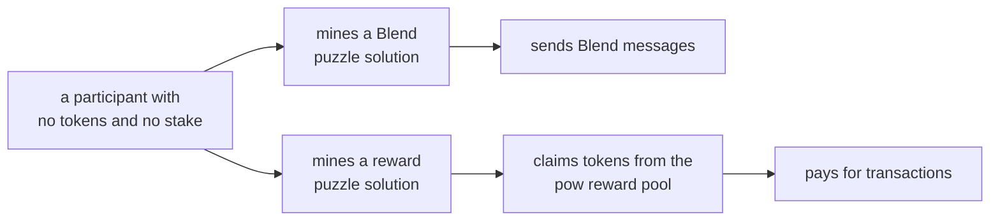
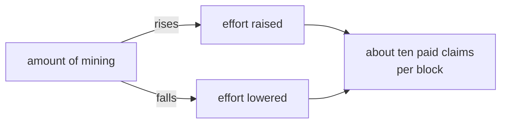
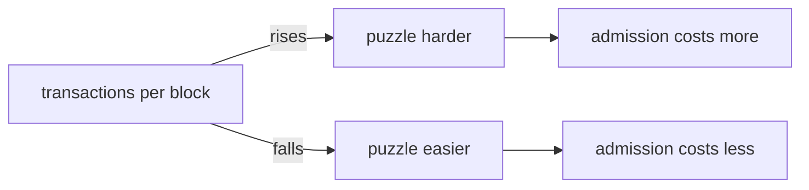
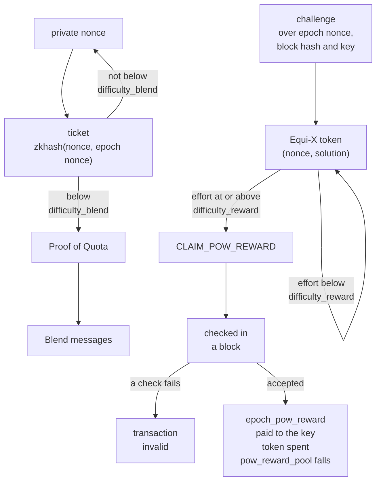

# PROOF-OF-WORK

| Field | Value |
| --- | --- |
| Name | Proof of Work |
| Slug | 245 |
| Status | raw |
| Category | Standards Track |
| Editor | Marcin Pawlowski <marcin@logos.co> |
| Contributors |  |

<!-- timeline:start -->

## Timeline

<!-- timeline:end -->

# Revision History

| **Version** | **Changes** | **Date** |
| --- | --- | --- |
| 1.0.0 | Initial revision. | 2026-09-09 |
| 1.1.0 | Solve the reward puzzle with Equi-X against an effort target, leaving the Blend puzzle on Poseidon2 | 2026-09-10 |

# Introduction

Posting a transaction to the chain or sending a message through the Blend network requires tokens. A participant who arrives with nothing therefore cannot use the protocol.

Proof of work removes this obstacle. A participant who has computed a puzzle solution may use it to post transactions and to send messages through Blend. Neither use has a prerequisite beyond the computation itself. The cost is the hardware and the electricity it burns, and it cannot be faked, since a valid solution proves the work, and a validator checks it cheaply.

The two uses run different puzzles, because they are checked in different places. A Blend solution is proven inside the [Proof of Quota](proof-of-quota.md) circuit, so its puzzle is a `zkhash`. A reward claim is checked by every validator in ordinary code, so its puzzle is [Equi-X](common-cryptographic-components.md#equi-x-asymmetric-client-puzzle), which no fixed-function hardware can shortcut.

Each puzzle is measured against its own threshold, and the two thresholds follow separate objectives:

- the reward threshold keeps the number of paid claims per block near a target whatever the amount of mining,
- and the Blend threshold keeps admission to the network affordable when the network is quiet and dearer when it is busy.

This document specifies the two puzzles, their thresholds, the pow reward pool and the reward it pays per claim, and the window within which a reward may be claimed. The Blend side of the mechanism is specified in [Proof of Quota](proof-of-quota.md) and the claim Operation in [Mantle](bedrock-v1.1-mantle-specification.md#claim_pow_reward); this document holds what both depend on.

# Overview

A miner finds a solution only by trying, so a solution costs electricity and nothing else: no tokens, no stake, no permission. Checking one is cheap in both puzzles: a single `zkhash` for Blend, and one Equi-X verification for a reward.

A solution is spent on one of two things, and this is how a participant that holds nothing starts using the protocol.



The tokens come from the pow reward pool, set aside at genesis. Nothing is minted for it, so mining does not inflate the supply. Each epoch pays out a fraction of what the pool still holds, so the reward is the same for every claim of that epoch, for as long as the pool can pay it.

Each threshold sets how much work a solution costs. Every node computes both from what blocks carry, so no node trusts another for them.

The reward threshold is an Equi-X effort target, and it reads the claims in a block, the only sign of mining the chain has. A larger effort is a harder puzzle.



The two branches end in the same place. About ten claims are paid per block once mining is heavy enough to find that many, so more mining changes the work behind a claim and not the number of claims paid.

A claim must name a recent block, so a solution cannot be spent long after it was found.

The Blend threshold reads the transactions in a block.



Here the branches end apart. Nothing absorbs the load, so a Blend message costs more work when blocks are full and less when they are quiet.

# Protocol



For Blend admission the miner picks a private nonce and hashes it into a **ticket**, `zkhash` over the nonce and the [Epoch Nonce](cryptarchia-v1-protocol.md#epoch-nonce). Tickets and the Blend threshold are numbers in the BN254 scalar field of [Poseidon2](common-cryptographic-components.md#poseidon2-zk-friendly-hash-function), and a ticket satisfies the threshold when it is below it, as [Blend Puzzle Target](#blend-puzzle-target) specifies. The miner keeps picking nonces, each sampled with full entropy, until one ticket satisfies `difficulty_blend`. The nonce stays secret: [Proof of Quota](proof-of-quota.md) proves the miner holds one, and that buys the quota of blending operations given in [Proof of Work Quota](blend-protocol.md#proof-of-work-quota).

For a reward the miner solves an [Equi-X](common-cryptographic-components.md#equi-x-asymmetric-client-puzzle) puzzle. The challenge is derived from the epoch nonce, a recent block hash and the public key the reward is to be paid to, so a token is valid for that key alone and cannot be re-pointed at another. The miner tries nonces until a token's achieved effort reaches `difficulty_reward`, then publishes a `CLAIM_POW_REWARD` Operation whose payload carries the token and whose proof signs the transaction.

A validator checks a claim against the `difficulty_reward` the previous block produced. A block's own claims update `difficulty_reward` after the block is processed, and that new value governs the next block. The validator accepts a claim when all of these hold:

- the token's solution is valid for the challenge,
- the token's achieved effort is at least `difficulty_reward`,
- the token has not been claimed before,
- the referenced block is canonical and inside the acceptance window,
- the epoch nonce is the current one or the one before it,
- the transaction is signed by the key the claim names, which binds the claim to the transaction carrying it,
- `epoch_pow_reward` is positive and `pow_reward_pool` still holds it.

[Mantle](bedrock-v1.1-mantle-specification.md#claim_pow_reward) specifies these checks and the order they run in. A claim that fails any of them makes its transaction invalid. On acceptance the node pays `epoch_pow_reward` to the key, marks the token spent, and subtracts the same amount from `pow_reward_pool`.

A node computes five values from the chain. `pow_reward_pool` and the set of spent tokens change when a claim is accepted. `difficulty_reward` is recomputed after every block, from the number of claims in that block. `epoch_pow_reward` is recomputed at each epoch boundary, from `pow_reward_pool`. `difficulty_blend` is recomputed once per epoch, from the transactions of the epoch before last, at the snapshot that fixes the epoch nonce. [Reward Difficulty](#reward-difficulty), [Reward Pool](#reward-pool) and [Blend Difficulty](#blend-difficulty) specify the three computations.

A node keeps a spent token only while its referenced block is inside the window, so the set stays small. [Acceptance Window](#acceptance-window) gives the window in slots.

# Details

## Notation

| Symbol | Name | Description |
| --- | --- | --- |
| $`d`$ | reward effort target | `difficulty_reward`, the effort an [Equi-X](common-cryptographic-components.md#equi-x-asymmetric-client-puzzle) token must achieve for a claim. A larger target is harder. |
| $`p`$ | field modulus | Modulus of the scalar field $`\mathbb{F}_p`$ of [Poseidon2](common-cryptographic-components.md#poseidon2-zk-friendly-hash-function); tickets and thresholds are its elements. |
| $`T`$ | target claims per block | `TARGET_CLAIMS_PER_BLOCK`, the accepted rate the reward threshold steers toward. |
| $`\rho`$ | distribution rate | `EPOCH_POW_DISTRIBUTION_RATE_NUM / EPOCH_POW_DISTRIBUTION_RATE_DEN`, the fraction of the pool an epoch distributes at the target rate. |
| $`N_b`$ | expected blocks per epoch | `EXPECTED_BLOCKS_PER_EPOCH`, the epoch length in slots of [Epoch Schedule](cryptarchia-v1-protocol.md#epoch-schedule) times $`f`$. |
| $`W_b`$ | window depth | `EXPECTED_BLOCKS_PER_WINDOW`, the acceptance window in expected blocks. |
| $`F`$, $`P`$ | smoothing factor and precision | `EMA_SMOOTHING_FACTOR` and `EMA_SMOOTHING_PRECISION`; the reward update weighs the previous estimate $`F`$ out of $`P`$. |
| $`\alpha = a / b`$ | damping exponent | `BLEND_DAMPING_NUM / BLEND_DAMPING_DEN`, the Blend update's response to the load ratio. |
| $`S_{cap}`$ | maximum supply | The hard cap of [Block Rewards](block-rewards.md). |
| $`f`$ | slot activation coefficient | The probability that a slot has a leader, $`1/30`$, from [Constants](cryptarchia-v1-protocol.md#constants). |
| $`k`$ | security parameter | $`2160`$, from [Constants](cryptarchia-v1-protocol.md#constants). |

## Parameters

```python
POW_REWARD_POOL_GENESIS: TokenValue             # 5/1000 of S_cap, set in the Genesis Block
EPOCH_POW_DISTRIBUTION_RATE_NUM: uint64 = 1     # rho, as a fraction NUM / DEN
EPOCH_POW_DISTRIBUTION_RATE_DEN: uint64 = 200
TARGET_CLAIMS_PER_BLOCK: uint64 = 10            # T
EXPECTED_BLOCKS_PER_EPOCH: uint64 = 21_600      # N_b = 10 k
EXPECTED_BLOCKS_PER_WINDOW: uint64 = 10         # W_b
EMA_SMOOTHING_FACTOR: uint64 = 9                # F, the weight given to the previous estimate
EMA_SMOOTHING_PRECISION: uint64 = 10            # P, the scale F is expressed against; F < P
REWARD_EFFORT_GENESIS: uint32 = 1_146_000       # difficulty_reward at genesis
REWARD_EFFORT_MIN: uint32 = 300                 # the lowest effort the retarget may reach
BLEND_DIFFICULTY_BASE: PowTarget = p // 2**19   # difficulty_blend at the reference load
TARGET_TXS_PER_BLOCK: uint64 = 512              # Reference transactions per block
BLEND_DAMPING_NUM: uint64 = 1                   # a, where the exponent is alpha = a / b
BLEND_DAMPING_DEN: uint64 = 2                   # b, with 0 < a <= b so that alpha <= 1
BLEND_MAX_STEP: uint64 = 2                      # Max factor difficulty_blend may move per epoch
```

The parameters must give an `epoch_pow_reward` above the fee of a claim transaction, which pays for the claim and the `TRANSFER` that spends its note, or a claim cannot pay its own fee.

## Reward Effort Target

`difficulty_reward` is an [Equi-X](common-cryptographic-components.md#equi-x-asymmetric-client-puzzle) effort target, an unsigned 32-bit integer. A claim satisfies it when the achieved effort of its token is at least the target, so a **larger** target is a **harder** puzzle. The expected number of attempts a token costs grows linearly with the target; verifying one does not.

The challenge a claim is solved against is derived from its payload:

```python
def get_challenge(claim: ClaimPowRewardOp) -> bytes:
    return Hash(b"MANTLE_POW_V1", claim.epoch_nonce, claim.block_hash, claim.public_key)
```

where `Hash` is BLAKE2b as given in [Common Cryptographic Components](common-cryptographic-components.md). The public key is part of the challenge, so a token is valid only for the key it was mined for.

The retarget below multiplies and divides efforts as integers. Its largest intermediate is the product of a target and the demand of a block, which is below $`2^{43}`$, so a 64-bit unsigned integer carries it.

## Blend Puzzle Target

`PowTarget` is an element of $`\mathbb{F}_p`$, as every Blend ticket is. A ticket satisfies a target when its canonical integer representative in $`[0, p-1]`$ is strictly below the target's; a smaller target is a harder puzzle. A representative is at most 254 bits, so a 256-bit unsigned integer holds any target.

The Blend update below multiplies and divides targets as integers rather than in the fixed-width types of [Arithmetic](bedrock-v1.1-mantle-specification.md#arithmetic), and caps its result at $`p - 1`$, so that it converts back to a field element without reduction. Every intermediate fits in **512 bits**: the radicand reaches $`2^{493}`$. Each operation is integer addition, multiplication, floor division or comparison, and `integer_nth_root` returns the exact floor, so two implementations agree exactly.

## Reward Pool

The pool is seeded once, at genesis, with `POW_REWARD_POOL_GENESIS`, five thousandths of $`S_{cap}`$, as specified in [Bedrock Genesis Block](bedrock-genesis-block.md). After that it changes only through claims.

```python
def compute_epoch_pow_reward(pow_reward_pool: TokenValue) -> TokenValue:
    denominator = (EPOCH_POW_DISTRIBUTION_RATE_DEN
                   * TARGET_CLAIMS_PER_BLOCK
                   * EXPECTED_BLOCKS_PER_EPOCH)
    return (pow_reward_pool * EPOCH_POW_DISTRIBUTION_RATE_NUM) // denominator
```

At each epoch boundary, before any block of the new epoch is processed, `epoch_pow_reward` is set to `compute_epoch_pow_reward(pow_reward_pool)` and held for the epoch. The division rounds down, and the remainder stays in the pow reward pool. All arithmetic here is checked, in accordance with [Arithmetic](bedrock-v1.1-mantle-specification.md#arithmetic).

### Exhaustion within an epoch

The reward is fixed for the epoch while the pool shrinks with every claim. The first condition of [CLAIM_POW_REWARD](bedrock-v1.1-mantle-specification.md#claim_pow_reward) validation, that the reward is positive and the pool covers it, is evaluated for every claim against the pool as it stands at that point in the block, and a claim it rejects invalidates its transaction. Claiming resumes at the next epoch boundary at which the recomputed reward is positive and the pow reward pool covers it.

## Acceptance Window

$$
\mathrm{WINDOW} = \left\lfloor \frac{W_b}{f} \right\rfloor
$$

With $`W_b = 10`$ and $`f = 1/30`$, `WINDOW` is $`300`$ slots. A claim's referenced block must be canonical and at most `WINDOW` slots older than the block including the claim; the check is step 2 of [CLAIM_POW_REWARD](bedrock-v1.1-mantle-specification.md#claim_pow_reward) validation. A nullifier may be discarded once the block its claim referenced has left the window.

## Reward Difficulty

```python
def compute_new_reward_difficulty(claims_in_block: uint64,
                                  current_target: uint32) -> uint32:
    # 64-bit integers; see Reward Effort Target.
    # The demand implied by this block, reconstructed from the target that produced
    # it and smoothed against the target rate; floored at 1 so the result is defined.
    demand = max(1, (EMA_SMOOTHING_PRECISION - EMA_SMOOTHING_FACTOR) * claims_in_block
                    + EMA_SMOOTHING_FACTOR * TARGET_CLAIMS_PER_BLOCK)
    new_target = (current_target * demand) // (TARGET_CLAIMS_PER_BLOCK
                                               * EMA_SMOOTHING_PRECISION)
    return clamp(new_target, REWARD_EFFORT_MIN, 2**32 - 1)
```

`claims_in_block` counts the `CLAIM_POW_REWARD` Operations the block includes. Every claim in a block is validated against the target produced by the previous block's update; the update from a block's own count is applied after the block is processed and governs the next block. At genesis `difficulty_reward` is `REWARD_EFFORT_GENESIS`.

A block carrying the target number of claims leaves the target unchanged, a block carrying none lowers it by a tenth, and a block carrying more raises it. `REWARD_EFFORT_GENESIS` is calibrated against a measurement of the work itself: about three hours per solution on one core of the target machine, a Raspberry Pi 5, measured on that hardware.

## Blend Difficulty

`difficulty_blend` for epoch $`N`$ is computed at the lottery-constants snapshot of epoch $`N-1`$ specified in [Epoch](cryptarchia-v1-protocol.md#epoch), the moment epoch $`N`$'s nonce is fixed, from the blocks of epoch $`N-2`$, and is the public input `pow_blend_difficulty` of [Proof of Quota](proof-of-quota.md) for the whole of epoch $`N`$. For epochs 0 and 1 it is `BLEND_DIFFICULTY_BASE`; the schedule begins with epoch 2, computed during epoch 1 from epoch 0's blocks.

```python
def compute_epoch_blend_difficulty(epoch_blocks: list[Block],   # the blocks of epoch N-2
                                   previous: PowTarget) -> PowTarget:  # difficulty_blend of epoch N-1
    # 512-bit integers over canonical representatives; see Puzzle Target.
    # Observed load as an exact ratio: num == den at the reference load.
    num = sum(num_transactions(b) for b in epoch_blocks)
    den = TARGET_TXS_PER_BLOCK * len(epoch_blocks)

    lo = previous // BLEND_MAX_STEP
    hi = min(previous * BLEND_MAX_STEP, p - 1)

    if num == 0:
        return hi   # No load observed: as permissive as this epoch's clamp allows.

    # A smaller target is harder, so load divides the baseline:
    #     target = BASE / load ** alpha
    # Only the final root is floored, so the result is at most one unit from exact.
    a, b = BLEND_DAMPING_NUM, BLEND_DAMPING_DEN
    radicand = (BLEND_DIFFICULTY_BASE ** b * den ** a) // num ** a
    return clamp(integer_nth_root(radicand, b), lo, hi)

def integer_nth_root(x: int, n: int) -> int:
    # The floor of the real n-th root: the largest integer r with r**n <= x.
    # Any exact method serves; this reference is a binary search.
    lo, hi = 0, 1 << (x.bit_length() // n + 1)   # hi**n > x by construction
    while lo < hi - 1:
        mid = (lo + hi) // 2
        if mid ** n <= x:
            lo = mid
        else:
            hi = mid
    return lo
```

`previous` is the value computed one snapshot earlier. `BLEND_DIFFICULTY_BASE` is calibrated against a measurement of the work itself: about 38 seconds per solution in expectation on one core of the target machine, a Raspberry Pi 5, measured on that hardware.
