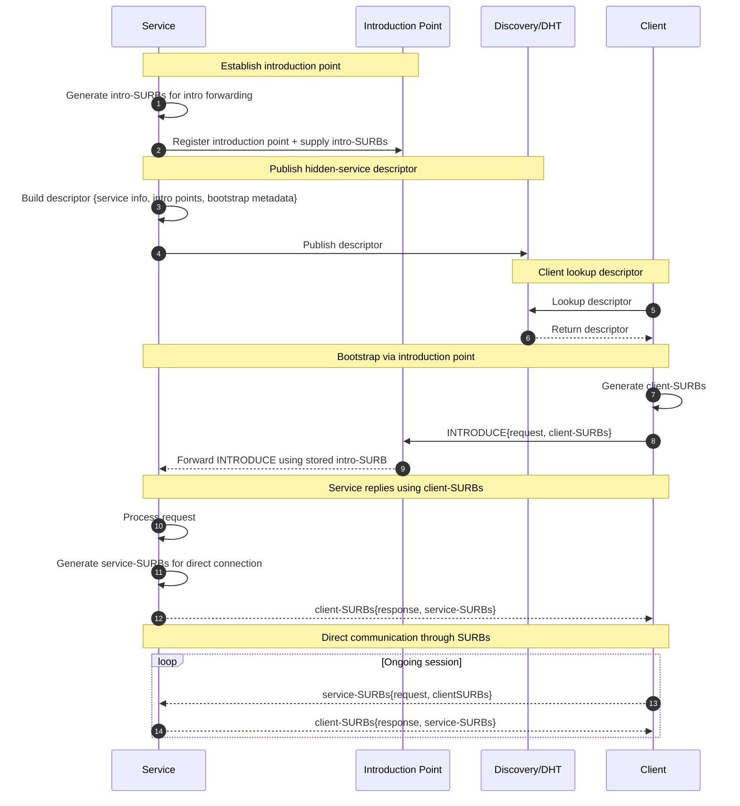

# HIDDEN-SERVICES-OVER-MiX

Field | Value
--- | ---
Name | Hidden Services over Mix
Slug | TBD
Status | raw
Category | Standards Track
Editor | Mohammed Alghazwi <mohalghazwi@status.im>
Contributors | Balázs Kőműves <balazs@status.im>

## 1. Abstract
In this document we specify the hidden service protocol over Sphinx-style mixnet. The main goal is to allow services to: (1) Be reachable, and (2) Serve contents to clients, without revealing its identity to clients or network observers. 

Mixnets already provide an anonymous way to send and receive messages with the use of Sphinx packet format and single-use reply blocks (SURBs). However, Sphinx and SURBs don't solve the whole problem of running a hidden service. A client that wishes to send a request to an anonymous service still needs to discover and reach its endpoints. This is where hidden service protocols such as the one used by Tor would be needed. The hidden services design in this document is inspired by Tor's, but adapted for Sphinx-style mixnets. 

## 2. Motivation
A hidden service protocol is useful for many applications in which services need to serve content and stay anonymous. One of the main motivation is supporting logos-storage anonymous file-sharing.

An [anonymous download protocol](https://hackmd.io/@codex-storage/rkCIGuuw-g) can be built using the Mix protocol as it is now, with an additional transport layer, i.e. a protocol for handling sending large messages, integrity, reliability, and SURBs management. However, this does not work for anonymous uploads from data providers since providers still need to be reachable. The provider's identity is revealed in two main places (See the [analysis](https://hackmd.io/@codex-storage/SySGcN5N-e) for more details):
1. Discovery `provide(...)` records. The provider advertizes manifestCID/blockCID which reveals its identity and network reachable address (peerId & multiaddrs). 
2. Direct connection to peers and serving contents through the `blockExchange`. 

A hidden service protocol over Mix such as the one specified in this document would allow providers to be reachable and serve contents while at the same time stay anonymous. 

### 3. Definition
Hidden services extend normal mixnet communication by providing anonymity to both communicating parties, i.e. the sender and receiver. In this sense it provides bi-directional anonymity. 

The main additional property of hidden services is that it allows a service to stay anonymous, meaning that an adversary cannot reliably link a content/dataset identifier (e.g. CID) to the network identity (peerId/multiaddr/IP) of the node(s) serving it.

An adversary may:
- Observe some of the network traffic,
- Control some fraction of peers/providers,
- Control some fraction of mix nodes,
- Participate in DHT queries/paths and control a fraction of DHT nodes.

### 4. Requirements
**4.1 Functional requirements**
- Nodes are able to anonymously serve data. This requires: 
    - An anonymous way for nodes to advertize themselves (e.g. on a DHT) as providers for some service/content/datasets.
    - Clients are able to discover these advertized anonymous services and connect to them anonymously
    - Making contents/datasets retrievable without revealing which node(s) are providing/serving it and which node are receiving it. 
    - The protocol can support any arbitrary applications (with different payload size requirements) running on top of it. 

**4.2 Desired Properties**
- Provider anonymity: hide provider identity (peerId/multiaddr/IP) from clients, observers, and discovery.
- Censorship resistance: make targeted blocking of the publisher/provider harder.
- DOS/Spam resilience: avoid attacks such as flooding intro points and services.

**4.3 Assumptions**
For the remainder of this document we will assume the existence of the following:

(1) A [transport layer over mix](https://hackmd.io/@bkomuves/BkU0yrgsbe) which gives us the following:
- An anonymous way to send data of any size over mix with integrity and some reliability guarantees (through acks and EC redundancy). 
- A way to encode SURBS in the anonymous message payload for the recipient to reply, as well as a way to encode requests for more SURBs from the other party. Note here that the request for more SURBs can be from both sender and reciever.

(2) An Anonymous discovery with the following properties:
- An anonymous way to query the DHT, i.e. the ability to find and retrieve a `value` that corresponds to the query `key` anonymously.
- An anonymous way to publish a `(key, value)` pair to the discovery/DHT nodes. 
- Discovery/DHT nodes must validate the published `(key, value)` pair according to the specification in this document. 
- The above might require discovery/DHT nodes to extend the protocol with a specific `publish()` call, e.g. `publish_descriptor()`. 

**4.4 Out of Scope**
- Query privacy (hiding what dataset/block is requested) is not currently required.
- Low latency may be relaxed for stronger anonymity guarantees. 

## 5. Background

### 5.1 Sphinx Packet Format and Single-Use Reply Blocks (SURBs)

Sphinx is a compact cryptographic packet format for mix networks. It allows a sender to route a fixed-size encrypted message through a path of mix nodes while hiding the full path, the sender, the recipient, and each mix node's position in the path. Sphinx uses layered-encryption so that each mix node learns only the information needed to process its own layer.

A key feature of Sphinx is support for Single-Use Reply Blocks (SURBs). SURBs act as an anonymous return address. Senders can give receivers SURBs, allowing the them to reply without learning the sender's network identity. This is important for hidden services because as we will see in this document, it can enables bidirectional anonymous communication.

For further reading, see:
- The original Sphinx design, see the paper: [*Sphinx: A Compact and Provably Secure Mix Format*](https://cypherpunks.ca/~iang/pubs/Sphinx_Oakland09.pdf). 
- [A write-up on Sphinx](https://hackmd.io/@bkomuves/SJzVxYMsZl) 
- [Sphinx section of the mix specification](./mix.md#8-sphinx-packet-format)

### 5.2 Mix Protocol
The Mix Protocol is a decentralized anonymous message-routing layer for libp2p networks. It allows existing libp2p protocols to selectively anonymize messages by routing them through a mix overlay containing a set of libp2p nodes. Each message is wrapped into a Sphinx packet and routed through a randomly selected mix path. Along the path, each mix node removes one layer of encryption, applies a randomized delay, and forwards the packet to the next hop.

Unlike Tor, which uses persistent low-latency circuits, the Mix Protocol is message-based and stateless. Each message (wrapped in Sphinx packet) is self-contained and independently routed. This makes it better suited for settings where higher latency is acceptable in exchange for stronger anonymity guarantees.

References:
- [Mix protocol specification](./mix.md).
- [Mix libp2p protocol implementation](https://github.com/logos-co/nim-libp2p-mix).

### 5.3 Tor Hidden Services
Tor hidden services (also called onion services) allow a service to be reachable without revealing its network identity. A hidden service publishes a signed descriptor to hidden service directories. This descriptor contains the information clients need to contact the service, including a set of introduction points. Clients fetch the descriptor, choose an introduction point, and use it to initiate contact with the hidden service. In Tor's design, the client and service then communicate through a rendezvous point (creating a 6-hop circuit), so neither side needs to reveal its network address to the other.

The design in this document is inspired by Tor hidden services, but adapted to a Sphinx-style mixnet. The main similarity is the use of descriptors, introduction points, blinded keys, and periodic publishing of descriptors. However, this protocol differs from Tor's design in that instead of using rendezvous points and long-lived circuits, it uses Sphinx packets and SURBs to allow the client and service to reply to each other anonymously over a mixnet. The aim for this hidden service to be work with the Mix Protocol as an additional component. 

References:
- [Tor specifications](https://spec.torproject.org/rend-spec/overview.html)
- [Blog post: Anonymity in Decentralized File Sharing](https://forum.research.logos.co/t/anonymity-in-decentralized-file-sharing/628)

### 5.4 Cryptographic primitives
The hidden services protocol requires the following cryptographic building blocks. 


**Diffie–Hellman Key Exchange**
Diffie–Hellman key exchange scheme (DH) between party $A$ and party $B$ consists of the following algorithms:

$$
\begin{aligned}
\mathsf{DH.Setup}(\lambda) &\rightarrow (\mathbb{G}, g, q)\\
\mathsf{DH.KeyGen}(\mathbb{G}, g, q) &\rightarrow (sk, pk) \\
\mathsf{DH.SharedKey}(sk_A, pk_B) &\rightarrow s
\end{aligned}
$$

This is usually instantiated as:
$$
\begin{aligned}
sk &\xleftarrow{$} \mathbb{Z}_q \\
pk &\leftarrow g^{sk} \in \mathbb{G} \\
s &\leftarrow (pk_B)^{sk_A} = (pk_A)^{sk_B} = g^{sk_A sk_B}
\end{aligned}
$$

Where $\mathbb{G}$ is a cyclic group of prime order $q$ with generator $g$, $sk$ is a private key, $pk$ is the corresponding public key, and $s$ is the shared secret/key. We require the scheme to provide standard Diffie-Hellman security, so that an adversary can't recover the shared secret/key from the public keys alone.

We use DH to derive shared secrets/keys between the protocol participants, which are then passed to a key derivation function (KDF) to obtain symmetric keys for authentication and encryption. To align with the mix protocol, we instantiate Diffie-Hellman using Curve25519.

**Signature Scheme**
A public-key signature scheme consists of the following algorithms: 

$$
\begin{aligned}
\mathsf{Sig.KeyGen}(\lambda) &\rightarrow sk, pk \\
\mathsf{Sig.Sign}(sk, m) &\rightarrow \sigma \\\
\mathsf{Sig.VerifySig}(pk, \sigma, m) &\rightarrow \{0, 1\}
\end{aligned}
$$

We require that the signature scheme be secure against forgeries, i.e., an adversary should not be able to create a valid message-signature pair $(𝑚′, \sigma′)$ for a new message $m \neq m'$ without knowledge of the signing key $sk$.

In addition, we require a key blinding property mechanism. We therefore extend the signature scheme with the following additional algorithms:

- $\mathsf{Sig.BlindKey}(pk, sk, r) \rightarrow (pk', sk')$: Given the keypair and a blinding value $r$, output a derived blinded keypair $(pk', sk')$. 
- $\mathsf{Sig.BlindPk}(pk, r) \rightarrow pk'$ Given only the public key $pk$ and $r$, output the corresponding $pk'$.

In our setting, we assume that the blinding value $r$ is derived from *public information*, for example a timestamp, epoch number, or public entropy.

The signature scheme with key blinding must satisfy two main security requirements: unforgeability and unlinkability, which can be summarized as follows:
- Given $pk$ and $r$, anyone can derive the corresponding blinded public key $pk'$.
- Given $pk'$ and $r$, it is infeasible to derive the blinded secret key $sk'$.
- Given $sk'$ and $r$, anyone can derive $sk$.
- Given any number of $pk'$ and their corresponding $r$, it is infeasible to determine if they were generated using the same $pk$ without knowledge of such key.
- Signatures produced using $sk'$ verify under $pk'$
- Without $sk'$, it is infeasible to forge signatures that verify under $pk'$.
- Different values of $r$ yield different blinded keys, except with negligible probability.

For more in-depth discussion and analysis of the security requirements for signature schemes with key blinding, refer to [Eaton et al.](https://eprint.iacr.org/2023/380.pdf) and [Celi et al.](https://eprint.iacr.org/2023/1524.pdf) In [the appendix](#appendix), we provide a concrete construction of a signature scheme with key blinding based on ECDSA, and Ed25519. 

**Hash Function**
Let $H(\cdot)$ be a *preimage resistant*, *second-preimage resistant*, and *collision resistant* cryptographic hash function:

$$
\mathsf{H}(m) \rightarrow d
$$

Where $m$ is the message and $d$ is the fixed-length digest. In this specification, we use SHA-256 as $\mathsf{H}$, which aligned with the mix specification.

**Message Authentication Code (MAC)**
A message authentication code (MAC) takes a key and a message and outputs a fixed-length digest/tag $t$.

$$
\mathsf{MAC}(key,msg) \rightarrow t
$$

We require the standard security property for a MAC. In this protocol, MACs are used to authenticate various protocol messages. We assume the use of HMAC-SHA-256 with output digest truncated to 128 bits to be consistent with the Mix protocol.

**Symmetric encryption**
A symmetric encryption scheme consists of the following algorithms:

$$
\begin{aligned}
\mathsf{Enc}(k, iv, m) &\rightarrow c \\
\mathsf{Dec}(k, iv, c) &\rightarrow m
\end{aligned}
$$

Where $k$ is a symmetric key, $iv$ is an initialization vector, $m$ is the plaintext message, and $c$ is the ciphertext. For consistency with Mix, we assume the use of AES-128 in Counter Mode (AES-128-CTR). Note that AES-CTR provides confidentiality only, integrity must be provided separately using the MAC defined above or a different symmetric encryption scheme.

## 6. High-level design

### 6.1 Participants
The protocol assumes the following participants:
- **service**: the hidden service provider. i.e. a node running the hidden services protocol as a service provider. 
- **client**: a user seeking a service from a hidden service provider. i.e., node running the hidden services protocol as a service client. 
- **Discovery/DHT**: a discovery network that both services and clients can contact to store and retrieve (key -> value) records such as anonymous service descriptor.
- **Introduction points**: mix nodes that are chosen by the service as contact points and are publicly reachable (we can assume for now that all mix nodes are publicly reachable). They only relay the initial introduction requests from clients to services through Mix. 

### 6.2 High-level description
The goal is to emulate the Tor-style hidden services over mixnet. The data flows through the mixnet with help from randomly chosen intermediate nodes called introduction points. With the Sphinx-style mixnet (as the one we intend to use), we have SURBs for replies and we can use them to safely remove the need for Tor's rendezvous points. Meaning that in this design of hidden services, we only rely on intro points to bootstrap a connection, then continue using SURBs so future messages do not need to pass through the intro points or rendezvous points.

### 6.3 Workflow
At a high-level, we can summarize the workflow as follows:
- Service establishes multiple intro points anonymously through Mix and supplies these intro points with `intro-SURBs`. These `intro-SURBs` allow intro points to forward client requests to the service.
- Service publishes anonymously through Mix a `descriptor` to the discovery (DHT) which contains information needed for a client to connect to the service as well as addresses of intro points to reach the service, and any other metadata needed to bootstrap the connection. Discovery would store the `key -> value` mapping as `key -> descriptor`.
- Service shares a `.mix` address with clients out-of-band. 
- Client derives `key` from the `.mix` address and fetches the `descriptor` from discovery/DHT.
- Client contacts the service via one of the intro points, and includes `client-SURBs` so the service can reply anonymously.
- Intro point forwards client request to service using `intro-SURBs`.
- Service replies directly to the client via a `client-SURBs` and includes its own `service-SURBs`.
- After bootstrap, the client sends subsequent requests/messages using `service-SURBs` and the service replies using `client-SURBs`. 
- Both sides keep refreshing SURBs as needed using the transport layer protocol.

The following figure summarizes the workflow. All communication shown below is assumed to take place over the mixnet using the transport layer. Solid lines denote forward messages, while dotted lines denote backward messages sent using SURBs.



As can be seen above, the way we use SURBs helps us remove the need for rendezvous points and make the connection shorter as well. In Tor's hidden services, you have 6 hops/relays between client and service, but in this design, we only have 3 mix hops. Though Tor has persistent long-lived circuits, while in mix, you have a random delay, so this might be a slight improvement in latency but still needs some experimentation. 

### 6.4 High-level API
The high-level API can be split into two: one for the service and one for the client. 

**Service API**
- Publish and run a hidden service:
    - Create a hidden service and pass the configuration for it, e.g. intro point count, SURBs count, TTL for intro, descriptor, etc.
    - Register multiple intro points.
    - Generate a service identifier/address (a `mix address`).
    - Publish a descriptor.
- Accept incoming anonymous requests:
    - Handle incoming requests from intro point.
    - Respond to requests using received `client-SURBs`, and include `service-SURBs`.
    - Respond to subsequent direct client requests coming through `service-SURBs`.

```
HiddenService.New(config) -> hs

HiddenService.GenerateAddress(identity_key) -> mix_address

HiddenService.RegisterIntroPoints(
    hs,
    intro_point_count,
    intro_surb_count,
    intro_validity
) -> intro_points

HiddenService.PublishDescriptor(
    hs,
    mix_address,
    intro_points,
    descriptor_validity,
    revision_counter
) -> (descriptor_key, descriptor)

HiddenService.Run(
    hs,
    mix_address,
    intro_points,
    descriptor_key
) -> result

HiddenService.HandleRequests(
    hs,
    handler
) -> result

```
**Client API**
- Connect and send requests to a hidden service, given a service identifier i.e. a `.mix` address.
    - Query the discovery/DHT for the descriptor using the service identifier. 
    - Select a random intro point from the set in the descriptor.
    - Connect to the hidden service through the selected intro point.
    - Send application protocol requests through the created connection (using the received `service-SURBs` + supply `client-SURBs` as needed). 

```
HiddenServiceClient.New(config) -> client

HiddenServiceClient.QueryDescriptor(
    client,
    discovery,
    mix_address
) -> descriptor

HiddenServiceClient.Connect(
    client,
    mix_address,
    descriptor
) -> hs_connection

HiddenServiceClient.Request(
    client,
    hs_connection,
    request
) -> response
```

### 6.5 Integration into Mix
In the current libp2p-mix implementation, when you send a libp2p message in the payload of a mix sphinx packet, the exit node doesn't process the payload at all, instead it unwrapps the message revealing (codec, msg, dest, surbs) and calls the exit layer to process it.

Then the exit layer will perform one of the following actions:
- If exit is not the destination, then forward to the encoded destination address and include (codec, msg)
- If exit==destination then the exit will run the handler for that codec, i.e. the exit speaks the protocol for that codec. Note that every Sphinx packet must contain a codec so that the exit can process it. 

There are two possible options on how the hidden services can be integrated into mix as a pluggable component:

1. Hidden services is an internal pluggable component of the Mix protocol with a designated/reserved codec (`"/mix/hiddenservices/1.0.0"`) that the mix protocol will handle without handing off to the exit layer. Meaning that mix nodes need to understand certain message types and handle these messages internally as part of the mix protocol.
2. Hidden services as a separate libp2p protocol. Meaning that mix nodes can speak (run the handler for) that protocol. Since the current implementation always forwards messages to an exit layer, a separate libp2p hidden services protocol can be defined to handle hidden service messages at the exit layer. This option separates the transport layer (in this case the mix protocol/transport layer acting as transport) from the application layer (which in this case is a hidden service). However, in this case the exit layer would require more information than (codec, msg) to be passed to it. This is because some messages require binding to the exact packet/transport layer session/state that carry them.

## 7. Establishing an introduction point

### 7.1 `EstablishIntro` request
The hidden services protocol begins with the service provider establishing a set of mix nodes as introduction points. This is done as follows: 
- Select `k` random mix nodes from discovery to act as intro points. Discovery should support unbiased random sampling from the set of live mix nodes. 
- build `k` mix paths, where each path terminates at the selected intro points, i.e. intro points become the exit/last node.
- Send the`EstablishIntro` message to each selected intro point. 
- The default value for `k` is three, resulting in three intro points.

*Note: The naming convention used for most messages in this mix-based hidden service protocol follows Tor's onion services protocol for consistency. However, the contents and processing of these messages are different since they are adapted for the Mix setting.*

**`EstablishIntro`**
A message created by the hidden service provider and sent to the Mix nodes that support the hidden service protocol with the intent to establish introduction points at these nodes. 


The `EstablishIntro` message contains the following:
```
EstablishIntro {
    auth_key: bytes
    auth_mac: bytes
    sig: bytes
}
```

Note that aside from the above message, we assume the mix transport layer will handle packaging the above message in a sphix packet and include SURBs for the reciever to respond to this message. In this step of the hidden service protocol, we refer to these SURBs are `intro-SURBs` and they will be used by the intro point to relay client requests to the service. The details of how SURBs are encoded in the sphinx packet is outside of the scope of this document, and will be specified in the transport layer specification.

- `auth_key`
The hidden service creates a signing key pair for each intro point and places the public key in the `auth_key` field. A unique key pair must be created for each intro point, i.e. no key pair is ever used with more than one intro point. These keys are used later to sign the `EstablishIntro` request. The intro points will use the `auth_key` as a public identifier for the hidden service and map client requests to the hidden service.

- `auth_mac`
The `auth_mac` field contains a MAC of all earlier fields in the message (i.e. the `auth_key`), and keyed by the shared secret/key `s` derived from the service and intro point Mix path. Since the intro point is the exit/last hop as stated above, it must have a per-hop shared key material with the service i.e. `s` under the Sphinx packet construction. Refer to the Sphinx specification for more details on how `s` is derived. This MAC binds the `EetablishIntro` request to the specific "session" in which it was sent/received. An alternative here is to use the transport layer session/state identifier to derive the `mac_key` resulting in the same binding property that we require.

- `sig`
Contains the signature of all message contents, including `auth_mac`, using the private key corresponding to the `auth_key`. Use of domain separation is recommended in this setting.

**Replay resistence**
The `auth_key` serves as a public identifier for the service at a specific introduction point instead of say a random value/cookie. This is because we want a way for intro points to check ownership of this identifier. i.e. intro points will only associate a public identifier to a mix node after checking ownership of this identifier to prevent unautherized use of the identifier. The hidden service provider proves ownership of the `auth_key` by signing the message content using the secret key corresponding to that public `auth_key`. 

The `auth_mac` in the message provides a form of replay resistance for the `EstablishIntro` message by binding the message to the session on which it was created, i.e. the session between the two parties with `s` as their shared key material. 

Without a MAC derived from a unique session key, an attacker could: 
- Replay the exact same signed `EstablishIntro` on a different intro point leading to unauthorized registration of introduction points.
- Cause clients to use attacker-controlled or invalid introduction points. 

**Bandwidth Optimization**
An optimization to reduce bandwidth (although slightly) is to remove the `auth_mac` from the `EstablishIntro` message. The intro point can compute `auth_mac` from the message content and the shared secret/key. Then, the signature can be checked against the concatenation of message content and the computed `auth_mac`. Therefore, the `EstablishIntro` message in this case would only contain `auth_key` and `signature` (slightly) reducing the size of the message. Unless bandwidth is especially constrained, keeping auth_mac explicit is preferred.

**`EstablishIntro` message extensions**
Note that the above content can be extended to support the following:
- Multiple key, MAC, and signature types. This can be done by including extra fields in the message to identify the types and sizes, i.e. (`key_type`, `key_size`, `mac_type`, `mac_size`, `sig_type`, `sig_size`).
- Denial-of-Service (DoS)/Spam prevention parameters. Additional parameters for the intro points to apply for the established hidden service. 
- Registration expiry or refresh parameters.
- Specifying protocol version. 


### 7.2 Processing `EstablishIntro` by intro points
On receiving an EetablishIntro message, the mix node will verify the signature `sig` using `auth_key`, and verify the MAC `auth_mac` using the shared key `s`. The mix node must reject the `EstablishIntro` message and drop the received packet in the following cases:
- The key `auth_key` or signature `sig` are malformed or unsupported.
- The signature is invalid.
- The MAC `auth_mac` is invalid.
- The mix node is already serving as an intro point for the same `auth_key`.
- The mix node has reached its local capacity for hidden services.

If all checks succeed, then the mix node will serve as an intro point for the hidden service and associate the supplied `auth_key` with a hidden service state i.e., map `auth_key -> service_state`.  Such `service_state` contains information needed to relay future client introduction messages to the service such as `intro-SURBs` and other metadata.

**Ack/Reply with `IntroEstablished`**
After successfully establishing an intro point, the intro point will acknowledge success with an `IntroEstablished` reply message, which has the following contents:

```
IntroEstablished {
    status: IntroStatus
}

type IntroStatus = enum
    Ok = 0
```

`IntroEstablished` is basically a reply message sent from the introduction point to the hidden service provider to respond to a request for establishing the intro point and report success/failure. Currently, only success is explicitly supported. Failures are indicated implicitly by dropping the message. More explicit error reporting can be supported in the future.

Once the `IntroEstablished` is received by the hidden service provider, then it can treat that node as an active intro point for the service.

## 8. Publishing a descriptor
A hidden service descriptor is a signed object that the service publishes anonymously to the discovery/DHT in order for clients to learn how to reach the hidden service. The descriptor is generated by the service after it has established its introduction points. Publishing the descriptor effectively makes the service available and ready to accept connections.

At a high level, the descriptor requires the following:
- A persistent service identifier that the service can distribute to clients or publish publicly. This must be derived from a long-term identity key for the service. 
- A deterministic period-specific identifier for the descriptor which can be used as the key in the `key -> value` mapping used in the discovery/DHT. Such identifier/key must be derived from the long-term identity key for the service together with the current epoch (time period), and should also include public epoch-specific entropy so that descriptor placement is not fully predictable in advance.
- The descriptor must contain the information clients need in order to reach the hidden service, including intro points and the public keys needed for encryption and authentication.
- The descriptor must be signed using the derived epoch-specific key to make it time/epoch-bound, i.e. its validity is tied to a specific epoch/time period. 

The following subsections describe these requirements in more detail and specify how the descriptor is constructed and published. However, as can be observed, we require multiple keys, therefore, we first summarize their definitions and uses in the following:
- **Identity key (`hs_id`):** A "master" signing keypair used as the long-term identity for a hidden service. This key is not used on its own to sign anything, and only used to generate blinded keys. The public part of this key is encoded in the hidden service identifier (the `.mix` address). 
- **Blinded keys (`bk`):** A signing keypair derived from `hs_id` and used to certify the descriptor signing keys. For each epoch `i` a different blinded key `bk_i` is generated. The key requires the security properties defined in section 5.4. Additionally, this key is used in creating the index (`disc_key`) in the discovery/DHT. 
- **Descriptor signing key (`desc_key`):** A signing key used to sign the descriptor. This key is certified/signed by `bk_i` and only valid for the epoch `i` in which `bk_i` is valid. The public part of this key is included in the outer layer (unencrypted) part of the descriptors. Unlike `hs_id` and `bk_i`, the secret part of this key needs be stored online by hidden services for signing.
- **Discovery key (`disc_key`):** An index in the DHT or DHT-like discovery which maps (`disc_key -> value`). It is derived from `bk_i`, epoch `i`, and public entropy `e`.
- **Intro authentication key (`auth_key`):** A short-term signing keypair created by the service for each intro point. It is used to sign the request to establish an intro point and intro points use it to map requests to services. Client must also use it when establishing connections via an intro point so that their requests are mapped correctly. 
- **Service encryption key (`service_key`):** A short-term encryption keypair created by the service for each intro point and included in the descriptor. It is used by the client to encrypt requests toward the service via an intro point.
- **Client encryption key (`client_key`):** A short-term encryption keypair created by the client and included in requests toward the service via an intro point. It is used to generate a shared secret between the client and service when encrypting the request payload to the service.

Note that in the above, the signing keys are keys generated using $\mathsf{Sig.KeyGen()}$ while encryption keys are generated using $\mathsf{DH.KeyGen()}$. See section 5.4 for more details. 

### 8.1 Hidden service identifier (Mix address)
A hidden service requires a stable identifier analogous to Tor's onion address. This identifier can then be distributed to clients out-of-band. For the remainder of this document, we refer to this identifier as the *mix address* or simply a `.mix` address.

The mix address must be constructed using the service long-term public identity key `hs_id`. Therefore, a mix address can be constructed as follows:

```
pk, sk <- Sig.KeyGen()
hs_id = pk
checksum = H("hidden-service-checksum" | hs_id)[:2]
mix_add = base32(hs_id | checksum)
```

where `H` is the hash function used (e.g. SHA265), `pk` is the public key generated from a signature scheme with key blinding, and checksum is truncated to two bytes before adding it to `mix_add`. The checksum is included only to detect accidental errors that may have been introduced during its transmission or storage. It does *not* provide authentication.

Optionally, the human-readable string `.mix` may be appended:

```
[mix_add].mix
```

### 8.2 Periodic descriptor publication
Descriptors must be published periodically to the discovery/DHT network. Every time a hidden service publishes its descriptor, it sets a `validity` time e.g. 60 minutes. After that `validity` time window, the hidden service needs to republish its descriptor to discovery/DHT. 

The purpose of periodic publication is to ensure that the descriptor is stored at different locations over time, so that the same small set of discovery nodes does not remain responsible for the service indefinitely. This makes targeted denial-of-service (DOS) attacks against the hidden service more difficult.

Discovery provides a `key -> value` mapping, where the `key` determines the region of the DHT in which the mapping is stored. Only discovery nodes whose identifiers are close to that key (in the DHT space) are expected to store the descriptor. Therefore, that `key` must be different on each republication. 

The `key -> value` mapping in this protocol:
- the **value** is the hidden-service descriptor.
- the **discovery key** (`disc_key`) is a deterministic epoch-specific value derived from `hs_id`, the current epoch (`epoch_i`), and a public epoch-specific randomness value (`e_i`).

Observe that in our setting, the discovery key `disc_key` does *not* describe the contents of the descriptor in the content-addressed sense. Instead, it identifies the service and the epoch for which the descriptor is valid. This differs from CID-based discovery systems, where the key usually identifies the content itself. This is not an issue for our protocol since the `disc_key` describes the key used to sign the `value` (descriptor). 

### 8.3 Epoch-specific blinded keys
The descriptor requires an epoch-specific discovery key (`disc_key`), but it also requires the descriptor to be authenticated in a way that is bound both to the service identity (`hs_id`) and to the current epoch. Our protocol uses **epoch-specific blinded signing keys (`bk_i`)** derived from the long-term service identity key (`hs_id`) using key blinding (see section 5.4 for security properties). 

**Blinded keys**
Let `epoch_i` denote the current time period. The service performs key blinding as follows:

```=
(sk, pk) = Sig.KeyGen()
hs_id = pk
r_i = H("key blinding" || hs_id || epoch_i)
(sk_i, pk_i) = Sig.BlindKey(pk, sk, r_i)
bk_i = pk_i
```

The blinded key (`bk_i`) derivation for clients is defined as follows:

```=
hs_id = decode_base32(mix_add)
r_i = H("key blinding" || hs_id || epoch_i)
bk_i = Sig.BlindPk(hs_id, r_i)
```

Since `epoch_i` is predictable, blinded signing keys `bk_i` can be generated in advance. This allows the long-term identity key `sk` to remain offline.

**Discovery keys**
The epoch-specific discovery key `disc_key` is derived from the blinded public key `bk_i`, the current epoch, and a public epoch-specific randomness value:

```=
e = get_public_entropy(epoch_i)
disc_key = H("discovery key" || bk_i || e_i)
```
where `e` is public epoch-specific entropy, for example a randomness beacon, block hash, or other agreed public entropy source. Including the public entropy `e` ensures that descriptor placement is not determined solely by public long-term service identity and epoch. This makes the storage location less predictable in advance and reduces the risk that an attacker can precompute and target the responsible discovery/DHT nodes for a future epoch.

The `disc_key` will then be used to publish or retrieve the descriptor from discovery/DHT. More details on discovery and client behaviour is discussed in the next sections. 

**Descriptor keys**
As previously mentioned, we require a signature for the descriptor. One could use the blinded keys `bk_i` to sign the descriptor directly, however, this would require these keys to be online and frequently accessed. This would mean exposing the secret part of the service identity key `hs_id` ( because you can derive `sk` from blinded `sk'`). Ideally, we would like `hs_id` and all pre-computed `bk_i` to stay offline and only expose short-term descriptor signing keys. To achieve this, the descriptor signing processing works as follows:

1. Precompute a set of blinded keys `bk_i`:
    ```
    (pk_i, sk_i) = Sig.BlindKey(pk, sk, r_i)
    ```
2. Precompute a set of descriptor ephemeral signing keys `desc_key`:
    ```
    (desc_sk_i, desc_pk_i) = Sig.KeyGen()
    ```
3. Use the set of blinded keys `bk_i` to create key certificates `key_cert` for the descriptor ephemeral signing keys `desc_key`. The content of such `key_cert` is as follows:
    ```
    KeyCert {
        epoch: bytes
        certified_key: bytes
        signing_key: bytes
        signature: bytes
    }
    ```
    where:
    - `epoch` is the epoch/time period on which this certificate is valid. 
    - `certified_key` is the descriptor ephemeral signing keys `desc_key`. 
    - `signing_key` is the key used to sign this certificate, i.e. this is the blinded key `bk_i`
    - `signature` is a signature using `bk_i` over all previous fields in the certificate. 
4. Store the hidden service identity key `hs_id` and all blinded keys `bk_i` offline. Keep the certificates and descriptor keys `desc_key` online. 
5. At each upcoming epoch, use the corresponding `key_cert` and `desc_key`. 
6. Create new `key_cert` and `desc_key` once you run out by following the previous steps, starting from step 2.

**Summary**
This design provides the following properties:
- Periodic re-publication of the descriptor with a unique epoch-specific `disc_key` to avoid DoS attacks (different descriptor location in each epoch).
- `disc_key` is bound to a signing key (`bk_i`) used to sign the descriptor. 
- The descriptor is signed using `desc_key_i` and valid only for epoch `i`. 
- `desc_key_i` is bound to `bk_i` with a `key_cert_i`. 
- `bk_i` is be bound to `hs_id` through key blinding, i.e. ownership of `hs_id` implies ownership of `bk_i`.
- Knowledge of `hs_id` is sufficient for clients to derive the epoch-specific `disc_key` for the descriptor and query the discovery/DHT. 
- The secret material for the long-term identity key `hs_id` remains offline while epoch-specific signing material are generated in advance. This helps lower the risk of compromise (depending on how many signing keys were generated in advance) and it is a good practice in general.

### 8.4 Descriptor components
The descriptor is split into two main parts:

**(1) Outer Layer**
Contains metadata needed for discovery/DHT nodes to validate it before storing it. This outer layer of the descriptor contains the following fields:
- `validity`: an unsigned integer specifying how long the descriptor should remain valid. 
- `desc_key_cert`: a certificate (in the format described earlier) containing the descriptor signing key `desc_key`, the blinding key `bk_i`, and a signature by the blinded key `bk_i` for the current epoch `i`. 
- `revision_counter`: version counter for the descriptor. Allows the service to revise the descriptor. If discovery/DHT receives multiple descriptors for the same key, it keeps the one with the higher revision counter.
- `inner_layer`: An encrypted blob data type containing salt, encrypted data, and MAC. 
- `signature`: A signature over all previous fields, made using the descriptor signing key (`desc_key`) listed in `desc_key_cert`. 

```
OuterLayer {
    validity: uint
    desc_key_cert: key_cert
    revision_counter: uint
    inner_layer: EncryptedBlob
    signature: bytes
}

EncryptedBlob {
    salt: bytes
    blob: bytes
    mac: bytes
}
```
See below for how `EncryptedBlob` is created and what its contents are. 

**(2) Inner Layer**
An encrypted data blob `EncryptedBlob` containing the actual connection details needed to reach the service. The encryption provides confidentiality against entities that don't know the identity key of the hidden service (`hs_id`) such as the discovery/DHT nodes.

To encrypt the inner layer, we first need to derive a symmetric encryption (stream cipher) key, IV, and MAC key from information known to both the service and client. 
First, we use both `hs_id` and `bk_i` to create a shared secret input:

```
secret_input = "inner layer" || hs_id || bk_i || revision_counter
```

Then we use a key derivation function (KDF) to generate the needed key materials. Once we have the key material, we can encrypt with a stream cipher e.g. `AES-128-CTR`, and create a MAC e.g. with `HMAC-SHA-256`. These schemes are already used by the Mix protocol and can work here as well. 

We can summarize the steps to encrypt the inner layer (i.e. the `EncryptedBlob`) as follows:

```=
secret_input = "inner layer" || hs_id || bk_i || revision_counter
(enc_key, enc_iv, mac_key) = KDF(secret_input)
salt = random()
blob = streamcipher.enc(inner_layer, enc_key, enc_iv)
mac = mac(salt || blob, mac_key)
encrypted_blob = EncryptedBlob.new(salt, blob, mac)
```

The plaintext of this inner layer contains the following fields:
- `intro_points`: A list of intro point objects `IntroPoint`, each containing:
    - `info`: A `MixPubInfo` object containing mix routing information and public key for the intro point. The contents of this object depends on how mix routing is implemented, but in general it should contain sufficient information to create a sphinx packet with the intro point as the exit.
    - `auth_key_cert`: a key certificate `KeyCert` in the same for shown earlier and includes `auth_key` the authentication key for clients to use at this intro point. Note that here we require `signing_key = auth_key` and `certified_key = desc_key`. This is to cross-link ownership of these keys.
    - `service_key_cert`: a key certificate `KeyCert` for an encryption key `service_key` for clients to use to encrypt requests for the service, routed through the intro point. here we have `signing_key = desc_key` and `certified_key = service_key`. Note that `service_key` is an encryption key not a signing key.
- `dos_params`: an optional DOS protection params/proofs. 


```
InnerLayer {
    intro_points: seq[IntroPoint]
    dos_params: bytes
}

IntroPoint {
    info: MixPubInfo
    auth_key_cert: KeyCert
    service_key_cert: KeyCert
}

MixPubInfo {
    peer_id: PeerId
    multi_addr: MultiAddress
    mix_pk: bytes
}

```

### 8.5 Creating descriptors
To publish a hidden service descriptor, the service will follow these steps:
1. Determine the current `epoch`, and the `validity` time period for the descriptors.
2. Create a hidden service public identity `hs_id` and derive the mix address. 
3. Use `hs_id` to create `k` blinded keys for `k` upcoming `epoch`s taking into account the current `epoch`, and the descriptor `validity`. 
4. Generate `k` descriptor signing key pairs `desc_key` to be used later for signing descriptors.
5. Create `k` certificates `desc_key_cert` for the `k` descriptor keys. 
6. Store (the secret parts) `hs_id` and all `bk_i`s offline, keep all `desc_key` and `desc_key_cert` online. 
7. For each upcoming `k` epochs:
    (a) Create a descriptor object following section 8.4 using intro point information and the generated keys. 
    (b) derive the discovery key `disc_key`. 
    \(c\) publish the descriptor anonymously to discovery/DHT. 
8. After `k` epochs, repeat the process, starting from step 3.


*Note: Hidden services periodically publish their descriptor, and must keep two active descriptors at any time/epoch. Services need to upload their descriptors to the discovery/DHT before the beginning of each upcoming epoch, so that they are available for clients to fetch them. Therefore, overlapping descriptors might happen and services must maintain both descriptors so they can be reachable to clients with older or newer descriptors.*

### Discovery Node Processing
Upon receiving a hidden service descriptor publish request, discovery/DHT nodes MUST check the following:
- Deserialize, extract the outer layer, and check if the outer layer is well-formed. 
- If the node has a descriptor for this hidden service (i.e. same `disc_key`), the `revision_counter` of the uploaded descriptor must be greater than the `revision_counter` of the stored one.
- The descriptor epoch (`validity`) is current.
- The descriptor signing key certificate `desc_key_cert` is valid.
- The discovery key `disc_key` is derived correctly from the blinded key in `desc_key_cert`. 
- The descriptor outer layer signature is valid.

If any of these outer layer validity checks fail, the discovery/DHT node MUST reject the descriptor. The descriptor is only stored for the `validity` time period specified in the descriptor.

*Note: Descriptors could pass these checks but still have an invalid inner layer. However, the discovery is not able (not expected) to validate the encrypted inner layer of the descriptor.* 

### Client Processing
The mix address `mix_add` should be sufficient for clients to query the discovery/DHT and fetch the descriptor. Therefore, clients will extract the public identity key `hs_id` from the mix address and use it to derive the epoch-specific blinded key. 

The process can be summarized as follows:
- Client receives the `.mix` address out-of-band
- Validate the `.mix` address using the checksum.
- Extract the public identity key `hs_id` from the `.mix` address.
- Determine the current `epoch`.
- Derive the blinded key `bk_i` for the current epoch
- Derive the discovery key `disc_key`.
- Query the discovery/DHT using `disc_key` to retrieve the descriptor.
- Validate the returned descriptor by:
    - Validate the outer layer in the same way as a discovery/DHT node (see "Discovery Node Processing" section above). 
    - Derive the secret_input for the inner layer
    - Use KDF to generate inner layer decryption keys (stream cipher key, IV, MAC key). 
    - Decrypt the inner layer data blob, and check its MAC. 
    - Parse the list of intro point information, validating the certificates (`auth_key_cert` and `service_key_cert`) included for each intro.
- Proceed with the intro protocol to establish a connection to the hidden service.

### Client Authorization / Restricted discovery mode
In restricted discovery mode, possession of the Mix address alone is not sufficient to decrypt the descriptor inner layer contents.

The outer layer and its validation remains the same and discovery key `disc_key` for the descriptor is derived in the same way. However, deriving the key to decrypt the encrypted inner layer requires additional material known only to authorized clients.

*[TODO ...]*

## 9. Bootstrap connection via intro point

### 9.1 Introduction Message Types
The following are the required message types that the hidden services protocol will use for bootstraping a connection between client.

- `Introduce1`
A message sent from clients to the introduction points to request an introduction to the hidden service provider.

```
Introduce1{
    auth_key: bytes
    client_key: bytes
    enc_payload: bytes
    mac: bytes
}
```

where the encrypted payload `enc_payload` contains:

```
Request {
    app_data: bytes
    client_surbs: [SURB]
}
```

- `Introduce2`
A message containing an introduction request sent from the introduction point on behalf of the client to the hidden service provider. 

```
Introduce2{
    auth_key: bytes
    client_key: bytes
    enc_payload: bytes
    mac: bytes
}
```

`Introduce2` is simply the forwarded `Introduce1` contents. The introduction point cannot decrypt or modify enc_payload without invalidating the `mac`. 

- `IntroduceAck`
A reply message sent from the introduction point to the client to acknowledge receipt of the introduction request and report success/failure.

```
IntroduceAck{
    status: IntroStatus
}
```

### 9.2 Client behaviour
To bootstrap a connection to a hidden service, the client first fetches and validates the hidden service descriptor as described in Section 8. After successful validation, the client obtains a list of introduction points, each containing:
- intro point information `info`
- authentication key `auth_key`
- service key `service_key`

The client then proceeds as follows:
1. Select a random intro point from the list. Clients must select an intro point at random to distribute load and reduce linkability.
2. Generate a fresh client encryption key `client_key`. The client must create a different `client_key` for every introduction attempt.
3. Derive the shared secret `s_intro` using the fresh `client_key` and the `service_key` for that intro point. 
    ```
    s_intro = DH.SharedKey(client_key, service_key)
    ```
4. Derives symmetric keys using a KDF with domain separation:
    ```
    (enc_key, enc_iv, mac_key) = KDF( "hs intro request" || s_intro)
    ```
5. Construct the request `Request` which includes the plaintext application-specific request/data and `client-SURBs` for the service to reply. The request should be formatted and include any additional fields that the anonymous transport layer specifies, i.e. it should act as a normal transport layer packet. This ensures that subsequent communication between the service and client maintains the same properties provided by the communication layer, e.g. sessions, requesting/supplying SURBs. We note that we our assumption here is that the transport layer will provide session/session-like communication so once the request is recieved by the service (or possibly after another round of communication depeding on the transport layer specification), all further communication will proceed in that created session until its termination.
6. Encrypt the plaintext request and create a MAC.
    ```
    enc_payload = Enc(enc_key, enc_iv, request)
    mac = MAC(mac_key, auth_key || client_key || enc_payload)
    ```
7. Create an `Introduce1` message and send it to the chosen intro point via the mix transport layer. The sphinx packet containing `Introduce1` message must also provide SURBs for the intro point to reply. 
8. If the introduction point accepts the request for forwarding, it must reply with:
    `IntroduceAck { status: Ok }`
9. Missing ack or timeout is treated as failure. On failure, the client may retry with a different intro point, but must generate a fresh `client_key` and a fresh request (i.e. repeat from step 1). 
10. Wait for a service reply coming through the SURBs/session in the request or timeout and start the process again from step 1.
11. On recieved reply from the service, the client creates a session/state for its communication with the service. This is done through the transport layer and uses the service-SURBs included in the service reply for all subsequent communication. Requesting more SURBs is also assumed to be done through the transport layer. 
12. Pass the reply plaintext to the application for further processing.

### 9.3 Intro point behaviour
The mix node after accepting the role of being an intro point must maintains a state about the service which includes:
- authentication key `auth_key`
- validity/expiry time.
- transport layer session/state to forward requests that the intro point recieves.

The intro point will then act only as a forwarding node:
1. check for replays (see section 9.4)
2. uses `auth_key` to forward incoming requests to an active hidden-service state using the transport layer state for that service. If `auth_key` is not found or expired, then request is dropped.
3. maintain a short-lived transport layer session/state with the client and send an acknowledgement (`IntroduceAck`) to the client. 

### 9.4 Service behaviour
A hidden service accepts intro requests only for intro points that it has previously established as described in Section 7. For each intro point the service must maintain the following:
- authentication key `auth_key`
- service key `service_key`
- validity/expiry time.
- transport layer session/state to recieve requests routed through the intro point.

When the hidden service receives an `Introduce2` message from an introduction point, it processes it as follows:
1. check for replays (see section 9.4)
2. Validate that the `auth_key` matches the intro point's assigned `auth_key`. If not, drop request.
3. Validate that the `client_key` is well-formed, and derive the shared secret `s_intro` in the same way as stated in the previous section.
4. Derive `enc_key`, `enc_iv`, and `mac_key` in the same way as stated in the previous section.
5. Validate the `mac` in the `Introduce2` message. If verification fails, drop the request.
6. decrypt the encrypted payload `enc_payload` and process the plaintext first by the transport layer, creating a session/state for subsequent communication.
7. Pass the request plaintext to the local service for further processing. 

### 9.5 Replay resistance
Replay resistance is required to prevent an adversary from resending previously valid intro messages in order to:
- DOS/spam the service by repeatedly sending a valid looking intro request message, and possibly consuming all SURBs stored at the intro point (this is dependent on how the transport layer manages SURBs).
- DOS/spam the service by triggering repeated processing of the packet at the hidden service. 
- Consume client-SURBs stored at the hidden service end (again this is dependent on how the transport layer manages SURBs)
- Create duplicate application requests.

In this protocol, replay resistance is achieved by the following:
- *Binding to `auth_key`*: the MAC in `Introduce1` is computed over `auth_key || client_key || enc_payload`, therefore, an attacker cannot move a valid encrypted intro payload from one intro point to another or change `auth_key` without invalidating MAC. 
- *Client tags*: The intro point and service must maintain replay cache/table of previously seen client tags for each service-intro session/state. These client tags are computed as `client_tag = H(client_key)`. When a request is received by either the intro point or service, they will check the existence of such tag in the local cache/table. If not present, record the tag in the cache/table and continue processing. If present, the request must be dropped with no further processing. The local cache for each service-intro session can be flushed with it expires or gets terminated (i.e. when `auth_key` is no longer assigned to a service/intro). 


*Note: these replay preventions are not suffcient for DOS/spam prevention. An additional (pluggable) component is needed for DOS/spam prevention. This will be specified in the future.*

## 10. Direct communication
After the bootstrap step described in Section 9, the client and hidden service communicate directly using SURBs exchanged through the anonymous transport layer. At this point, introduction points are no longer involved in the communication path unless the session fails and the client needs to re-bootstrap through an introduction point.

Direct communication begins when the hidden service successfully processes an `Introduce2` message and replies to the client using one of the `client-SURBs` included in the decrypted request. The service reply includes a set of `service-SURBs`, which the client can use for subsequent messages to the service.

This hidden service protocol does not define a separate long-lived circuit between the client and service as in Tor. Instead, it relies on the transport layer over Mix to provide session-like communication over independently routed Sphinx packets and SURBs. Additionally, we assumes that the transport layer specifies the exact encoding of requests for additional SURBs, acknowledgement messages, fragmentation, retransmission, and reliability.

*[TODO: specify how the hidden services protocol interacts with the mix transport layer]* 

## 11. Security Considerations
*[TODO ...]* 

## Appendix

### Signature scheme with key blinding
In the appendix, we provide concrete construction for a signature scheme with key blinding based on Ed25519/EdDSA. The construction follows the standard EdDSA algorithms, but extends it with key blinding. The algorithms here are based on [Tor's signature scheme](https://spec.torproject.org/rend-spec/keyblinding-scheme.html) and re-stated formally in the [Eaton et al. paper](https://eprint.iacr.org/2023/380.pdf).

#### Notation 
- $B$ be the Ed25519 base point.
- $\ell$ be the prime order of the Ed25519 subgroup.
- $H$ be the hash used in the protocol, e.g. SHA256.
- $H_{512}$ be the hash used internall by Ed25519, which is SHA-512.
- $\mathsf{Clamp}(\cdot)$ be the Ed25519 scalar clamping function, which is defined in the Ed25519 spec as:
    ```
    Clamp(h):
        h[0] &= 248;
        h[31] &= 63;
        h[31] |= 64;
    ```
For a more detailed description of the the clamp function, see: [An Explainer On Ed25519 Clamping](https://jcraige.com/an-explainer-on-ed25519-clamping).
#### Key generation ($\mathsf{Sig.KeyGen}$)
The normal Ed25519 key generation algorithm is:
$$
\begin{aligned}
\mathsf{Sig.KeyGen}(\lambda):\quad
& seed \xleftarrow{\$} \{0,1\}^{256} \\
& h \leftarrow H_{512}(seed) = h_0 \parallel h_1 \\
& x \leftarrow \mathsf{Clamp}(h_0) \\
& d \leftarrow h_1 \\
& A \leftarrow xB \\
& pk \leftarrow A \\
& sk \leftarrow (x, d) \\
& \mathbf{return}\ (sk, pk)
\end{aligned}
$$

Here the Ed25519 seed is 32-byte. Ed25519 expands this seed using SHA-512, then splits the output into two halves. The first half is clamped to obtain the long-term signing scalar $x$. The second half is used as the deterministic nonce prefix $d$. These are used later for signing.

#### Derive Blinding
In this document, the blinding value is deterministic and publicly derived from the hidden-service identity `hs_id` and the current `epoch`:

$$
r = H(\texttt{"key blinding"} \parallel hs\_id \parallel epoch)
$$


where:
- $hs\_id$ is the long-term public identity key of the hidden service.
- $epoch$ is the epoch on which the blinded key is valid.
- $r$ is the $epoch$-specific blinding value for $hs\_id$.

#### Public key blinding ($\mathsf{Sig.BlindPk}$)
Anyone who knows the hidden-service identity public key $hs\_id$ and the epoch can derive the corresponding epoch-specific blinded public key:

$$
\begin{aligned}
\mathsf{Sig.BlindPk}(pk, r):\quad
& \texttt{Parse}:\ pk = A \\
& z \leftarrow \mathsf{Clamp}(r) \\
& A' \leftarrow z A \\
& pk' \leftarrow A' \\
& \mathbf{return}\ pk'
\end{aligned}
$$

In the hidden-service protocol, clients would derive the blinded public key for each epoch by calling:

$$
bk_i = \mathsf{Sig.BlindPk}(hs\_id, r_i)
$$

#### Blinding key generation ($\mathsf{Sig.BlindKey}$)
The service derives the corresponding blinded signing material from its long-term secret key and epoch as follows:

$$
\begin{aligned}
\mathsf{Sig.BlindKey}(pk, sk, r):\quad
& \texttt{Parse}:\ pk = A \\
& \texttt{Parse}:\ sk = (x, d) \\
& z \leftarrow \mathsf{Clamp}(r) \\
& x' \leftarrow z x \bmod \ell \\
& A' \leftarrow z A \\
& d' = H_{512}(\texttt{"key blinding nonce"} \parallel d)[0:32] \\
& sk' \leftarrow (x', d') \\
& pk' \leftarrow A' \\
& \mathbf{return}\ (pk', sk')
\end{aligned}
$$

The returned $sk'$ is sufficient to sign messages for the epoch under $pk'$. 

*Note: Since $r$ is public in this protocol, compromise of $x'$ also compromises the long-term signing scalar $x$.*

$$
\begin{aligned}
z \leftarrow \mathsf{Clamp}(r) \\
x = z^{-1} x' \bmod \ell
\end{aligned}
$$

*For this reason, the protocol uses blinded keys mainly to "certify" short-term descriptor signing keys, and keeps the long-term identity key and precomputed blinded signing material offline.*

#### Sign a message ($\mathsf{Sig.Sign}$)
Once $sk'$ has been generated by $\mathsf{Sig.BlindKey}$, signing is a normal Ed25519-style signing operation under the blinded key, which works as follows:

$$
\begin{aligned}
\mathsf{Sig.Sign}(sk, m):\quad
& \texttt{Parse}:\ sk = (x, d) \\
& A \leftarrow x B \\
& r \leftarrow H_{512}(d \parallel m) \bmod \ell \\
& R \leftarrow rB \\
& k \leftarrow H_{512}(R \parallel 
A \parallel m) \bmod \ell \\
& s \leftarrow r + kx \bmod \ell \\
& \sigma \leftarrow (R, s) \\
& \mathbf{return}\ \sigma
\end{aligned}
$$

#### Verify a signature $\mathsf{Sig.VerifySig}$

Verification is also the same as normal Ed25519 verification, except that the verifier uses the blinded public key $pk'$:

$$
\begin{aligned}
\mathsf{Sig.VerifySig}(pk, \sigma, m):\quad
& \texttt{Parse}:\ pk = A \\
& \texttt{Parse}:\ \sigma = (R, s)  \\
& k \leftarrow H_{512}(R \parallel A \parallel m) \bmod \ell \\
& \mathbf{if}\ sB = R + kA\ \mathbf{return}\ 1 \\
& \mathbf{else}\ \mathbf{return}\ 0
\end{aligned}
$$

