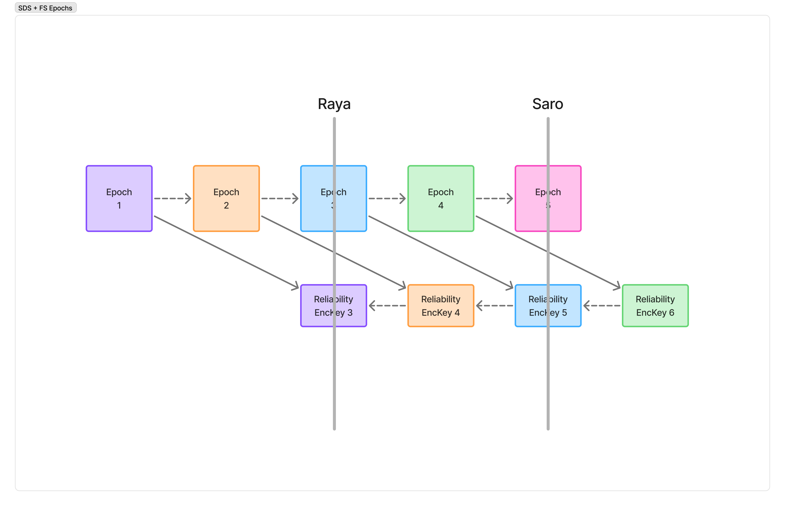

# SDS-FS

| Field | Value |
| --- | --- |
| Name | Forward Secrecy with SDS|
| Status | raw |
| Type | RFC |
| Category | Standards Track |
| Tags |  |
| Editor | jazzz <jazz@logos.co> |

<!-- timeline:start -->

## Timeline

<!-- timeline:end -->


## Abstract

This document specifies an encryption scheme for Scalable Data Sync (SDS) headers that is compatible with forward secrecy. The key for each epoch's headers is derived from the `epoch_secret` of the epoch `LAG` epochs earlier, so a member that has missed up to `LAG` epoch updates can still read incoming headers and use their causal history to recover the messages it is missing. Headers are authenticated and bound to the message they accompany. Header confidentiality has forward secrecy at the granularity of one epoch.

## Terminology

The key words "MUST", "MUST NOT", "REQUIRED", "SHALL", "SHALL NOT", "SHOULD",
"SHOULD NOT", "RECOMMENDED", "MAY", and "OPTIONAL" in this document
are to be interpreted as described in [RFC 2119](https://datatracker.ietf.org/doc/html/rfc2119).

**SDS**: The Scalable Data Sync protocol for distributed logs, LIP 109.

**Epoch**: A period during which a single `epoch_secret` is current. Epochs are advanced by
the application, not by this protocol. Where advance is triggered by membership or state
change, epoch duration is variable and unbounded in wall-clock time. Epochs are identified
by a monotonically increasing index.

**Causal history**: The references to previously seen messages carried in an SDS payload,
from which a recipient determines whether it is missing any messages.

**Reliability set**: The participants that hold reliability keys for a conversation and can
therefore process its SDS headers. This is not identical to group membership: removed
members remain in the reliability set until their retained keys expire.

## Motivation

SDS is a reliability protocol that uses causal history to detect missing messages.
An SDS payload contains references to previous messages, so that a recipient can inspect them and determine if it is missing any messages.
Once a missing message is detected, it can then begin a recovery process to retrieve it. 

Forward secrecy (FS) is a security property in which payloads sent now are not vulnerable to compromises in the future. 
Practically this is achieved by deriving new secrets from past ones, such that previous keys cannot be recovered.
Forward secrecy is a minimum requirement in modern private messaging protocols.

For a messaging protocol that wants to use SDS and still retain forward secrecy, these two items conflict. 

SDS works by receiving the latest payload and walking through the history backwards to recover lost messages. However FS based encryption schemes require the first encryption key in order to derive the others. Given the case where a message containing key material has been lost, a client cannot decrypt future messages - and if SDS payload is encrypted the previous message_ids cannot be recovered.

This problem can be avoided by sending SDS payloads in cleartext, however that leaks metadata that undermines privacy required in messaging protocols. This directly exposes `sender_id`, `channel_id`, previous messages, while also leaking metadata that increases linkability.

What is needed is an encryption scheme for SDS payloads which is compatible with forward secrecy.


## Security Model

The data contained within the SDS header does not require confidentiality from a security perspective - no properties of the protocol rely on it. Confidentiality is desired for metadata management which lowers the security required for header messages when compared to message contents. 

The SDS protocol does rely on integrity. If SDS headers can be modified in transit, malicious actors could inject false causal histories, resulting in wasted resources and potentially denial of service for protocols built on top of SDS that rely on complete message histories. 

Integrity alone is not sufficient. An authenticated header proves only that some member of the group produced it during a given epoch; it does not establish which message the header belongs to. A header MUST therefore be bound to the message it accompanies, so that a valid header cannot be detached from its own message and reattached to another.

Under this scheme the following assumptions are made:
- Participants are trusted entities; A participant who you willingly share private content with, can also be trusted with reliability metadata. This trust extends to removed members for the `LAG + 1` epochs during which they retain usable reliability keys.
- There exist active external attackers. External attackers hold no reliability keys.
- Epoch-granular forward secrecy is sufficient for encrypting SDS Header information. 

## Environment Assumptions

- There exists an `epoch_secret` used for encrypting messages which is eventually rotated. This key is deleted to maintain forward secrecy, and its lifetime is bounded to a single epoch. The key is assumed to be uniformly distributed.
- Epoch advance is driven by the application, not by this document. The exposure windows described here are bounded in epochs. Where the application advances epochs only on membership or state change, those windows are unbounded in wall-clock time.
- The application's content encryption layer is assumed to be IND-CPA, and therefore to produce distinct ciphertexts for repeated plaintexts.
- The `epoch_secret` is assumed not to be compromised. An attacker holding an `epoch_secret` recovers message content directly, which is catastrophic to the application independent of anything in this document. The reliability keys derived from it are not the dominant harm in that case, and it is out of scope here.
- Causal history recovered from a header is assumed to be valid. This construction establishes that a header was produced by a holder of the epoch reliability key and belongs to the message it accompanies. It does not establish that the causal history within it describes messages that exist. Protocols that treat causal history as authoritative have no recourse where it has been forged.


## Theory / Semantics

### Overview

The approach taken follows double-ratchet header encryption - where the encryption key for headers lags behind the messaging key by some interval. 
This means that a participant which does not hold the most recent encryption key can still decrypt information as long as they do not miss more than `LAG` epochs.

An `epoch_reliability_key` is derived from the `epoch_secret`, which is then used to encrypt the SDS headers for an epoch. 


### External Parameters

**LAG**: number of *additional* previous epochs which can still decrypt this header. A receiver at epoch `E` therefore holds `LAG + 1` usable reliability keys at any time: `epoch_reliability_key[E]` through `epoch_reliability_key[E + LAG]`. Higher values result in more allowable desynchronization, at the cost of a longer exposure window after compromise or removal.

### Key Schedule

There is a predictable rotation to keys. The `epoch_reliability_key` used to encrypt reliability headers in epoch `E`, is the key derived from epoch `E - LAG`. 

This allows members who have missed `LAG` state updates to parse reliability headers and begin recovery of missing messages. 



In the figure `LAG` = 2. Saro, at epoch 5, encrypts headers with reliability key 5, which is derived from epoch 3. Raya is two epochs behind but holds the secret for epoch 3, which is enough to read Saro's headers.

For the first `LAG` epochs of a group there is no epoch `E - LAG` to derive from. The creator of the group generates the reliability keys for these epochs at random. Every other member is a joiner, and receives them by the mechanism described in Initialization. From epoch `LAG` onward the derivation applies normally.

### Initialization 

New members joining the reliability set MUST receive `epoch_reliability_key[E]` through `epoch_reliability_key[E + LAG]`, where `E` is the current epoch, by another mechanism.

This SHOULD be the same "invite" that distributes the required keying material. 

Sending the `epoch_secret` would violate FS, by allowing participants not party to the original communication to access message contents - this MUST NOT be permitted. Only the derived `epoch_reliability_key` is to be transported.

### Member removal

Members leaving the group retain usable keys for the current epoch and the following `LAG` epochs, and can decrypt SDS headers despite not being part of the group. The reliability keys give no access to encrypted content, and as once-valid members they already hold the identifiers, membership and transport bindings that the headers would reveal. The construction is symmetric, so a retained key also allows a removed member to produce headers that current members accept as authentic. This is covered by the trust assumption in the Security Model; complicated key rotation is not considered.

The bound is expressed in epochs, not in time. Where the application advances epochs only on membership or state change, a removed member may retain usable reliability keys indefinitely in wall-clock terms.


### Eventual Forward Secrecy

Header encryption maintains forward secrecy with epoch granularity. A compromised `epoch_reliability_key` decrypts all headers sent in that epoch, and no headers sent in any other epoch. Its value therefore expires once the epoch it covers is closed, which is a bound in epochs rather than in elapsed time.

The encryption of the headers does not incorporate a ratchet mechanism or new entropy, as this increases the coordination required between members. A deterministic key schedule lowers the requirements for decryption, and does not require shared state. Any message can be decrypted using the a priori `epoch_reliability_key` for that epoch and the provided cleartext data in the payload. This feature is critical for desynchronized members to be able to fetch previous messages.

Given the data at risk, eventual forward secrecy is acceptable here.


### PQ Considerations

Grover's algorithm reduces the effective security of a `k`-bit symmetric key to about `k/2` bits against a quantum attacker. `ENC` SHOULD therefore use keys of at least 256 bits. `HASH` is relied on only for collision resistance, which quantum search degrades less sharply; a 256-bit output is sufficient.

This construction adds no public-key cryptography, so it introduces no quantum weakness of its own. Its post-quantum security is that of the `epoch_secret` it derives from. Where the `epoch_secret` is established by a classical key agreement, an attacker who records traffic now and later breaks that agreement recovers the reliability keys along with the message keys.


## Construction

### External Functions

**KDF_DOM(ikm, domain)**: Returns a domain-separated encryption key of length `L` given a uniformly distributed key, and `domain`. `L` MUST be the key length required by `ENC`. The output is a uniformly distributed key.

**HASH(data)**: Returns a fixed-size digest of `data`. The hash function MUST be collision resistant.

**ENC(key, aad, plaintext)**: Produces a ciphertext. MUST provide IND-CPA and INT-CTXT. MUST be nonce-based. `aad` is authenticated but not encrypted, and is not carried in the ciphertext. Where `ENC` uses a randomly generated nonce, that nonce MUST be at least 192 bits; see Security, Nonce Reuse.

**DEC(key, aad, ciphertext)**: Inverse of `ENC`. MUST NOT require confidential state other than the parameters provided.


### Associated Data and Binding

Each header is encrypted with associated data that binds it to the epoch it was sent in and to the message it accompanies, as the Security Model requires.

```
HeaderAAD(label, i, h) = uint8(len(label)) || label || uint64_be(i) || h
```

- `||` denotes concatenation.
- `label` is the ASCII encoding of the domain string, currently `"sds-hdr-v1"`, prefixed with its length in bytes.
- `i` is the epoch index, encoded as an unsigned 64-bit big-endian integer.
- `h` is `HASH(content_ciphertext)`, where `content_ciphertext` is the application's encrypted content for the message the header accompanies. `HASH` output is fixed-size, so `h` needs no length prefix.

The associated data is not transmitted. The receiver reconstructs it from the content ciphertext, which travels alongside the header (see Wire Format), and from the candidate epoch index during trial decryption.

Binding prevents a valid header from being moved onto a different message; see Security, Header Substitution. It does not prevent a complete message, header and content together, from being replayed unmodified. Such a replay is a duplicate at the SDS layer, which participants MAY discard by `message_id` as SDS already permits.

### Epoch Reliability Key Derivation

Where `i` = the current epoch index

`epoch_reliability_key[i + LAG] = KDF_DOM(epoch_secret[i], "sds-enc-v1")`


### Header Encryption

Where `i` = the current epoch index

```
aad[i]        = HeaderAAD("sds-hdr-v1", i, HASH(content_ciphertext))
ciphertext[i] = ENC(epoch_reliability_key[i], aad[i], header[i])
```

where `header[i]` is the serialized `SDS::Message` with its `content` field unset (see Wire Format).

### Header Decryption

The epoch index is not carried on the wire, so a receiver does not know in advance which `epoch_reliability_key` was used. The receiver holds `LAG + 1` keys, and attempts decryption against each in turn.

```
For each j from E to E + LAG:
    aad[j] = HeaderAAD("sds-hdr-v1", j, HASH(content_ciphertext))
    result = DEC(epoch_reliability_key[j], aad[j], ciphertext)
```

The first candidate for which `DEC` succeeds yields the header. If every candidate fails, the header is not addressed to this receiver, falls outside the `LAG` window, or has been modified; it SHOULD be discarded.


## Wire Format

### EncryptedSdsHeader

The header is the `SDS::Message` with its `content` field unset. The content cannot travel inside the encrypted header, because the receiver needs `HASH(content_ciphertext)` to form the associated data before it can decrypt. The enclosing protocol therefore carries the content ciphertext alongside `EncryptedSdsHeader`, and the receiver restores it into `content` after decryption.

```protobuf
syntax = "proto3";
message EncryptedSdsHeader {
    bytes nonce = 1;
    bytes ciphertext = 2;
}
```

- `nonce` MUST carry the nonce required by `ENC`, sized as `ENC` requires
- `nonce` MUST be randomly generated
- `ciphertext` MUST contain an encrypted serialized `SDS::Message`, as defined in [SDS](https://lip.logos.co/anoncomms/raw/sds.html), with its `content` field unset


## Implementation Suggestions

**Primitives**

- `ENC` = XChaCha20-Poly1305. Note the extended form is required; ChaCha20-Poly1305 does not meet the nonce size requirements.
- `KDF_DOM(ikm, domain) = HKDF-Expand(ikm, domain, L)`, where `ikm` is the `epoch_secret` and `L` is the key length required by `ENC`. Extract is not required here; the `epoch_secret` is assumed uniformly distributed, so there is no entropy to concentrate. MLS deployments MAY substitute `ExpandWithLabel` (RFC 9420, Section 8), which provides the same domain separation with a length-prefixed and version-prefixed encoding of the domain string.


## Security 

**Retention of `epoch_reliability_key`s**
A member at epoch `E` holds `epoch_reliability_key[E]` through `epoch_reliability_key[E + LAG]`. On advancing to epoch `E + 1`, it derives `epoch_reliability_key[E + 1 + LAG]` and MUST delete `epoch_reliability_key[E]`. The `epoch_secret` is not retained past its epoch.

Once an epoch's key is deleted, headers from that epoch can no longer be read, including headers of messages recovered later through SDS. Their content is encrypted under that epoch's `epoch_secret`, which is already gone, so nothing further is lost. Where the application keeps past epoch secrets to handle late delivery, it SHOULD keep the matching reliability keys for the same period.

A compromise of a member's state at epoch `E` exposes headers from epochs `E` through `E + LAG`. Headers from earlier epochs remain protected.

**Nonce Reuse**
The construction uses random nonces, over a counter to avoid issues with persistence/state rollbacks leading to nonce reuse. 

The re-use domain is restricted to a single epoch, and the nonce size is chosen to limit the risks here. 

With random 96-bit nonces, the collision probability reaches 2^-32 after about 2^32 messages under one key. This is the conventional limit, and it is too low for large groups with peer syncing. With 192-bit nonces the same probability is not reached until about 2^80 messages.

These bounds hold only under random generation, which is why the wire format requires it rather than recommending it. A counter-based implementation would inherit the rollback exposure this construction is written to avoid, and the stated margins would not apply to it.

**Header Substitution**
Binding `HASH(content_ciphertext)` into the associated data prevents a valid header from being detached from its own message and reattached to another. Two headers are substitutable only if their accompanying content ciphertexts are identical. This does not occur for messages with content, because the application's content encryption layer is IND-CPA and therefore produces distinct ciphertexts for repeated plaintexts. The substitution resistance of the header is inherited from this property of a layer that this document does not specify. Messages with no content, such as SDS periodic sync messages, all share the same `h`. For these, moving a header onto another such message is the same as replaying the original, which is covered under Associated Data and Binding.

**Compromised Reliability Keys**
Anyone holding a reliability key can forge SDS headers. This approach currently has no solution to that. The compromise is bounded in that the key validity expires with future epochs, however while valid an attacker could cause clients to request non-existent messages.

**Trial Decryption Cost**
A receiver performs up to `LAG + 1` decryption attempts before rejecting a header. An attacker who emits headers that will never decrypt therefore imposes `LAG + 1` times the work of a single verification, per header. Headers are small and the operation is cheap, but the amplification scales linearly with `LAG`. Implementations MAY cap the number of attempts, and SHOULD apply whatever rate limiting the transport already provides before entering the trial loop.

**Metadata Exposure**
Omitting the epoch index from the wire prevents an observer from grouping or ordering headers by epoch. This is only a gain where the enclosing transport does not already expose it. Under MLS the group identifier and epoch are cleartext fields of `PrivateMessage`, so an observer recovers the epoch from the enclosing frame regardless of what this construction does; the trial decryption cost buys no privacy in that deployment. The construction is specified this way so that it does not import that exposure as a requirement, and so that transports which do not leak the epoch are not forced to.