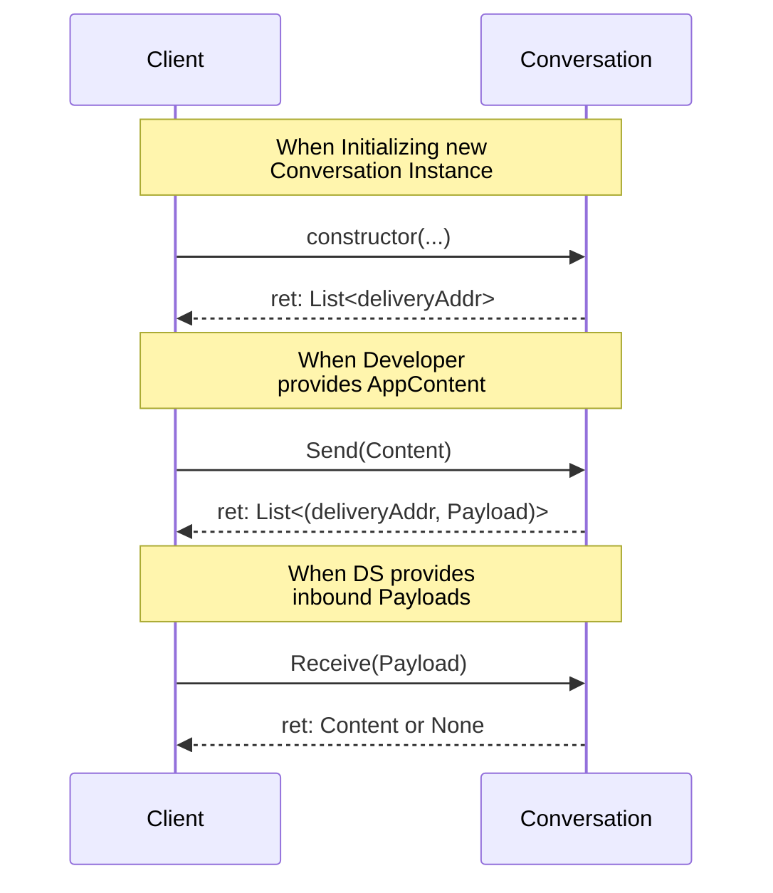

# ConversationTypes

## Terminology

This specification uses the terminology outlined in [CHAT_DEFS](https://github.com/logos-messaging/specs/blob/master/informational/chatdefs.md) including;
- Content
- Frame
- Payload

## Background

Messaging protocols specifications can be long and dense documents. To fully describe a messaging protocol, there are many layers and operations which are required to be documented. This includes payloads, message transport, encryption as well as user level features such as account registration, typing indicators, content formatting.

This specification Introduces a common method for defining core messaging protocols, in a way that promotes interoperability, and version handling in a decentralized environment. 

## Overview

This specification outlines the requirements for defining abstract communication mechanisms called "ConversationTypes".

ConversationTypes are specifications which define protocol messages and their serialization. This includes the message structures, encryption mechanisms, and encoding. 

A Conversation is an instance of a ConversationType. 
A ConversationType is a protocol for full-duplex communication. 

### Scope & Context

A Conversation can be considered a processor which converts between Content and Payloads and vice versa.

[TODO: Add Diagram]

The Scope of an ConversationType includes:

- Framing: How data is bundled and organized into frames.
- Encryption: How and if frames have confidentiality and integrity. 
- Encoding: How frames are converted to bytes for transport
- Addressing: Which delivery address to send a payload too.

Tasks which are handled by other components:

- Transport and Routing: How messages are sent between clients.
- Content Schema: Conversations are Content agnostic.

#### High Level Flow

## Assumptions 

### Delivery Service
This specification assumes that a service exists which is responsible for routing payloads - called a DeliveryService or DS.

A DeliveryService has the following properties:
- A DS operates as a PubSub like - It supports Publish and Subscribe functionality.
- A DS uses a `delivery address` to created broadcast domains.
- A DS is not reliable - message delivery is not guaranteed

## Specification

- A ConversationType SHOULD be defined in a normative specification.
- A ConversationType MUST define how to generate ConversationIds
- A ConversationType MUST define how to generate Payloads.
- A ConversationType MUST define how to retrieve Content.
- A ConversationType MUST define how to encode/decode frames. 
- A ConversationType MUST be immutable.
- A ConversationType SHOULD explicitly document all the Frames used in operation.
- A ConversationType MUST be agnostic of any content. 
- A ConversationType MUST be self-contained and operate independently of other ConversationTypes.

### Initialization
#### ConversationIds

ConversationIds are used to uniquely identify a protocol instance on a client. 
Their primary use is for routing Payloads to the correct Conversation for processing inbound messages.
ConversationTypes are responsible to defining a mechanism to produce these identifiers.

- ConversationIds MUST be 96bits long.
- For every client, ConversationIds MUST reference one and only one Conversation.

The serialization of ConversationIds is determined by the the implementation is not defined by a ConversationType.

#### Delivery Subscriptions

When a new Conversation is initialized, the delivery service does not know where the conversation expects to receive messages. As how the `delivery_addresses` are used have implications on Conversation privacy, these identifiers are defined by the ConversationType. 

- A Conversation instance MUST define a static set of `delivery addresses` to subscribe to during initialization. 

### Payload Generation & Content Retrieval

All Conversation Instances MUST provide the following conversions:

- Content -> list(DeliveryAddress, Payload)
- Payload -> Content | None

A single content message MAY result in multiple Payloads, and it is not assumed that the destination delivery_address is the same for each payload generated.
An incoming payload will either generate a single Content, or nothing. 

### Immutability

To avoid compatibility mismatches between different client versions, Conversations are considered static.
Clients supporting a ConversationType MUST always be able to inter-operate regardless of implementation.
Any breaking changes to a ConversationType are considered a different independent ConversationType. 

As there cannot exist multiple versions of a single ConversationType, compatibility issues between clients are removed.

Upgrading from one conversation to another is purposely not specified. Any such feature would be defined by a individual ConversationType. 

### Frame Definitions

ConversationTypes MUST define all the types used in the operation of the protocol. These types referred to as `Frames` are specific to each ConversationType. Multiple ConversationTypes CAN reuse the same types, however there are no requirements to due so. 

### Encoding/Decoding
The output Payloads from a Conversation are treated as opaque bytes by other layers. 
A ConversationType MUST define how to convert between Payloads and Frames.
Different ConversationTypes MAY use different encoding procedures.

## Implementation Suggestions

### Logical "Chats"

It is strongly suggested that App developers keep a logical separation between the user facing stream of messages (ie: a "chat") and the method used to transport those messages (ie: Conversation)
As ConversationTypes are immutable, the life cycle of a "chat" may exceed that of the original Conversation used to transport those messages. 
Applications which consider a "ChatId" that maps to a current ConversationId will have a smoother time during conversation rotation. 

### Versioning 

Coordinating client upgrades is complex in decentralized protocols, which eats up resources and slows deploying features. 
To avoid conflicts ConversationTypes cannot be altered in a way that would break compatibility. 

This establishes an Invariant - Any Clients that implement the same ConversationTypes can communicate. 

#### Conversation-Centric Versioning

In this model it's expected that Clients can support multiple different conversationTypes simultaneously.
Rather than the Client version being the major factor on wether clients can communicate, compatibility is determined by what set of protocols a client supports. 

#### Protocol Naming

ConversationTypes themselves are identified by the specification, and any associated name is solely for convenience.
 
ConversationType names carry no semantic meaning. 
Implementors MAY use a common prefix for organizational clarity, but similarly named ConversationTypes do not imply any protocol relationship, compatibility, or ordering between types.

While it makes sense to use similar names for similar ConversationTypes, this is not required.  

#### Upgrading from one ConversationType to another
In order to access new functionality, participants may want to "upgrade" from one ConversationType to another.
To achieve this, a new conversation is initialized with the same membership, and the existing Conversation is archived. This process is referred to as `Conversation Rotation`. 

- ConversationTypes MAY create specialized frames for coordinating this process.
- There is no inherent limitations on which ConversationTypes a Conversation can rotate to. This is defined by the specific ConversationType, thought it should be deterministic.

### Deterministic Parsing Trees

ConversationTypes are responsible for defining all types used in operation. 
How to parse these types SHOULD be clear and unambiguous - even in the presence of errors.
Conversations SHOULD use a parsing strategy which is deterministic and makes no assumption about the payloads received.  

Deterministic parsing trees, forces a frame or payload to be in 1 of 3 states: Valid, Invalid, Unsupported. Distinguishing between invalid and unsupported types helps increase observability in a decentralized environment. 

Choosing self-describing protocol messages is always preferred.

#### Explicit Content Tagging

Assuming an unknown frametype corresponds to content intended for the Application, can surface bad data to applications in the event of decoding errors.
All content intended for applications SHOULD be explicitly tagged so there is no ambiguity. This ensures that client implementations can always differentiate between three possible outcomes:
- The frame contains a meta-message to be handled by the conversation.
- the frame contains content destined for the Application
- The frame is malformed due to a protocol error. 

### State Persistence

Because ConversationTypes are immutable, implementors do not need to manage breaking schema changes. Any additions to stored state will be additive, removing the need for complex migrations, `semver`, or version tracking.

Instead Implementors are encouraged to enable fast deployments with minimal to no changes in clients. 

## Security Considerations

### State Binding

[TODO]
