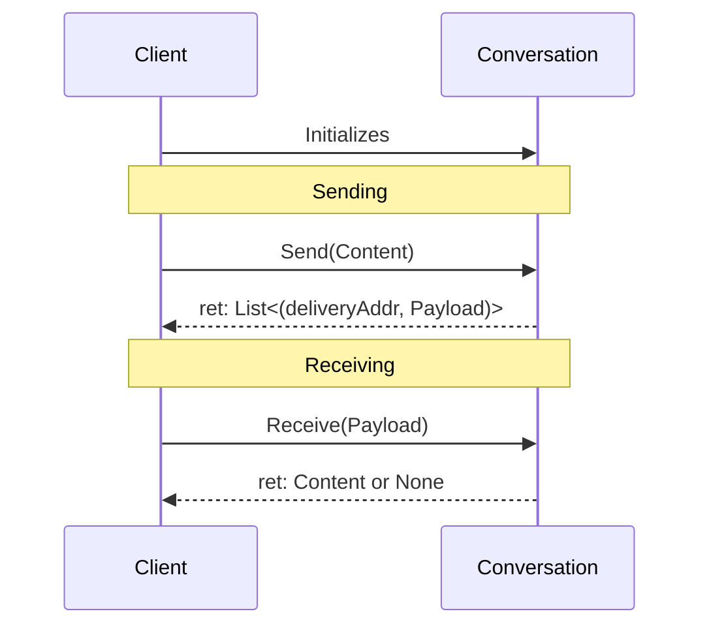

# ConversationTypes

| Field | Value |
| --- | --- |
| Name | ConversationTypes |
| Slug |  |
| Status | raw |
| Type | RFC |
| Category | Standards Track |
| Editor | jazzz <jazz@status.im> |

## Terminology

This specification uses the terminology outlined in [CHAT_DEFS](https://github.com/logos-messaging/specs/blob/master/informational/chatdefs.md) including:
- Content
- Frame
- Payload

## Background

Building a messaging protocol requires solving the same set of problems repeatedly: 
how to structure messages, encrypt them, encode them for transport, and handle versioning across a decentralized network where you can't force clients to upgrade in lockstep.

Without a shared abstraction, each protocol re-solves these problems independently — producing incompatible implementations that resist interoperability and make coordinated upgrades expensive.

### The hard problem: versioning in a decentralized network

In centralized systems, versioning is straightforward — the server dictates the protocol, and clients update or lose access. 
In a decentralized network, no such authority exists. Clients at different versions must coexist indefinitely, and any breaking change risks permanently fragmenting the network.

The conventional response is complex negotiation logic, `semver` schemes, and careful backwards-compatibility maintenance. 
This creates a compounding burden: the older the protocol, the more legacy behavior implementors must carry.

## Overview

This specification takes a different approach to the versioning problem. 
Rather than versioning protocols, we make them immutable. 
A ConversationType is a fixed contract — it never changes. 
When new functionality is needed, a new ConversationType is defined and participants rotate to it. 
This makes upgrades cheap, explicit, and coordination-free: clients that support a ConversationType can always communicate, and adding new capabilities never breaks existing ones.

ConversationTypes are the mechanism that makes this possible — a common framework for defining messaging protocols that is modular, immutable, and interoperable by design. 
ConversationTypes define protocol messages and their serialization, including message structures, encryption mechanisms, and encoding.

In this model, clients are expected to support multiple ConversationTypes simultaneously. 
Compatibility between clients is determined not by client version, but by the set of ConversationTypes each client supports.

### Definitions

A ConversationType is a specification for full-duplex communication.

A Conversation is a software instance of that specification.

### Scope

A Conversation can be considered a processor which converts between Content and Payloads. 
The scope of a ConversationType defines everything inside that boundary.

| In scope | Out of scope |
| --- | --- |
| Framing: how data is bundled into frames | Transport & routing: how payloads move between clients |
| Encryption: confidentiality and integrity of frames | Content schema: conversations are content-agnostic |
| Encoding: how frames are converted to bytes | Discovery & peer negotiation |
| Addressing: which delivery address a payload targets | Conversation initialization & bootstrapping |
| Membership & Administration  |  |

### High Level Operation

## Assumptions

### Delivery Service

This specification assumes the existence of a Delivery Service(DS) responsible for routing payloads between clients. A ConversationType is always defined in the context of a DS with the following properties:

- A DS operates as a PubSub — it supports Publish and Subscribe functionality.
- A DS uses a `delivery address` to create broadcast domains.
- A DS is not reliable — message delivery is not guaranteed.

## Specification

- A ConversationType MUST define how to generate ConversationIds.
- A ConversationType MUST define how to assign `delivery addresses` to Payloads.
- A ConversationType MUST define how to generate Payloads.
- A ConversationType MUST define how to retrieve Content.
- A ConversationType MUST be immutable.
- A ConversationType MUST explicitly document all Frames required for interoperability.
- A ConversationType MUST NOT impose any requirements on Content structure.
- A ConversationType MUST NOT depend on the internal state of any other ConversationType.

### ConversationIds

ConversationIds uniquely identify a Conversation instance on a client. 
Their primary role is routing — when an inbound Payload arrives, the client uses the ConversationId to determine which Conversation should process it.

**Requirements:**
- ConversationIds MUST be 128bits long.
- For every client, a ConversationId MUST reference one and only one Conversation.

### Delivery Subscriptions

Delivery addresses define where a Conversation expects to receive inbound Payloads from the DS. 
They are defined by the ConversationType rather than the DS for two reasons:

First, delivery addresses have direct privacy implications — 
how messages are grouped and addressed can leak metadata about participants and group membership. 
The ConversationType is best positioned to reason about this, as it has full knowledge of the message structure and encryption scheme.

Second, the DS treats all Payloads as opaque bytes — it has no visibility into content, participants, or intent. 
The ConversationType, by contrast, understands the semantics of its messages and can make informed decisions about how to group and address them for delivery.

**Requirements:**
- A Conversation instance MUST define a static set of `delivery addresses` to subscribe to during initialization.

### Payload Generation & Content Retrieval

A Conversation exposes two conversions — one for each direction of communication. 
These are the core operations of a ConversationType and define how Content moves in and out of the protocol layer.

A single Content message MAY result in multiple Payloads, each with its own delivery address. 
This allows a ConversationType to fan out messages across multiple delivery addresses when required by its design.

An inbound Payload will either produce a single Content or nothing. 
The None case is intentional — not all Payloads are intended to surface content to the application. Some may be protocol-level messages handled internally by the Conversation.

**Requirements:**
- All Conversation instances MUST provide the following conversions:
  - `Content -> list(DeliveryAddress, Payload)`
  - `Payload -> Content | None`

### Immutability

A ConversationType is a fixed contract — once published it cannot be changed. 
This eliminates compatibility mismatches between clients: any two clients that support the same ConversationType can always interoperate, regardless of their implementation or version.

When new functionality is needed, a new ConversationType is defined. Existing ConversationTypes remain valid indefinitely.

Immutability applies to frame definitions and their semantics — not to the data carried within frames.

Because ConversationTypes are immutable, implementors do not need to manage breaking schema changes. 
Any additions to stored state will be additive, removing the need for complex migrations, `semver`, or version tracking.

**Requirements:**
- A ConversationType MUST NOT be modified after publication.
- Any change that affects interoperability MUST be defined as a new ConversationType.

### Frame Definitions

Frames are the typed data structures that a Conversation operates on internally. 
They sit between the raw Payload bytes and the Content exposed to the application — a Payload is decoded into a Frame, and either handled internally by the Conversation or converted to Content.

Each ConversationType defines its own set of Frames. 
Multiple ConversationTypes may reuse the same Frame definitions but there is no requirement to do so.

All Frames fall into one of three states when processed by a Conversation. 
Distinguishing between these states improves observability — a malformed Frame and an unrecognized Frame are different problems and should not be conflated:
- **Valid** — the Frame is well-formed and recognized.
- **Invalid** — the Frame is malformed or fails validation.
- **Unsupported** — the Frame is unrecognized by this Conversation instance.

**Requirements:**
- A ConversationType MUST explicitly document all Frames required for interoperability.
- A ConversationType MUST define how to distinguish between Valid, Invalid, and Unsupported frames.
- A ConversationType MUST explicitly tag all Frames intended for the application layer.
- A ConversationType SHOULD define an unambiguous parsing strategy for all Frames, including in the presence of errors.

### Encoding/Decoding

Encoding defines how Frames are serialized into Payload bytes for transport, and how inbound Payload bytes are deserialized back into Frames. 
Payloads are treated as opaque bytes by all other layers — only the Conversation itself is responsible for interpreting them.

Different ConversationTypes may use different encoding schemes. 
There is no requirement to share encoding procedures across ConversationTypes.

**Requirements:**
- A ConversationType MUST define how to encode Frames into Payloads.
- A ConversationType MUST define how to decode Payloads into Frames.

## Implementation Suggestions

### Logical "Chats"

App developers should maintain a logical separation between the user-facing message stream (a "chat") and the Conversation used to transport it. 
As ConversationTypes are immutable, the lifecycle of a "chat" may outlive the Conversation that carries it — particularly across Conversation Rotation. Applications that map a stable "ChatId" to a current ConversationId will handle rotation more gracefully.

### Membership

One property which is determined by the ConversationType is the membership model. 
For clarity the ConversationType SHOULD define this clearly in the spec.

Is participant list fixed at initialization or can be changed? 
Who decides which participants are allowed to join? 
How does a participant join? 
These are all questions which would be helpful for implementors to know. 

### Conversation Rotation

Conversation Rotation is the process of migrating participants from one ConversationType to a new one. 
A new Conversation is initialized with the same membership and the existing Conversation is archived. 
This is the primary mechanism for accessing new functionality without breaking existing clients.

### Protocol Naming

ConversationType names are for convenience only — they carry no semantic meaning and imply no protocol relationship, compatibility, or ordering. 
Similarly named ConversationTypes do not imply any relationship between them. Implementors MAY use a common prefix for organizational clarity.

## Security Considerations

[TODO]